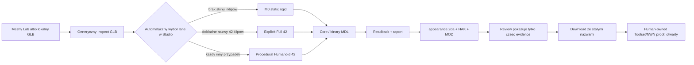

# Audyt aplikacji pod katem modeli Creature i animacji

Data audytu: 2026-07-28
Branch: `animation`
Worktree: `C:\Projects\meshy2aurora\.worktrees\animation`
Zakres: lokalny kod Core, WASM, Studio Web, Meshy Lab/Local Bridge, testy i
dokumentacja kontraktowa.
Poza zakresem: uruchamianie Aurora Toolset/NWN oraz wizualny proof, ktory
zgodnie z decyzja wlasciciela pozostaje human-owned.

## Werdykt

Stan aplikacji to:

`OFFLINE CORE STRONG / PRODUCT FLOW NOT READY / RUNTIME NOT PROVEN`

Najtrudniejsza czesc techniczna jest juz zaawansowana. Core potrafi:

- bezpiecznie sparsowac GLB ze skinem i animacjami;
- zbudowac wlasny rig, SkinMesh i binarny MDL;
- zapisac animacje typu 5, eventy i kontrolery;
- wykonac natychmiastowy readback wlasnego MDL;
- sprawdzic komplet 42 stanow, rozroznialnosc ruchu, terminalna poze smierci
  oraz rzeczywista niesztywna deformacje wierzcholkow;
- materializowac `appearance.2da`, HAK i testowy MOD z raportami i hashami.

Aplikacja nie jest jednak jeszcze spojnym produktem do tworzenia Creature z
animacjami. Studio podejmuje za uzytkownika zbyt szerokie decyzje, przyjmuje
tylko jeden GLB, nie ma kolektora wielu klipow Meshy, nie pokazuje wiekszosci
dowodow animacyjnych z Core, uzywa stalych nazw artefaktow i ma sprzeczne
budzety trojkatow. Zielone testy potwierdzaja deterministycznosc istniejacych
sciezek offline, ale nie zamykaja tych luk ani runtime proof.

## Mapa obecnego przeplywu



Problemem nie jest brak elementow pipeline. Problemem sa granice i automatyczne
przejscia miedzy nimi.

## Macierz gotowosci

| Obszar | Stan | Ocena |
|---|---|---|
| Bezpieczny ingest GLB | gotowy offline | Mocne limity, walidacja struktur, skinow i animacji. |
| Statyczny M0 | gotowy jako diagnostyka offline | Nie jest pelnym produktem Creature i nie moze byc domyslnym fallbackiem. |
| H1 z jednym klipem idle | dziala offline przez proceduralne 42 | To clean-room generation, a nie zachowanie zestawu animacji Meshy. Wymaga jawnego opt-in. |
| Dokladny zestaw 42 klipow | wspierany w Core | Studio nie umie zebrac 42 zadan/plikow ani potwierdzic wspolnego szkieletu. |
| Eventy animacji | wspierane w Core | UI nie oferuje kompletnego authoringu ani osi czasu eventow. |
| SkinMesh i deformacja | mocne bramki offline | Jest readback i oracle deformacji, lecz brak owner runtime proof dla nowego wyniku tej galezi. |
| Preview | dziala osobno dla source i readback | Brak zsynchronizowanego porownania, root-motion plot i markerow eventow. |
| HAK/MOD | materializowane | Stale nazwy w Studio zagrazaja izolacji lineage i pobraniom. |
| Toolset/NWN | nieudowodnione w tym audycie | Poprawny status to `not_tested`, nie `visible`. |

## Co jest zrobione dobrze

### 1. Core jest fail-closed i ma wlasny model danych

Parser nie przekazuje GLB bezposrednio do writera. Profil A wymaga m.in.
jednoznacznego skinu, hierarchii, skinned mesh, indeksowanych trojkatow oraz
kompletu atrybutow pozycji, normalnych, UV, jointow i wag. Odrzuca morph targety,
nieobslugiwane sciezki i niebezpieczne skale. To dobra granica zaufania.

### 2. Writer i readback sa rzeczywiste, nie deklaratywne

Binary writer obsluguje SkinMesh, kontrolery, animacje typu 5 i eventy. Po
zapisie aplikacja czyta swoje bajty ponownie i porownuje semantyke. Osobna
granica formatu jednego strumienia mesh pozostaje poprawnie sprawdzana przy
21 845 trojkatach; 21 846 jest odrzucane.

### 3. Full 42 ma mocne bramki zachowania

Core nie ogranicza sie do sprawdzenia nazw. Dla pelnego profilu kontroluje:

- dokladny namespace 42 stanow;
- aktywny ruch;
- rozroznialnosc `cwalk` i `crun`;
- rozroznialnosc stanow gameplay;
- terminalna poze `ckdbckdie`;
- niesztywna deformacje SkinMesh dla klipow.

To jest wartosciowy offline oracle i powinien pozostac centralnym kontraktem.

### 4. Proceduralna sciezka jest deterministyczna

Sciezka proceduralna zachowuje source `cpause1`, rozpoznaje semantyczne stawy
humanoida i generuje pozostale 41 stanow oraz typowe eventy. Nie jest to
substytut danych Meshy, ale jako jawnie eksperymentalna opcja moze byc
przydatnym narzedziem.

### 5. Pobieranie artefaktow weryfikuje hash

Studio przelicza SHA-256 przed downloadem. Raport Core zawiera znacznie wiecej
dowodow niz obecnie pokazuje UI, wiec nie trzeba przebudowywac writera, aby
poprawic warstwe Review.

## P0 — blokery produktu Creature/Animation

### P0.1. Diagnostyczny M0 jest automatycznie oferowany jako wynik Creature

W `apps/studio-web/src/App.tsx:557-562` brak skinu i brak animacji automatycznie
wybiera `M0_STATIC_RIGID`. Kazdy pozostaly plik, ktory nie ma dokladnych 42 nazw,
jest automatycznie kierowany do `SKINNED_PROCEDURAL_HUMANOID_42`.

To miesza trzy rozne intencje:

1. diagnostyczny statyczny model;
2. import animacji dostarczonych przez uzytkownika/Meshy;
3. clean-room procedural animation generation.

Skutek: uzytkownik moze otrzymac pakiet Creature, ktorego semantyka nie wynika
z wybranego zrodla. Obecne testy `App.test.tsx` oczekuja tego zachowania, wiec
utrwalaja je zamiast wykrywac.

Wymagana zmiana: jawny wybor trybu przed buildem:

- `STATIC_DIAGNOSTIC` — poza glownym produktem Creature;
- `EXPLICIT_SOURCE_CLIPS` — preferowany produkt;
- `PROCEDURAL_HUMANOID_EXPERIMENTAL` — opt-in z czytelna informacja, ze 41
  klipow i eventy sa generowane lokalnie.

Brak skinu albo wymaganych klipow powinien blokowac tryb produktowy, nie
przelaczac go po cichu.

### P0.2. Nie istnieje wieloklipowy projekt animacji

Studio przyjmuje jeden GLB. Meshy Animation API tworzy osobne zadanie i osobny
wynik dla akcji, dlatego pelny Creature wymaga kolekcji wielu klipow i
potwierdzenia, ze wszystkie odnosza sie do tej samej bazy riggingowej.

Obecny Core umie przetworzyc wiele animacji znajdujacych sie juz w jednym GLB,
ale aplikacja nie umie:

- dodac wielu wynikow Meshy do jednego projektu;
- zapisac `rig_task_id`, `animation_task_id` i `action_id` dla kazdego klipu;
- policzyc i porownac sygnature szkieletu;
- odrzucic klip z obcego rigu;
- scalic klipy deterministycznie do mapowania Aurora;
- pokazac brakujace pozycje floor 7 lub full 42.

Bez tego explicit Full 42 jest zdolnoscia biblioteki, a nie osiagalnym
workflow produktu.

Wymagana zmiana: wersjonowany `CreatureAnimationProjectV1`, ktory posiada jeden
base rig, liste klipow, provenance Meshy, sygnature szkieletu, mapowanie nazw,
polityke loop/terminal, eventy i wybrany profil docelowy.

### P0.3. Budzet geometrii jest wewnetrznie sprzeczny

Obowiazujaca decyzja wlasciciela to:

- warning powyzej 10 000;
- akceptacja dokladnie 20 000;
- blokada dopiero powyzej 20 000;
- niezalezna granica binarna jednego mesh stream: 21 845.

Tymczasem:

- `crates/m2a-core/src/glb/mod.rs:99-100` ma warning `5_000` i blokade `10_000`;
- `crates/m2a-core/src/profile_a.rs:200-201` powtarza `5_000/10_000`;
- Meshy Lab domyslnie wysyla `30_000`
  (`apps/studio-web/src/features/meshy/bridge.ts:225`);
- Local Bridge mapuje `BALANCED` na `30_000`, a `HIGHER_DETAIL` na `60_000`
  (`tools/meshy-local-bridge/index.mjs:54`);
- UI pozwala wpisac do `300000`
  (`apps/studio-web/src/features/meshy/MeshyLab.tsx:394`).

Domyslny generator wytwarza zatem wynik, ktory obecny importer Creature
odrzuci, a importer sam stosuje juz nieaktualny limit.

Wymagana zmiana: jedna wspoldzielona stala
`AURORA_MODEL_TRIANGLE_BUDGET_V1 = 20_000`, pochodny warning `10_000` oraz testy
granic `10_000`, `10_001`, `20_000`, `20_001`, `21_845`, `21_846`. Presety
Meshy musza byc opisane wzgledem tego limitu; wartosci ponad 20 000 moga sluzyc
tylko jako jawne zrodlo do pozniejszej redukcji, nie jako gotowy target Aurora.

### P0.4. Studio gubi najwazniejsze evidence animacji

Raport Core posiada:

- `animationCompleteness`;
- `animationBehavior`;
- `animationEventConformance`;
- `skinAnimationConformance`.

Pola sa tworzone w `crates/m2a-core/src/model_pipeline.rs:573-581`. Projekcja
wyniku Studio w
`apps/studio-web/src/features/results/projectCanonicalResult.ts` parsuje tylko
skrocone dane jednej animacji i opcjonalne event conformance. Review nie
pokazuje kompletnej macierzy 42 klipow, pochodzenia explicit/procedural,
wynikow behavior oracle ani per-clip non-rigid deformation.

Skutek: aplikacja potrafi wyprodukowac dowod, ale uzytkownik nie moze go
ocenic przed pobraniem. Przy proceduralnych 41 klipach jest to szczegolnie
niebezpieczne.

Wymagana zmiana: zachowac i pokazac pelny raport jako typed view model, z
macierza klipow: nazwa Aurora, zrodlo, czas, loop/terminal, aktywne jointy,
root motion, eventy, deformacja i wynik bramki.

### P0.5. Stale nazwy pakietu lamia izolacje lineage

Worker zapisuje dla wszystkich sciezek H1 stale nazwy:

- `m2a_codex_aproof.hak`;
- `m2a_m6p01.mdl`;
- `m2a_codex_aproof.mod`.

Zrodlo: `apps/studio-web/src/worker/m2a.worker.ts:344`.

Core posiada funkcje przyjmujaca caller-owned identity dla proceduralnego
pakietu, ale WASM i Studio jej nie eksponuja. Kolejne buildy moga przez to
nadpisywac pobrania, otrzymac suffix przegladarki albo pomieszac MOD z HAK.
Jest to sprzeczne z wymaganiem immutable, candidate-bound lineage.

Wymagana zmiana: kreator tozsamosci projektu z walidowanymi, swiezymi resrefami
modelu, tekstury, HAK, MOD, Area i UTC. Manifest oraz nazwy downloadow musza
pochodzic z tej jednej tozsamosci.

### P0.6. Explicit Full 42 i procedural Full 42 nie dostaja tego samego runtime envelope

W `crates/m2a-core/src/model_pipeline.rs:2411-2418` tylko proceduralna sciezka
uzywa profilu `ActiveMonsterBaseline` i nowego buildera proof module.
Pozostale pelne profile przechodza przez historyczny
`build_creature_proof_module_v1`.

Oznacza to, ze dwa wyniki deklarujace ten sam docelowy Creature sa testowane w
roznych modulach i z roznym envelope runtime. To uniemozliwia uczciwe
porownanie zachowania.

Wymagana zmiana: jeden wersjonowany kontrakt proof-module dla wszystkich
produkcyjnych Creature, z caller-owned identity i ta sama kompletna konfiguracja
aktywnie animowanego potwora.

### P0.7. Worktree `animation` nie moze uruchomic real-asset testow H1/H2

`assert-canonical-workspace.ps1` poprawnie akceptuje zatwierdzony worktree.
Natomiast `assert-meshy-asset-layout.ps1` wymaga literalnie glownego katalogu
`C:\Projects\meshy2aurora` i odrzuca
`C:\Projects\meshy2aurora\.worktrees\animation`.

W worktree sa manifesty H1/H2, ale lokalne, ignorowane payloady `source.glb`
nie sa dostepne. Test integracyjny H2 w
`crates/m2a-core/tests/model_pipeline.rs:232` i browser worker integration nie
moga byc tu uruchomione. Nie wolno kopiowac modeli do drugiego root ani
obchodzic kanonicznego layoutu.

Wymagana zmiana: formalna, pojedyncza polityka read-only dostepu worktree do
kanonicznych payloadow `sample-3d`, przy zachowaniu jednego manifestu,
jednego hasha i braku duplikacji. Guard musi rozpoznawac jawnie zatwierdzony
worktree. Dopiero potem real H1/H2 powinny byc wymaganym testem brancha.

### P0.8. Brak runtime proof pozostaje blokada wydania

Offline readback i deformacja sa mocnym dowodem strukturalnym, ale nie dowodza,
ze Aurora/NWN narysuje model i odtworzy animacje. W tym audycie nie powstal
nowy candidate-bound artefakt i nie wykonano Toolset/NWN proof.

Poprawny stan obu osi dla tej galezi:

- `modelVisibility = not_tested`;
- `proofCompleteness = missing`.

Nie wolno zmienic go na `visible` na podstawie Three.js preview, readbacku,
testow Rust ani kompletnego namespace 42. Po implementacji P0 aplikacja moze
przygotowac immutable handoff; finalna ocena pozostaje po stronie wlasciciela.

## P1 — istotne luki jakosci i UX

### P1.1. Inspect jest zbyt ogolny

`sourceInspection.ts` pokazuje liczbe kosci, klipy, czasy i target paths, lecz
`conversionEligible` pochodzi z generycznego ingestu. Nie wyjasnia:

- czy plik spelnia restrykcyjny profil H1;
- czy ma wymagane semantyczne jointy humanoida;
- czy aktywne kanaly trafiaja w weighted joints;
- czy klip ma root motion;
- czy jest loopem albo stanem terminalnym;
- czy 42 nazwy sa tylko nazwami, czy rzeczywiscie zawieraja poprawny ruch.

Dlatego ekran moze napisac, ze inspection jest gotowy, a build pozniej upadnie
na bramce specyficznej dla Creature.

### P1.2. Kontrakt 42 nazw jest zduplikowany

Lista native clip names istnieje w Rust oraz osobno w
`directCreatureAnimationProfile.ts`. Nalezy generowac kontrakt TS z jednego
wersjonowanego zrodla albo zwracac go z WASM. Inaczej routing UI moze rozejsc
sie z Core.

### P1.3. Ledger buildu nie obejmuje wszystkich etapow

UI ma szesc krokow. Mapowanie bledow zna `INGEST`, `PROFILE`, `MODEL`,
`READBACK`, `APPEARANCE` i `HAK`, ale Core zwraca tez etapy `ANIMATION`,
`TEXTURE`, `PACKAGE` i `PROOF_MODULE`. Te awarie moga trafic do stanu
`Unknown`, zamiast wskazac dokladna bramke.

### P1.4. Preview nie jest porownaniem animacji

Source preview i Aurora readback preview potrafia odtwarzac klipy, przewijac,
zmieniac predkosc i pokazywac skeleton. Brakuje jednak:

- wspolnego zegara source/readback;
- porownania pozycji jointow;
- wykresu root motion;
- markerow eventow;
- rozroznienia klipu explicit, alias i procedural;
- podswietlenia wierzcholkow o najwiekszej deformacji;
- szybkiego przejscia po brakach floor 7/full 42.

### P1.5. Profil H1 jest bardzo waski, ale UI tego nie komunikuje

Automatyczne mapowanie oczekuje jednego skinu, jednego skinned mesh node i
jednego primitive. To poprawna pierwsza wersja fail-closed, ale uzytkownik
powinien zobaczyc te warunki przed buildem oraz instrukcje naprawy.

### P1.6. Proceduralne eventy sa zalozeniem, nie danymi autora

Proceduralny profil umieszcza typowe eventy w zdefiniowanych ulamkach czasu.
Jest to deterministyczne, ale nie wynika z kontaktu stopy, fazy ataku ani
momentu cast z konkretnej animacji. Eventy powinny byc widoczne i edytowalne,
a automatyczne wartosci oznaczone jako `generated`.

### P1.7. Brak sciezki N1/quadruped

Aktualna semantyka proceduralna jest humanoidalna. Modele niehumanoidalne
powinny zostac jawnie odrzucone z komunikatem o braku obslugi, nie kierowane
do humanoid authoringu. W przyszlosci wymagaja osobnego profilu rigu,
mapowania i zestawu animacji.

## Docelowy kontrakt produktu

Minimalny spojny obiekt projektu powinien wygladac logicznie tak:

```text
CreatureAnimationProjectV1
  identity
    modelResref
    textureResref
    hakResref
    moduleResref
    areaResref
    creatureResref
  baseRig
    sourceAssetId
    rigTaskId
    sourceSha256
    skeletonSignature
  clips[]
    animationTaskId
    actionId
    sourceSha256
    sourceAnimationName
    auroraClipName
    origin = explicit | procedural | alias
    loopPolicy
    events[]
  targetProfile = gameplay_floor_7 | full_native_42
  triangleBudget = AURORA_MODEL_TRIANGLE_BUDGET_V1
```

Kazdy klip musi przejsc ta sama sekwencje:

1. identity i provenance;
2. zgodnosc skeleton signature;
3. walidacja kanalow i czasow;
4. jawne mapowanie do nazwy Aurora;
5. retarget do jednej kanonicznej osi i skali;
6. writer;
7. binary readback;
8. behavior, event i SkinMesh deformation gates;
9. materializacja jednego immutable pakietu;
10. human-owned Toolset/NWN proof.

## Zalecana kolejnosc implementacji

### Etap 0 — przywrocic jedna prawde

- naprawic wspolny budzet `10k warn / 20k block`;
- zsynchronizowac Meshy Lab i Local Bridge;
- dodac testy wszystkich granic;
- uzgodnic bezpieczny read-only dostep worktree do kanonicznych sample payloads.

### Etap 1 — rozdzielic tryby i tozsamosc

- usunac automatyczny M0/procedural fallback z produktu Creature;
- dodac jawny wybor trybu i provenance badge;
- przeprowadzic caller-owned identity przez Studio, worker, WASM i Core;
- ujednolicic proof-module envelope.

### Etap 2 — zbudowac wieloklipowy projekt

- jeden base rig;
- import wielu wynikow Meshy albo lokalnych GLB;
- skeleton signature i odrzucenie obcego rigu;
- mapa brakow dla floor 7, potem full 42;
- deterministyczne scalenie i manifest provenance.

Najpierw warto zamknac prawdziwy, explicit floor 7 bez aliasow. Full 42 powinien
byc kolejnym poziomem, a nie warunkiem uruchomienia calego edytora.

### Etap 3 — pokazac evidence, ktore juz istnieje

- rozszerzyc typed projection wszystkich pol raportu Core;
- macierz wszystkich klipow;
- zsynchronizowane preview i event timeline;
- pelny build ledger oraz stabilne komunikaty naprawcze.

### Etap 4 — immutable handoff do proof

- wygenerowac jeden exact MOD/HAK i manifest;
- zweryfikowac hashe instalacji zgodnie z regulami projektu;
- przekazac wlascicielowi dokladna nazwe `.mod`, nazwe modulu, Area, obiekt,
  HAK, Appearance row i placement;
- zapisac osobno `modelVisibility` oraz `proofCompleteness`.

## Definition of Done dla Creature z animacjami

Produkt nie powinien byc oznaczony jako gotowy, dopoki:

- tryb statyczny, explicit i proceduralny sa rozdzielone;
- zadna brakujaca animacja nie jest uzupelniana bez jawnej polityki;
- wiele klipow Meshy mozna zwiazac z jednym zweryfikowanym rigiem;
- floor 7 jest kompletne z rzeczywistych klipow albo jawnie oznaczonych danych;
- full 42 przechodzi namespace, behavior, events i non-rigid deformation;
- warning wynosi 10 000, 20 000 jest akceptowane, ponad 20 000 blokowane;
- kazdy build ma swieza, caller-owned identity;
- Studio pokazuje pochodzenie i wynik kazdego klipu;
- source/readback da sie porownac na wspolnej osi czasu;
- real H1/H2 testy dzialaja w zatwierdzonym worktree bez duplikacji assetow;
- pakiet jest immutable i gotowy do owner proof;
- tylko owner proof moze nadac stan runtime `visible`.

## Weryfikacja wykonana podczas audytu

| Polecenie | Wynik |
|---|---|
| `assert-canonical-workspace.ps1` | PASS dla zatwierdzonego worktree `animation` |
| `cargo test -p m2a-core --lib` | 63 passed, 1 ignored fixture-bound |
| `cargo test -p m2a-core --test profile_a` | 40 passed |
| `cargo test -p m2a-core --test mdl_writer` | 43 passed |
| 4 targetowane testy `model_pipeline` dla Full 42/eventow/auto H1 | 4 passed |
| `npm run typecheck` w Studio | PASS |
| `npm test` w Studio | 35 plikow, 200 testow passed |
| `assert-meshy-asset-layout.ps1` w worktree | FAIL: guard nie uznaje zatwierdzonego worktree |
| Real H2 Core/worker integration | NOT RUN: brak lokalnego payloadu w worktree i fail-closed asset policy |
| Aurora Toolset/NWN | NOT RUN: human-owned proof |

Lacznie wykonane wywolania testowe potwierdzily 150 zielonych testow Core i
200 zielonych testow Studio. Nie nalezy sumowac tego z runtime proof.

## Dokumenty powiazane

- [Audyt Meshy API pod katem animacji](audyt-meshy-api-animacje-2026-07-28-codex.md)
- [Kontrakt animacji profilu A](animacje-kontrakt-profil-a-codex.md)
- [Kontrakt runtime Creature MDL](nwn-creature-mdl-runtime-contract-2026-07-26.md)
- [Kanoniczny layout assetow Meshy](MESHY_ASSET_LAYOUT.md)
- [Reguly projektu](PROJECT_RULES.md)
