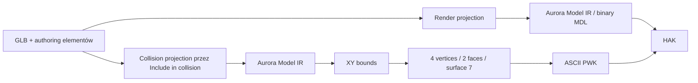

# Audyt edytowalnego footprintu PWK dla Placeable

Data: 2026-07-31
Status: `IMPLEMENTED_OFFLINE / VERIFIED / OWNER_RUNTIME_PROOF_PENDING`

Sekcje 1–11 zachowują stan audytu i plan sprzed implementacji. Sekcja 12
zawiera wynik realizacji oraz aktualny stan kryteriów ukończenia.

## 1. Decyzja

Opcja rysowania powierzchni blokującej jest możliwa i pasuje do istniejącej
architektury, ale obecnie nie istnieje w produkcie. Aktualny pipeline generuje
wyłącznie automatyczny prostokąt obejmujący rzut geometrii kolizji na
płaszczyznę XY Aurory.

Pierwsza wersja funkcji powinna dostarczyć dwa tryby:

1. `AUTO_RECTANGLE` — obecne zachowanie i bezpieczny domyślny fallback;
2. `CUSTOM_POLYGON` — jeden prosty, ręcznie edytowany wielokąt bez otworów.

`CONVEX_HULL`, wiele rozłącznych wysp, otwory oraz walkable pokład nie należą
do pierwszego zakresu. Convex hull jest rozsądnym kolejnym rozszerzeniem, ale
nie powinien blokować dostarczenia ręcznego obrysu.

Najważniejsza zasada: viewport nie może samodzielnie odtwarzać algorytmu PWK.
Core Rust ma rozwiązać i zwrócić dokładnie ten footprint, który następnie
zostanie zapisany do HAK. UI pokazuje wynik core, a build wymaga zgodności
hasha source, authoringu i resolved footprintu.

## 2. Zakres

Zakres obejmuje statyczny Placeable:

- wybór automatycznego albo ręcznego footprintu;
- rysowanie i edycję punktów w ortograficznym widoku Top;
- podgląd dokładnej powierzchni `Nonwalk` przed buildem;
- zapis tego samego obrysu do ASCII PWK Resource Type `2053`;
- raport, readback, testy offline i osobny owner proof w NWN.

Poza zakresem pierwszej wersji pozostają:

- tworzenie walkable powierzchni pokładu — to wymaga Area/Tile WOK, a nie
  blokującego PWK placeable'a;
- use nodes i interakcje;
- dynamiczne przesuwanie placeable'a skryptem podczas runtime;
- wielokąty z otworami, wiele wysp i nakładające się footprinty;
- edycja render mesh na poziomie vertex/edge/face;
- automatyczne generowanie kolizji 3D.

## 3. Fakty z audytu

### 3.1. Fakty formatu i runtime

`DECOMP_FACT / RETAIL_FACT`

- PWK statycznego placeable'a jest tekstowym zasobem typu `2053`.
- Loader `CNWPlaceableSurfaceMesh::LoadWalkMesh` konsumuje między innymi
  rekordy `node`, `position`, `orientation`, `verts`, `faces` i `endnode`.
- Retailowe statyczne footprinty używają płaskiego `trimesh` i powierzchni
  `7 = Nonwalk`.
- PWK ma ten sam bazowy resref co render MDL. Pozycja i bearing instancji
  placeable'a wiążą oba zasoby w Area.
- Use dummy są oddzielnym mechanizmem interakcji i nie są potrzebne do samego
  blokowania ruchu.

Źródło istniejących ustaleń:
`documentation/audyt-placeable-widocznosc-aurora-nwn-plan-implementacji-2026-07-25.md`.

### 3.2. Fakty aktualnej implementacji

`PROJECT_FACT`

- `PlaceableAuthoringDocumentV1` przechowuje tylko elementy, ich transformacje
  i flagi. Nie ma pola opisującego footprint.
- `Include in collision` pozwala wybrać elementy zasilające projekcję kolizji.
- Core tworzy osobny collision projection z tego samego authoring documentu,
  a następnie konwertuje go tym samym profilem co model renderowany.
- `derive_placeable_walkmesh_ir_v1` redukuje wynik do `world_xy_bounds` i zawsze
  tworzy cztery wierzchołki oraz dwa trójkąty na `Z=0`.
- Writer i reader ASCII PWK są już oddzielone od binary MDL i sprawdzają
  semantykę `surface_id = 7`.
- PWK trafia do HAK pod tym samym resrefem co MDL.
- UI Placeable Authoring ma perspektywiczną kamerę, grid, gizmo transformacji,
  undo/redo i flagę `Include in collision`.
- UI nie ma kamery Top, warstwy PWK, trybu rysowania ani tabeli punktów.
- Worker nie ma komendy resolve/preview footprintu. Wynik builda zwraca HAK,
  MDL i MOD, ale nie wystawia osobnego payloadu PWK do inspekcji w Studio.
- Report zapisuje hash PWK i ogólny status kolizji, lecz nie zapisuje trybu,
  wejściowych punktów, resolved punktów ani hasha footprintu.
- Obecny ASCII PWK ma zielony writer/readback offline, ale jego zachowanie
  kolizyjne nadal wymaga candidate-bound owner proof w NWN.

### 3.3. Potwierdzony baseline testów

Uruchomiono 2026-07-31:

- `cargo test -p m2a-core --test placeable_collision --test placeable_pipeline`
  — `17 passed`, `1 ignored`, `0 failed`;
- cztery test suites Studio dotyczące authoringu/viewportu/diagnostyki —
  `13 passed`, `0 failed`;
- `npm run typecheck` dla `apps/studio-web` — PASS.

Baseline potwierdza obecny prostokątny kontrakt. Nie jest dowodem istnienia
ani poprawności ręcznego footprintu.

## 4. Obecny przepływ



Wąskim gardłem nie jest serializer PWK. Problemem jest brak domenowego
footprintu przed serializerem oraz brak publicznego resolvera dla UI.

## 5. Luki i ryzyka

| Priorytet | Luka | Skutek |
|---|---|---|
| P0 | Brak wersjonowanego collision spec | Nie można zapisać intencji użytkownika ani związać jej z buildem. |
| P0 | Generator zawsze redukuje geometrię do AABB | Duże i wklęsłe obiekty blokują pustą przestrzeń. |
| P0 | Brak resolvera preview | UI musiałoby zgadywać wynik core, co grozi rozjazdem viewport–PWK. |
| P0 | Brak walidacji prostego wielokąta | Samoprzecięcia lub zdegenerowane obrysy mogłyby wejść do HAK. |
| P1 | Brak Top/orthographic i narzędzia punktów | Nie da się wygodnie ani jednoznacznie narysować obrysu. |
| P1 | Brak revision/hash gate | Stary preview może zostać zbudowany po nowszej edycji. |
| P1 | Brak resolved footprintu w raporcie | Audyt i reprodukcja builda są niepełne. |
| P1 | Brak osobnego artefaktu PWK w wyniku Studio | Użytkownik nie może łatwo sprawdzić dokładnego payloadu. |
| P1 | Brak runtime proofu custom polygon | Zielone testy offline nie potwierdzają blokowania w NWN. |
| P2 | Edycja tylko myszą byłaby niedostępna | Funkcja musi mieć równoważną tabelę współrzędnych i obsługę klawiatury. |

Największym ryzykiem technicznym jest transformacja współrzędnych. Viewport
Three.js pracuje na źródłowej płaszczyźnie gruntu XZ, a PWK Aurory na XY.
Konwersja basis, skala oraz wyrównanie do podłoża muszą być wykonane raz w
core i użyte zarówno przez resolve preview, jak i finalny build.

## 6. Docelowy kontrakt

Nowa wersja dokumentu authoringu powinna zachować elementy V1 i dodać jawny
collision spec. Stare entrypointy oraz semantyka V1 pozostają bez zmian.

Proponowany kontrakt:

```json
{
  "schemaVersion": 2,
  "sourceSha256": "...",
  "elements": [],
  "collision": {
    "schemaVersion": 1,
    "mode": "CUSTOM_POLYGON",
    "coordinateSpace": "GLTF_SOURCE_XZ_METERS",
    "paddingMeters": 0,
    "vertices": [
      [-2.5, -1.0],
      [2.5, -1.0],
      [2.0, 1.2],
      [-2.0, 1.2]
    ]
  }
}
```

Reguły:

- `AUTO_RECTANGLE` wymaga pustego `vertices` i używa elementów
  `Include in collision`;
- `CUSTOM_POLYGON` wymaga `3..=64` punktów;
- punkty custom są zapisane w metrach na source/authored ground plane XZ;
- `paddingMeters` w pierwszej wersji działa tylko dla `AUTO_RECTANGLE`;
- custom polygon pozostaje dokładną intencją użytkownika — transformacje
  elementów po jego utworzeniu nie deformują go automatycznie; UI pokazuje
  ostrzeżenie i akcję `Regenerate from collision elements`;
- po resolve core zwraca punkty w `AURORA_XY_METERS`, trójkąty, bounds,
  surface ID, canonical collision hash i authoring hash;
- pozycja/bearing instancji Area nie są zapisywane w punktach. Runtime stosuje
  placement placeable'a do powiązanego MDL/PWK.

Proponowany resolved report:

```json
{
  "schemaVersion": 1,
  "mode": "CUSTOM_POLYGON",
  "sourceSha256": "...",
  "authoringSha256": "...",
  "collisionSha256": "...",
  "coordinateSpace": "AURORA_XY_METERS",
  "vertices": [[-2.5, -1.0], [2.5, -1.0], [2.0, 1.2], [-2.0, 1.2]],
  "triangles": [[0, 1, 2], [0, 2, 3]],
  "boundsMin": [-2.5, -1.0],
  "boundsMax": [2.5, 1.2],
  "surfaceId": 7,
  "warnings": []
}
```

## 7. Walidacja i deterministyczność

Core odrzuca build nazwanym błędem, gdy:

- schema version, mode albo coordinate space są nieobsługiwane;
- dowolna współrzędna lub padding jest NaN/Infinity;
- custom polygon ma mniej niż 3 lub więcej niż 64 punkty;
- punkty kolejne albo pierwszy/ostatni duplikują się w tolerancji kontraktu;
- pole wielokąta jest zerowe lub zbyt małe;
- krawędzie przecinają się poza wspólnymi końcami;
- triangulacja nie obejmuje całego wielokąta;
- resolved footprint wychodzi poza limity formatu lub bezpieczny zakres
  liczbowy produktu;
- source, authoring albo collision hash nie odpowiada bieżącej rewizji;
- readback PWK różni się od resolved reportu.

Deterministyczna kanonizacja:

1. usunięcie wyłącznie jawnie dozwolonego domknięcia `last == first`;
2. normalizacja windingu do jednego kierunku;
3. rotacja listy tak, aby zaczynała się od stabilnego leksykograficznego
   minimum;
4. deterministyczna triangulacja ear-clipping dla prostego wielokąta;
5. wszystkie faces otrzymują `surface_id = 7` i `Z=0`;
6. identyczny input daje byte-identical PWK oraz identyczny collision hash.

## 8. Docelowy UX

Panel powinien nazywać funkcję `Blocking footprint (PWK)`.

Wymagane elementy:

- wybór `Auto rectangle` / `Custom polygon`;
- przełącznik `Show PWK`, domyślnie włączony podczas edycji Collision;
- przycisk `Top`, przełączający na ortograficzną kamerę prostopadłą do gruntu;
- `Draw polygon`, kliknięcie kolejnych punktów i jawne `Close polygon`;
- wybór i przeciąganie punktu wyłącznie po płaszczyźnie gruntu;
- `Add point`, `Delete point`, `Reset`, `Regenerate from collision elements`;
- tabela punktów z X/Z w metrach, dostępna bez myszy;
- półprzezroczyste wypełnienie, kontur i hatch; sam kolor nie wystarcza;
- widoczne `surface 7 · Nonwalk`, liczba punktów i liczba trójkątów;
- błędy samoprzecięcia pokazane na konkretnych krawędziach i w panelu;
- undo/redo: całe zakończone przeciągnięcie punktu jest jednym wpisem;
- Escape anuluje draft, Enter/blur zatwierdza pole numeryczne;
- Build jest zablokowany, dopóki ostatni core resolve nie odpowiada bieżącemu
  authoring hash.

Podczas przeciągania UI może pokazywać draft lokalnie dla płynności. Po
`pointerup` musi wykonać core resolve i zastąpić draft wynikiem core. Finalny
build nigdy nie korzysta z lokalnej triangulacji TypeScript.

## 9. Plan implementacji

### P0 — testy kontraktu przed implementacją

- Dodać fixture prostokąta, wielokąta wklęsłego oraz wielokąta z
  samoprzecięciem.
- Zapisać golden obecnego V1 `AUTO_RECTANGLE`, aby nowa wersja z paddingiem
  zero dawała byte-identical PWK.
- Dodać testy negatywne schema, finite, duplicate, area i intersection.
- Zamrozić nazwy błędów oraz limity `3..=64`.

### P1 — domena i resolver w Rust

- Dodać `PlaceableAuthoringDocumentV2`, `PlaceableCollisionSpecV1` oraz
  `ResolvedPlaceableFootprintV1`.
- Zachować V1 i jego dotychczasowe entrypointy bez zmiany semantyki.
- Udostępnić exact transform source XZ → Aurora XY używany przez Profile A.
- Zaimplementować resolve dla `AUTO_RECTANGLE` i `CUSTOM_POLYGON`.
- Zaimplementować walidację, kanonizację i deterministyczny ear clipping.
- Refaktoryzować generator tak, aby ASCII writer przyjmował resolved footprint,
  zamiast zawsze wywoływać `world_xy_bounds`.
- Rozdzielić gate pustej kolizji:
  - auto rectangle wymaga co najmniej jednego elementu collision;
  - custom polygon wymaga poprawnego polygonu, niezależnie od flag elementów.
- Rozszerzyć report o mode, punkty wejściowe/wyjściowe, bounds, counts i hash.

### P2 — granica WASM i Worker

- Dodać nowe wersjonowane inspect/resolve/build entrypointy; nie zmieniać V1–V3
  w miejscu.
- Dodać `RESOLVE_PLACEABLE_COLLISION` z request ID, source revision i
  authoring revision.
- Odrzucać stale response po zmianie GLB albo authoringu.
- Zwracać resolved footprint JSON do viewportu.
- W wyniku builda wystawić dokładny PWK jako osobny artefakt oraz zachować go
  w HAK pod tym samym resrefem co MDL.

### P3 — stan edytora

- Rozszerzyć typy i reducer o collision spec oraz draft punktu.
- Dodać akcje mode/show/start/add/move/delete/close/reset/regenerate.
- Włączyć collision w authoring hash i build identity.
- Zachować source inspection podczas edycji; unieważniać wyłącznie resolve,
  build, result i downloads.
- Objąć punkty istniejącym undo/redo i resetem.

### P4 — viewport i panel Collision

- Dodać ortograficzny Top view oraz poprawne mapowanie pointera na source XZ.
- Dodać warstwę footprintu opartą na resolved report core.
- Dodać narzędzie rysowania i uchwyty punktów bez konfliktu z TransformControls.
- Dodać tabelę współrzędnych, komunikaty walidacji i dostępność klawiaturą.
- Pokazać auto rectangle od razu po inspekcji source.
- W custom mode zachować ręczny obrys po zmianie geometrii, ale oznaczyć go
  jako wymagający ponownego resolve i pokazać ostrzeżenie o możliwym rozjeździe.

### P5 — integracja build/report

- Powiązać finalny build z exact source/authoring/collision hashes.
- Wymagać semantycznej zgodności resolved report ↔ ASCII PWK readback ↔ HAK.
- Pokazać w Review mode, bounds, punkty, surface ID i PWK hash.
- Dodać plik sidecar authoringu do wyników, aby build był reprodukowalny.

### P6 — weryfikacja i owner proof

- Uruchomić pełne testy Rust, WASM, Worker, React, typecheck i build Studio.
- Przygotować jeden dokładny MOD/HAK z prostym modelem oraz wyraźnie wklęsłym
  footprintem, np. kształtem L.
- Umieścić dwie instancje tego samego placeable'a w różnych pozycjach i z
  różnym bearingiem, bez tworzenia drugiej tożsamości modelu.
- Zamrozić hashe, zainstalować artefakty tylko zgodnie z aktualną polityką
  owner-proof i przekazać exact handoff.
- Właściciel potwierdza w NWN, że część wypełniona blokuje, wycięcie pozostaje
  dostępne, a footprint podąża za pozycją i bearingiem instancji.

### P7 — rozszerzenie po MVP

- Dodać `CONVEX_HULL` w nowej wersji kontraktu.
- Rozważyć wiele wysp i otwory dopiero po oddzielnym audycie parsera/runtime.
- Nie łączyć tego rozszerzenia z walkable pokładem; Tile/Area WOK pozostaje
  osobnym profilem produktu.

## 10. Kryteria ukończenia

### 10.1. Kontrakt i kompatybilność

- [ ] Stare API V1–V3 oraz legacy authoring generują ten sam prostokątny PWK.
- [ ] Nowy dokument jest versioned, strict i source-SHA-bound.
- [ ] `AUTO_RECTANGLE` z paddingiem `0` jest byte-identical z golden V1.
- [ ] `CUSTOM_POLYGON` jest częścią canonical authoring hash i build identity.
- [ ] Nieznane pola, enumy i wersje są odrzucane nazwanym błędem.

### 10.2. Geometria i PWK

- [ ] Można zapisać jeden prosty polygon `3..=64` punktów.
- [ ] Polygon wklęsły jest deterministycznie triangulowany bez wypełniania
  jego wycięcia.
- [ ] Samoprzecięcia, duplikaty, zero-area i wartości niefinitywne blokują build.
- [ ] Każdy wynikowy vertex PWK ma `Z=0`, a każdy face `surface_id=7`.
- [ ] Readback ma te same kanoniczne punkty, faces i bounds co resolved report.
- [ ] Identyczny input daje identyczny collision hash i byte-identical PWK.
- [ ] MDL i PWK używają tego samego bazowego resrefu w HAK.

### 10.3. Parytet transformacji

- [ ] Ten sam core transform przenosi source/authored XZ do Aurora XY dla
  preview i builda.
- [ ] Scale, rotation, grounding i element authoring nie powodują rozjazdu
  render bounds–PWK.
- [ ] Tolerancja porównania preview/report/readback jest jawna i testowana.
- [ ] Zmiana placementu Area nie zmienia payloadu PWK; pozycja i bearing są
  stosowane do całej instancji przez runtime.

### 10.4. UX

- [ ] Użytkownik przełącza `Auto rectangle` / `Custom polygon`.
- [ ] Użytkownik widzi dokładny resolved PWK przed Build.
- [ ] Użytkownik może utworzyć, zamknąć, przesunąć, dodać i usunąć punkt.
- [ ] Wszystkie operacje są dostępne także przez tabelę i klawiaturę.
- [ ] Top view jest ortograficzny i zachowuje stałą skalę osi.
- [ ] Jeden drag daje jeden wpis undo; Escape przywraca poprzedni stan.
- [ ] Build jest niemożliwy przy błędzie albo stale resolved revision.
- [ ] Status nie jest komunikowany wyłącznie kolorem.

### 10.5. Raport i artefakty

- [ ] Review pokazuje mode, source/authoring/collision hashes, punkty, bounds,
  liczbę faces oraz `surface 7`.
- [ ] Studio udostępnia dokładny `.pwk` jako artefakt i ten sam payload znajduje
  się w HAK.
- [ ] Sidecar authoringu pozwala odtworzyć byte-identical build z tym samym GLB
  i `placeables.2da`.
- [ ] Offline status nie jest przedstawiany jako runtime proof.

### 10.6. Testy

- [ ] Rust unit: walidacja, kanonizacja, winding i triangulacja.
- [ ] Rust property/negative: self-intersection, duplicate, area, finite i limit.
- [ ] Rust integration: V1 parity oraz custom polygon → PWK → HAK readback.
- [ ] WASM: strict V2 JSON, deterministic resolved report i błędy domenowe.
- [ ] Worker: stale response i revision/hash binding.
- [ ] Reducer: draw/edit/reset/undo/redo oraz invalidation builda.
- [ ] React: tryby, Top view, pointer editing i numeric editing.
- [ ] Accessibility: pełna ścieżka bez myszy i widoczny focus.
- [ ] Studio typecheck, testy i production build przechodzą bez błędów.

### 10.7. Proof końcowy

- [ ] Exact MOD/HAK/PWK/MDL oraz sidecar mają zapisane SHA-256.
- [ ] Handoff podaje dokładny MOD, module name, Area, HAK, appearance row,
  obiekt, placement i bearing.
- [ ] Właściciel potwierdza w NWN blokowanie wewnątrz custom footprintu.
- [ ] Właściciel potwierdza możliwość wejścia w wycięcie polygonu wklęsłego.
- [ ] Druga instancja potwierdza, że footprint podąża za pozycją i bearingiem.
- [ ] Toolset i NWN mają osobne osie `modelVisibility`, `proofCompleteness` oraz
  `collisionRuntimeVerdict`.

Agent-side granicą jest `ready_for_owner_proof`. Pełny stan
`RUNTIME_PROVED` może zostać zapisany dopiero po świeżym, exact-candidate
wyniku właściciela w NWN.

## 11. Minimalna kolejność dostarczenia

Najmniejszy wartościowy vertical slice to:

1. V2 contract i Rust resolver;
2. custom polygon z walidacją i deterministyczną triangulacją;
3. worker resolve i resolved report;
4. Top view, overlay, rysowanie oraz tabela punktów;
5. build/hash/readback parity;
6. owner runtime proof na wklęsłym footprintcie.

Nie należy rozpoczynać od samego canvasowego narzędzia rysowania. Bez
wcześniejszego kontraktu i resolvera core powstałby drugi, nieautorytatywny
algorytm kolizji w TypeScript.

## 12. Wynik implementacji 2026-07-31

Zrealizowano kompletny vertical slice offline dla jednego prostego footprintu
Placeable:

- strict `PlaceableAuthoringDocumentV2` z `AUTO_RECTANGLE` i
  `CUSTOM_POLYGON` w źródłowym układzie XZ;
- zachowane entrypointy V1–V3 oraz nowy inspect V3, resolver V1 i build V4;
- walidacja `3..=64`, finite, duplikatów, pola i samoprzecięć;
- deterministyczna kanonizacja i ear clipping polygonu wklęsłego;
- wspólny transform Profile A source XZ → Aurora XY dla preview i builda;
- resolved report z input/source/output vertices, faces, bounds, surface `7`,
  authoring hash, collision hash i PWK hash;
- dokładny ASCII PWK w HAK oraz jako osobny artefakt Studio;
- sidecar `placeable-authoring-v2.json` do reprodukcji builda;
- Worker `RESOLVE_PLACEABLE_COLLISION` z odrzucaniem odpowiedzi dla
  nieaktualnego dokumentu;
- blokada Build, gdy bieżący dokument nie ma poprawnego resolved preview;
- panel `Blocking footprint (PWK)`, tryb Top orthographic, `Show PWK`, rysowanie,
  przeciąganie uchwytów, Finish/Escape/Enter, tabela X/Z, delete, clear, reset do
  Auto oraz undo/redo;
- dokładne wypełnienie i krawędzie resolved triangulation z Core; lokalny draft
  jest pokazywany wyłącznie jako przerywany kontur podczas oczekiwania na Core;
- Review pokazuje mode, counts, surface, bounds i source/authoring/collision/PWK
  hashes.

### 12.1. Kryteria spełnione offline

- [x] Wersjonowany, strict i source-bound kontrakt V2.
- [x] Legacy V1–V3 pozostają osobnymi, niezmienionymi entrypointami.
- [x] Prosty polygon `3..=64`, w tym polygon wklęsły bez wypełnienia wycięcia.
- [x] Named failure dla samoprzecięć, duplikatów, zero-area i non-finite.
- [x] Każdy wynikowy vertex PWK ma `Z=0`, a face `surface_id=7`.
- [x] Resolver i finalny build zwracają identyczny raport i PWK hash dla tego
  samego resrefu, source, authoringu i opcji.
- [x] MDL i PWK mają ten sam bazowy resref w HAK.
- [x] Preview używa resolved triangulation z Core, nie lokalnej triangulacji
  TypeScript.
- [x] Auto/Custom, Top, Show PWK, draw/move/delete, tabela i undo/redo są
  dostępne w Studio.
- [x] Stary albo błędny resolved preview blokuje Build.
- [x] Osobny `.pwk`, authoring sidecar oraz rozszerzony Review są dostępne.
- [x] Status offline nie jest przedstawiany jako runtime proof.

### 12.2. Dowody testowe

Uruchomiono na kanonicznym workspace:

- `cargo test -p m2a-core --test placeable_collision --test placeable_pipeline`
  — `21 passed`, `1 ignored`, `0 failed`;
- ukierunkowany test natywnej granicy WASM V4/resolver/PWK — PASS;
- `npm --prefix apps/studio-web run typecheck` — PASS;
- pełne testy Studio — `238 passed`, `0 failed`;
- real WASM Worker integration — `9 passed`, `2 skipped`, `0 failed`;
- production build Vite/WASM — PASS;
- świeży serwer kanonicznej aplikacji na `http://127.0.0.1:5179/` — render
  strony startowej potwierdzony bez nowego błędu modułów.

### 12.3. Świadomie niezakończone

- Owner runtime proof w Toolset/NWN pozostaje niewykonany zgodnie z zasadą
  `Human-owned final proof`; agent nie uruchamiał Toolset ani NWN.
- Wiele wysp, holes, convex hull i walkable deck pozostają poza MVP.
- Pełne wskazanie przecinających się krawędzi bezpośrednio na canvasie oraz
  property-based fuzzing są dalszym utwardzeniem, nie blokują obecnego strict
  fail-closed builda.

Granica agent-side to obecnie `IMPLEMENTED_OFFLINE / VERIFIED`. Stan
`RUNTIME_PROVED` wymaga świeżego wyniku właściciela dla dokładnego kandydata
MOD/HAK/PWK/MDL.
