# Audyt pełnego pipeline'u generowania Item z Meshy

## Amendment 2026-08-03 — Item Properties axis i item-only MOD

Wynik właściciela dla dokładnego V3 wykazał, że historyczny fitter składał party ModelType 2 w `+Z`, przez co miecz leżał w `Item Properties`. Obowiązujący produktowy kontrakt został zastąpiony przez `ORDERED_SLOT_AXIAL_ENVELOPE_SEAM_GATE_V2_AURORA_Y`; `V1` pozostaje wyłącznie do odtworzenia zamrożonego V3.

Dla ModelType 2 Build wymaga teraz raportu fit z `axialTargetAxis=1`, a Worker porównuje obwiednię każdego zapisanego binarnego MDL z obwiednią kontraktu przez `BINARY_MDL_BOUNDS_MATCH_FIT_V1`. Ręczna rotacja placementu w Area nie spełnia tej bramki.

Standardowy proof MOD ModelType 2 ma profil `ITEM_ONLY_GROUND_ITEM_V1`: dokładnie jeden item, zero creature i zero UTC. Equipped proof pozostaje osobną ścieżką dla CAPART armor oraz cloak.

Status: `IMPLEMENTED_OFFLINE_ITEM_SCOPE / V3_MODEL_COLOR_CANDIDATE_FROZEN / READY_FOR_OWNER_PROOF`

V3 freeze amendment (2026-08-03): exact `m2atgls3.mod` and
`m2atglh3.hak` were generated by the product model/color route after the owner
reported V2 as `modelVisibility=not_visible`. V3 uses a real identified Item
UTI with selected values `23/63/23`, packages the complete 12-colorway
MDL/TGA/icon matrix, applies explicit proportions `0.22/0.08/0.90`, and keeps
the placed Item separate from the equipped-render witness. The installed files
are byte-identical to the canonical frozen artifacts; visual proof remains
owner-owned and not yet tested.

Data: 2026-08-02

Branch/worktree:

- branch: `items`;
- worktree: `C:\Projects\meshy2aurora\.worktrees\items`.

## Amendment 2026-08-03 — ModelType 2 model/color pipeline

Ponowny audyt dekompilacji Aurora wykazał, że każdy z trzech partów ModelType 2
ma dwa niezależne selektory UI, ale jeden zakodowany BYTE w UTI:

```text
encodedValue = model * 10 + color
color = 1..4
model = 0..25 (z kontrolą encodedValue <= 255)
```

`colorFields=[]` dla ModelType 2 oznacza brak sześciu pól
`Leather/Cloth/Metal`, a nie brak kolorów weapon partów. Implementacja została
poprawiona zgodnie z tym kontraktem:

- Core, WASM i TypeScript mają jawne encode/decode i odrzucają końcówki
  `0` oraz `5..9`;
- UI nie pokazuje już dowolnego `Numeric variant (BYTE)` dla ModelType 2;
  każdy Bottom/Middle/Top ma osobne kontrolki `Model` i `Color 1..4`;
- namespace allocator rezerwuje atomowo cały zestaw 3 × 4 zasobów; kolizja
  jednego elementu przesuwa całą grupę modelową, bez częściowej rezerwacji;
- każdy z trzech GLB Meshy jest konwertowany do czterech konkretnych wariantów
  MDL, TGA i ikony. Geometria jest współdzielona, ale tekstury są realnymi,
  różnymi zasobami direct-color: source, cool steel, bronze i blackened steel;
- podgląd Three.js stosuje te same mnożniki colorway co writer TGA;
- PLT jest ukryte w UI i blokowane w Workerze dla ModelType 2, ponieważ ten
  profil nie serializuje samodzielnych pól palette color;
- raport buildu zapisuje `weaponColorwayCoverage` i wymaga `12/12` dla układu
  Bottom/Middle/Top;
- auto-fit przyjmuje jawny axial-length contract per ordered slot. Domyślny
  kontrakt pozostaje `0.30 / 0.10 / 0.60`, lecz użytkownik może zmienić długość
  rękojeści, łącznika i ostrza, po czym ponownie uruchomić autorytatywny seam gate.

Weryfikacja 2026-08-03:

- `cargo test -p m2a-core --test item`: 34/34 PASS;
- Studio domain/UI/colorway: 11/11 PASS;
- Item browser Worker/WASM: 2/2 PASS, w tym 12 MDL, 12 różnych TGA,
  12 ikon, kompletna matryca i negatywne bramki coverage/PLT;
- `npm run typecheck`: PASS;
- `cargo check -p m2a-wasm`: PASS.

Ta implementacja zmienia kod produktu i testy, ale nie tworzy nowego modelu,
resrefu, HAK ani MOD. Zamrożony kandydat V2 pozostaje niezmieniony. Nowa linia
proof może zostać zmaterializowana dopiero po spełnieniu model iteration gate;
końcowy proof wizualny pozostaje własnością właściciela.

## 0. Wynik implementacji z 2026-08-02

Stan opisany w pierwotnym werdykcie audytu został zastąpiony implementacją
jednego przypadku domenowego `Item`. Produkt nie wprowadza kategorii `Weapon`
ani `Shield`: `baseitems.2da`, `BaseItem` i `ModelType` nadal wyznaczają dokładne
sloty, ich kolejność oraz to, czy źródłem jest Meshy GLB, CAPART albo Cloak.

| Cel | Wynik implementacji |
|---|---|
| IPG-0 | `ItemGenerationSessionV1` wiąże BaseItem, koncept, review, run/task, koszt, artifact, fit i akceptację buildu. Sidecar ma ścisły, wersjonowany kontrakt bez nieznanych pól. |
| IPG-1 | Osobny panel `Item generation` działa wewnątrz Item Source i przypisuje wynik bezpośrednio do właściwego `ModelPart*`. Profile retail z 0 GLB nie dostają fałszywej generacji. |
| IPG-2 | Wszystkie niedokończone party przechodzą jedno zbiorcze review; suma jest blokowana przez saldo i jawny owner cap przed utworzeniem pierwszego płatnego taska. Sukces wcześniejszych partów pozostaje zachowany. Stabilny nonce slotu powoduje idempotentny replay tego samego runu po utracie odpowiedzi. |
| IPG-3 | Local Bridge odzyskuje dokładny task Image-to-3D przez jego ID oraz weryfikuje typ, status, GLB, SHA-256 i provenance. Recovery wykonuje tylko GET i nie tworzy kolejnego płatnego taska. Nietajny JSON sidecar można pobrać/odtworzyć, a bieżąca sesja jest zapisana w local storage; po restarcie exact task można odzyskać lub ponownie pobrać. |
| IPG-4 | Granica auto-fitu używa Item-specific intake Core: statyczna triangulowana geometria, normalne, UV, materiał, tekstura i wspólny limit 300 000 trójkątów są sprawdzane przed montażem. |
| IPG-5 | Deterministyczny solver dla 1 albo 3 uporządkowanych slotów ustala wspólną oś, dodatnią skalę jednostajną, pozycję partów oraz wymaga przejścia autorytatywnego seam gate BVH. |
| IPG-6 | Preview i writer używają tego samego dokładnego quaternionu `rotationXyzw`, skali i translacji. Zmiana źródła, sourceNode albo transformu unieważnia poprzedni fit. |
| IPG-7 | Worker odrzuca sesję, GLB albo fit po zmianie hash/slot/task/BaseItem/transform. Raport zawiera koszty, concept/task/GLB hashes, fit i seam lineage bez signed URL ani credentiali. |
| IPG-8 | Build emituje dwa jawne zestawy: runtime HAK/MOD/UTI/MDL/tekstury/ikony/raport oraz dokładne źródłowe GLB-y z deterministycznym `manifest.yaml` w schemacie `meshy2aurora.sample-3d/v1`. GLB-y nie trafiają do HAK ani automatycznie do repo. |
| IPG-9 | Testy domeny, Bridge, UI, Worker/WASM, realnego corpusu długiego miecza, typecheck i build produkcyjny są wykonane bez utworzenia nowego płatnego taska. Granica wizualna pozostaje własnością właściciela. |

Realny env-gated corpus `sample-3d/tlc-guard-longsword-parts-v1` przeszedł
auto-fit i seam qualification dla dokładnych trzech hashy zapisanych w jego
manifeście. Deterministyczny wynik ma:

```text
algorithm:       ORDERED_SLOT_AXIAL_ENVELOPE_SEAM_GATE_V1
tolerance:       0.01
solution_sha256: e88556ddcd24d665f3f9d36ae1d6e75a0bcc973d9d7d7fe9e494a43c08f49bde
status:          PASSED
```

Weryfikacja wykonana 2026-08-02:

- `assert-canonical-workspace.ps1`: PASS;
- `assert-meshy-asset-layout.ps1`: PASS;
- `cargo test -p m2a-core --test item`: 28/28 PASS, w tym pełna materializacja
  realnych trzech GLB-ów po auto-fit bez utraty geometrii;
- Local Bridge: 21/21 PASS;
- Studio unit/UI: 238 PASS, 1 SKIP;
- Item browser Worker/WASM: 2/2 PASS, w tym source bundle i negatywne tamper tests;
- `npm run typecheck`: PASS;
- `npm run build`: PASS.

Pełne, niezwiązane z Item `cargo test -p m2a-wasm` ma 32/34 PASS. Dwa testy
proceduralnego Creature H2 nie startują, ponieważ lokalny Git-ignored
`sample-3d/h2-clockwork-sentinel-1500/source.glb` nie istnieje w tym checkoutcie.
Ten sam brak blokuje import dwóch niezwiązanych suite'ów w pełnym
`test:worker-integration`; suite Item przechodzi. Nie podstawiono innego modelu,
bo naruszyłoby to kanoniczne provenance H2.

Po pełnym teście realnego korpusu zamrożono osobny pierwszy kandydat assetu
`tlc-guard-longsword-v1-20260802`. Item writer używa dokładnych skończonych
face-plane'ów MDL, dlatego wszystkie `16 356` poprawnych trójkątów przeszło do
trzech MDL; usunięto `0`. Exact `m2atgls1.mod` i `m2atglh1.hak` zostały
zainstalowane jako nowe cele, a hashe źródła i natywnej kopii są identyczne.
Status wynosi `ready_for_owner_proof`, lecz nadal nie deklaruje
`modelVisibility=visible` ani runtime parity. Aurora Toolset ani NWN nie były
uruchamiane; wizualny proof dokładnego kandydata pozostaje własnością właściciela.

## 1. Werdykt audytu przed implementacją

Pełny pipeline jeszcze nie istnieje jako jeden przebieg produktu. Istnieją i są
przetestowane dwie niezależne części:

1. Meshy Lab/Local Bridge potrafi utworzyć i zweryfikować jeden statyczny GLB
   z obrazu;
2. Item Workflow potrafi przyjąć wymagane GLB-y, złożyć receptę Item, sprawdzić
   seam, zapisać MDL/tekstury/ikony/UTI oraz spakować HAK i testowy MOD.

Brakującym elementem jest Item-aware orchestration łącząca obie części. Dzisiaj
operator musi osobno wygenerować każdy GLB, pobrać go i ręcznie wskazać w polu
`ModelPart*`. Nie ma jednego trwałego stanu, który wiąże BaseItem, slot, koncept,
limit kredytów, task Meshy, wynik GLB, transform, seam oraz końcowe artefakty.

Wniosek implementacyjny: nie należy pisać nowego konwertera Item ani drugiego
klienta Meshy. Należy połączyć istniejące kontrakty przez wersjonowaną sesję
generowania Item i uzupełnić recovery, automatyczne przypisanie oraz fit partów.

## 2. Definicja pełnego pipeline'u

W tym dokumencie „pełny pipeline generowania” oznacza:

```mermaid
flowchart LR
    A["baseitems.2da + wybór BaseItem"] --> B["Resolver ModelType i dokładnych slotów"]
    B --> C["Koncept przypisany do każdego slotu MESHY_GLB"]
    C --> D["Jedno zbiorcze review kosztu i ustawień"]
    D --> E["Kontrolowane taski Meshy bez ukrytych retry"]
    E --> F["Recovery i weryfikacja dokładnych GLB"]
    F --> G["Automatyczne przypisanie do ModelPart1/2/3"]
    G --> H["Normalizacja, auto-fit i podgląd złożenia"]
    H --> I["Autorytatywny seam gate na trójkątach"]
    I --> J["MDL + tekstury + ikony + UTI"]
    J --> K["HAK + testowy MOD + raport i provenance"]
    K --> L["Handoff do proofu właściciela"]
```



Pipeline nadal jest jednym przypadkiem domenowym `Item`. Nie powstaje podział
na `Weapon`, `Shield`, `Potion` ani inne ręczne rodziny. Jedynym źródłem schematu
jest:

```text
UTI.BaseItem -> drukowany wiersz baseitems.2da -> ModelType -> dokładne sloty
```

Dla istniejącego długiego miecza:

- `BaseItem=1`;
- `ModelType=2`;
- `ModelPart1` = Bottom;
- `ModelPart2` = Middle;
- `ModelPart3` = Top;
- wymagane są dokładnie trzy źródła Meshy GLB.

Ten zakres nie tworzy nowego wiersza `baseitems.2da`. Tabela jest wejściem
read-only, które rozstrzyga kontrakt. Tworzenie nowego BaseItem pozostaje osobnym
zakresem.

## 3. Stan obecny i dowody

| Etap | Stan | Dowód | Brak do pełnego pipeline'u |
|---|---|---|---|
| Resolver BaseItem | gotowy | `m2a-core/item.rs`, testy Item | brak |
| ModelType 0/1/2/3 i wyjątki retail | gotowy | macierz Item, retail conformance | brak |
| Image-to-3D | gotowy dla pojedynczego runu | Local Bridge + Meshy Lab | brak batcha Item |
| Review kosztu | gotowe dla pojedynczego runu | preview, saldo, nonce | brak sumy kosztu wszystkich partów |
| Recovery | częściowe | historia odzyskuje tylko Text-to-3D refine | brak recovery Image-to-3D po restarcie Bridge |
| Trwała sesja generowania | brak | runy są w pamięci `Map` procesu Bridge | brak state/lineage Item |
| Import wyniku | częściowy | Meshy Lab importuje jeden GLB do ogólnego Source | brak importu do konkretnego `ModelPart*` |
| Item Source | gotowy dla plików lokalnych | osobne file input dla każdego slotu | brak CTA `Generate with Meshy` przy slocie |
| Podgląd złożenia | gotowy | Three.js Composed/Exploded/Icon | brak początkowego auto-fit dla wyników Meshy |
| Transform partów | gotowy ręcznie | preview i writer używają wspólnego kontraktu | brak solvera proponującego transformy |
| Seam gate | gotowy | BVH, powierzchnie trójkątów, containment | wymaga poprawnych transformów wejściowych |
| GLB -> MDL/tekstura/ikona | gotowy | Item V2 + own readback | brak dodatkowego konwertera |
| UTI | gotowy | natywny UTI V3.2, semantic readback | powiązać generation provenance |
| HAK/MOD | gotowy | własne writery i readback | powiązać z dokładną sesją generowania |
| Proof runtime | otwarty | właściciel wykonuje proof | nowy miecz nie był testowany w Toolset/NWN |

### 3.1 Fakty z kodu produktu

- `App.tsx` zwraca `ItemWorkflow` natychmiast po wyborze targetu `ITEM`.
  Meshy Lab jest osadzony tylko w ogólnym workflow Source, więc nie może obecnie
  wstawić artefaktu do slotu Item.
- `MeshyLab.tsx` utrzymuje jeden `run` i wywołuje jedno ogólne `onImport`.
- `ItemWorkflow.tsx` wymaga lokalnego `File` dla każdego slotu `MESHY_GLB`.
- Local Bridge przechowuje `previews`, `runs` i nonce w pamięci procesu.
  Restart usuwa lokalny stan, choć zdalny task Meshy może nadal trwać i zużywać
  kredyty.
- Endpoint `/v1/history` i `recoverArtifact` obsługują obecnie tylko zakończony
  `text-to-3d-refine`; nie odzyskują `image-to-3d` po exact task ID.
- Worker Item już wykonuje autorytatywny seam gate, budowę V2 każdego partu,
  budżet 300 000 trójkątów, UTI, HAK, MOD i readback.
- UTI tworzony przez Studio ma `identified: true`.

### 3.2 Fakty z obecnego długiego miecza

Kanoniczna próbka:

`sample-3d/tlc-guard-longsword-parts-v1/manifest.yaml`

| Slot | Task Meshy | GLB SHA-256 | Trójkąty |
|---|---|---|---:|
| Bottom / ModelPart1 | `019fc24e-2b01-78b6-8edc-5b3c63758adf` | `01e554b8a59e934597540f9b1e4a697a2536356c0c60ebb0e5f8ad2067b79766` | 5 155 |
| Middle / ModelPart2 | `019fc250-9a9f-77f7-bd8d-db021fcc4877` | `6dae50bf1844d549c3e46c8a570258100ec14d04420bd333736854913af2b071` | 8 218 |
| Top / ModelPart3 | `019fc254-ed2e-79da-b404-ac85c9103a74` | `be226f1f891dfee517c221121289689cb21fed99bc41ec3b6e09e7611df15143` | 2 983 |

Łącznie źródła mają 16 356 trójkątów. Każdy GLB jest statyczny, ma jeden mesh,
jeden primitive, jeden materiał i cztery tekstury PBR. Układ próbki przechodzi
`assert-meshy-asset-layout.ps1`.

Każdy model został jednak znormalizowany przez Meshy niezależnie. Ich surowe
wymiary nie są wspólną przestrzenią montażową. Same poprawne pliki GLB nie są
dowodem, że po złożeniu powstaje poprawny długi miecz.

### 3.3 Świeży baseline testów z 2026-08-02

- Local Bridge: `19 PASS`;
- `cargo test -p m2a-core --test item`: `25 PASS`;
- `ItemWorkflow.test.tsx` + `MeshyLab.test.tsx`: `9 PASS`;
- TypeScript typecheck: `PASS`.

Baseline dowodzi poprawności istniejących połówek. Nie istnieje jeszcze test
obejmujący pełny przebieg od trzech konceptów do jednego pakietu Item.

## 4. Luki blokujące

### P0-1. Brak sesji generowania Item

Nie istnieje typ wiążący:

- hash `baseitems.2da` i drukowany BaseItem;
- wynik resolvera i ordered slot list;
- koncept i jego hash dla każdego slotu;
- zatwierdzone opcje oraz limit kredytów;
- lokalny run ID i exact Meshy task ID;
- status, zużyte kredyty, hash i rozmiar GLB;
- wybrany `sourceNode`, transform i wynik seam;
- resrefy oraz hash końcowego HAK/MOD/UTI.

Bez tego restart, częściowy sukces albo powrót do Item Workflow wymaga ręcznej
rekonstrukcji stanu i stwarza ryzyko duplikacji płatnego taska.

### P0-2. Brak zbiorczego review i idempotencji partów

Trzy osobne ekrany review nie pokazują maksymalnego kosztu całego itemu.
Pipeline musi pokazać koszt per slot i sumę, sprawdzić saldo oraz wymagać jednego
jawnego potwierdzenia planu. Każdy slot nadal otrzymuje osobny jednorazowy nonce.

Meshy API nie daje transakcji obejmującej trzy modele. UI nie może obiecywać
atomiczności. Po częściowym sukcesie zachowuje gotowe party i pozwala wznowić
wyłącznie brakujące/nieukończone sloty po ponownym review dodatkowego kosztu.

### P0-3. Brak recovery Image-to-3D

Po restarcie Bridge dokładny zdalny task Image-to-3D musi być odczytany przez
jego ID, bez utworzenia nowego taska. Recovery musi zweryfikować typ, status,
GLB, hash i zgodność ze slotem sesji. Signed URL nie może trafić do UI, logu ani
manifestu.

### P0-4. Brak automatycznego przypisania do slotu Item

Meshy Lab importuje do ogólnego Source. Pełny pipeline musi wstawić wynik
bezpośrednio do dokładnego draftu `ModelPart1`, `ModelPart2` albo `ModelPart3`,
nie rozpoznawać slotu po nazwie pliku i nie prosić o ponowny file picker.

### P0-5. Brak auto-fit

Istniejące narzędzia mierzą transformy i seam, lecz nie wyznaczają startowego
złożenia. Dla niezależnie znormalizowanych wyników Meshy jest to krytyczna luka.
Potrzebny jest deterministyczny solver, który proponuje jednolitą skalę,
orientację i translację każdej części, a następnie używa istniejącego pomiaru
powierzchniowego jako funkcji akceptacji.

Solver nie może deformować siatki, stosować niejednolitej skali, usuwać
trójkątów ani scalać partów w jeden MDL.

### P0-6. Brak generation provenance w raporcie Item

Build report utrwala źródła użyte do konwersji, ale nie ma jednego kontraktu
sesji obejmującego koncepty, taski, koszt i decyzje recovery. Końcowy packet
nie może wymagać ręcznego sklejania manifestu Meshy z raportem Item.

## 5. Cele implementacyjne

### IPG-0 — wersjonowany kontrakt sesji

Wprowadzić `ItemGenerationSessionV1` w warstwie UI/Bridge z ordered `slots`.
Każdy slot ma stabilny klucz pola UTI, rolę autora, hash konceptu, zatwierdzone
opcje Meshy, stan runu, task ID, provenance GLB i stan importu.

Stany slotu:

```text
EMPTY -> CONCEPT_READY -> REVIEWED -> TASK_CREATED -> RUNNING
      -> ARTIFACT_VERIFIED -> IMPORTED -> FITTED -> BUILD_ACCEPTED
```

Stany boczne: `FAILED`, `CANCELED`, `RECOVERY_REQUIRED`. Żaden z nich nie może
automatycznie przejść do nowego `TASK_CREATED`.

Kryteria:

- kontrakt odrzuca brak, duplikat albo nieoczekiwany slot;
- ordered slot list pochodzi wyłącznie z resolvera BaseItem;
- ModelType 0/1 tworzy jeden slot Meshy, ModelType 2 trzy, a profile retailowe
  z `meshySourceCount=0` nie pokazują generatora;
- serializacja nie zawiera API key ani signed URL;
- round-trip zachowuje wszystkie task ID i hashe.

### IPG-1 — Meshy w Item Workflow

Dodać Item-aware wejście do Meshy Lab przy każdym slocie `MESHY_GLB` oraz tryb
zbiorczy `Generate missing parts`. Nie tworzyć drugiego Item Workflow.

Kryteria:

- dla BaseItem 1 UI pokazuje dokładnie Bottom, Middle i Top;
- koncept jest przypisany jawnie do pola UTI przed review;
- powrót z Meshy zachowuje BaseItem, wszystkie drafty, properties i namespace;
- gotowy artefakt trafia tylko do wskazanego slotu;
- CAPART/Cloak nie oferują fałszywego generowania GLB.

### IPG-2 — batch preview i kontrola kredytów

Rozszerzyć Bridge o Item batch plan, ale pozostawić wykonanie jako zestaw
ograniczonych istniejących runów S1. Plan wylicza koszt każdego brakującego
slotu oraz sumę.

Kryteria:

- review pokazuje BaseItem, slot, miniaturę/hash konceptu, target polycount,
  maksymalny koszt per slot, sumę i aktualne saldo;
- review jest bezpłatne;
- brak wystarczającego salda lub przekroczenie owner cap blokuje create;
- pojedyncze potwierdzenie planu jest zużywane raz;
- Bridge nigdy nie wykonuje automatycznego retry płatnego create;
- częściowy sukces nie usuwa gotowych partów i nie zmienia ich task ID.

### IPG-3 — trwałe recovery dokładnego taska

Dodać bezkosztowy odczyt/recovery `image-to-3d` po exact task ID oraz możliwość
odtworzenia sesji po restarcie Bridge z nietajnego sidecara.

Kryteria:

- recovery nie wywołuje `POST image-to-3d`;
- typ taska inny niż oczekiwany, brak GLB lub status niekońcowy daje nazwany
  stan, a nie nowy task;
- gotowy artifact przechodzi GLB 2.0, limit rozmiaru, SHA-256 i provenance;
- obecne trzy taski długiego miecza można odzyskać i otrzymać dokładnie hashe
  zapisane w manifeście bez wydania kredytów;
- restart w stanach `TASK_CREATED`, `RUNNING` i `ARTIFACT_VERIFIED` ma testy.

### IPG-4 — intake Item przed importem

Uruchomić lekki Item-specific intake natychmiast po pobraniu GLB.

Kryteria:

- GLB musi być statyczny, triangulowany, mieć pozycje, normalne, UV i osadzoną
  teksturę;
- skin, animacja, zewnętrzne URI lub brak obsługiwanego materiału blokują import;
- więcej niż jeden użyty materiał kończy się znanym
  `ITEM-PART-MULTI-MATERIAL-UNSUPPORTED`;
- raportuje mesh/primitives/vertices/triangles/materials/textures i AABB;
- suma partów korzysta z jednego budżetu 300 000;
- przekroczenie per-stream 21 845 trójkątów nie jest mylone z budżetem produktu
  i trafia do istniejącej segmentacji bez usuwania geometrii.

### IPG-5 — deterministyczny auto-fit Item

Zaimplementować `fit_meshy_item_parts_v1` jako propozycję transformów, nie jako
nowy format modelu. Solver pracuje na ordered slot list i istniejącej geometrii
przygotowanej przez Item V2.

Minimalny algorytm:

1. ujednolica osie wejścia według jawnego kontraktu Y-up -> Aurora Z-up;
2. wyznacza długą oś i seam-facing końce każdego partu;
3. stosuje wyłącznie dodatnią jednolitą skalę;
4. ustawia kolejne sloty w kolejności resolvera;
5. wykonuje ograniczone, deterministyczne wyszukiwanie translacji/skali;
6. akceptuje wynik wyłącznie przez istniejący triangle-surface seam gate;
7. zwraca transformy, metryki, liczbę iteracji i hash rozwiązania.

Kryteria:

- ten sam input daje byte-identical JSON transformów i ten sam hash;
- Bottom/Middle i Middle/Top kończą jako `TOUCHING` w tolerancji;
- Bottom/Top nie mają overlap;
- żaden part nie ma niejednolitej lub niedodatniej skali;
- solver nie zmienia bajtów źródłowych GLB;
- nieudany fit pozostawia edycję ręczną i blokuje Build do czasu przejścia seam;
- realne trzy GLB-y obecnego długiego miecza są obowiązkowym env-gated corpus
  case, a ich exact hashe są sprawdzane przed testem.

### IPG-6 — jeden preview/writer contract

Po auto-fit `ItemCompositionViewport`, ikony, seam measurement i writer muszą
używać dokładnie tych samych `sourceNode` oraz transformów.

Kryteria:

- zmiana pliku, sourceNode albo transformu unieważnia preview, seam i Build;
- podgląd Composed pokazuje trzy prawdziwe GLB-y, nie proxy;
- Exploded zmienia wyłącznie prezentację kamery/offset wizualny, nie transformy
  przekazywane do writerów;
- raport łączy hash każdego wejścia z hashem jego transformu;
- test regresyjny porównuje macierze UI i Core dla wszystkich trzech partów.

### IPG-7 — generation provenance w Build Item

Rozszerzyć `BUILD_ITEM_PACKAGE` o nietajny snapshot sesji generowania i sprawdzić
go przed budową.

Kryteria:

- `artifact.sha256` każdego slotu jest równy hashom bajtów `sourceGlb`;
- slot/field/role zgadzają się z resolverem BaseItem;
- UTI ma `BaseItem=1`, dokładnie `ModelPart1/2/3` i `Identified=1` dla scenariusza
  długiego miecza;
- powstają trzy niezależne MDL, tekstury i warstwy ikon;
- nie powstaje scalony MDL;
- HAK i MOD przechodzą own readback;
- raport zawiera koszt, task IDs, concept/GLB hashes, fit hash, seam hash,
  resrefy oraz hashe wszystkich outputów, ale nie signed URL ani credential.

### IPG-8 — kompletny output i kanoniczne źródła

Produkt ma dwa jawne wyjścia:

1. pakiet runtime: HAK, MOD, UTI, MDL, tekstury, ikony i raport;
2. pakiet źródłowy: trzy GLB-y oraz manifest zgodny z
   `meshy2aurora.sample-3d/v1`.

Kryteria:

- użytkownik wybiera zapis/pobranie; Bridge nie otrzymuje ogólnego dostępu do
  systemu plików;
- źródłowy manifest deklaruje każdy obecny payload, hash, rozmiar, rolę,
  koncept, task, timestamps, credits i kwalifikację;
- zapis do repo może trafić wyłącznie pod `sample-3d/<asset-id>` i po nim musi
  przejść `assert-meshy-asset-layout.ps1`;
- runtime artifacts nie są promowane do `sample-3d`;
- żaden GLB nie jest force-added do Git.

### IPG-9 — testy, realny lineage i granica proof

Kryteria testów bez kredytów:

- unit: kontrakt sesji, resolver slotów, koszt, idempotencja, recovery i fit;
- Bridge fake transport: pełny sukces, częściowy sukces, restart, timeout,
  cancel, utrata odpowiedzi create i brak duplikacji;
- UI: ModelType 0/1/2 oraz profile z 0 GLB, keyboard/accessibility i zachowanie
  draftu po wejściu/wyjściu z Meshy;
- Worker/WASM: exact trzy źródła -> seam -> UTI/HAK/MOD;
- negatywne: podmieniony koncept, task ID, GLB, hash, slot, materiał, transform,
  seam, namespace i BaseItem;
- żadna część codziennego CI nie tworzy płatnego taska.

Kryteria realnego E2E:

- istniejący lineage długiego miecza jest najpierw używany do bezkosztowego
  recovery i pełnego Build;
- nowy płatny E2E wymaga osobnego jawnego owner cap i nie jest automatycznym
  następstwem testów;
- exact output otrzymuje immutable report i status
  `IMPLEMENTED_OFFLINE_AWAITING_OWNER_PROOF`;
- gdy zostaje zamrożony kandydat proof, MOD/HAK muszą zostać przygotowane zgodnie
  z aktualnymi regułami instalacji, absent-target i byte-identical verification;
- agent nie deklaruje widoczności Toolset/NWN;
- dopiero wynik właściciela dla tego samego lineage może nadać
  `modelVisibility=visible` i zamknąć runtime proof.

## 6. Kolejność implementacji

1. `IPG-0`: kontrakt i testy stanu bez UI oraz bez sieci.
2. `IPG-3`: recovery Image-to-3D, ponieważ chroni przed ponownym wydaniem
   kredytów i usuwa znany failure mode.
3. `IPG-2`: batch preview, owner cap i częściowe wznowienie.
4. `IPG-1`: osadzenie generatora w Item Workflow i bezpośredni slot import.
5. `IPG-4`: Item intake przy granicy importu.
6. `IPG-5` i `IPG-6`: auto-fit oraz jedna semantyka preview/writera.
7. `IPG-7`: złączenie provenance z istniejącym Build Item.
8. `IPG-8`: source/runtime bundles i kanoniczny manifest.
9. `IPG-9`: pełna macierz testów, bezkosztowe recovery realnego lineage,
   zamrożenie jednego kandydata i handoff właściciela.

Nie należy zaczynać od nowego mocka wizualnego ani od kolejnego płatnego modelu.
Najpierw kontrakt, recovery i testy fake transportu.

## 7. Globalne kryteria zakończenia

Implementacja pełnego pipeline'u może otrzymać status
`IMPLEMENTED_OFFLINE_AWAITING_OWNER_PROOF` wyłącznie wtedy, gdy jednocześnie:

- jeden przebieg UI zaczyna się od BaseItem i kończy pobraniem kompletnego
  source/runtime packetu bez ręcznego ponownego wybierania GLB;
- schema slotów wynika wyłącznie z `baseitems.2da`;
- dla BaseItem 1 powstają dokładnie trzy party w poprawnej kolejności;
- wszystkie płatne operacje były widoczne w jednym aggregate review i mieściły
  się w owner cap;
- restart/utrata odpowiedzi nie może utworzyć duplikatu taska;
- każdy GLB ma zweryfikowaną tożsamość i pełne provenance;
- auto-fit albo jawne ręczne transformy przechodzą autorytatywny seam gate;
- UTI ma `Identified=1` oraz poprawne pola `ModelPart1/2/3`;
- writer emituje trzy niezależne MDL i zachowuje budżet 300 000;
- HAK, MOD, UTI, MDL, tekstury i ikony przechodzą own readback;
- source manifest przechodzi canonical asset-layout gate;
- pełne testy Bridge, UI, Worker/WASM, Core, typecheck i build produkcyjny są
  zielone;
- raport nie zawiera API key, session token ani signed URL;
- status proof pozostaje `modelVisibility=not_tested` i
  `proofCompleteness=missing`, dopóki właściciel nie sprawdzi dokładnego
  kandydata w Toolset i NWN.

Stan `RUNTIME_PROVED` wymaga dodatkowo świeżego werdyktu właściciela dla tego
samego MOD/HAK/UTI/MDL lineage. Udany build, podgląd Three.js ani own readback
nie zastępują tego werdyktu.

## 8. Zakres poza celem

- tworzenie nowych wierszy `baseitems.2da`;
- ręczne kategorie `Weapon`, `Shield` itd.;
- scalanie Bottom/Middle/Top do jednego MDL;
- automatyczne regenerowanie artystycznie nieudanego partu;
- ukryte retry płatnych operacji;
- agent-run Toolset/NWN proof bez nowej, bezpośredniej zgody właściciela;
- obsługa wielu materiałów w jednym parcie przed osobnym kontraktem atlasowania.

## 9. Źródła audytu

- `apps/studio-web/src/App.tsx`;
- `apps/studio-web/src/features/meshy/MeshyLab.tsx`;
- `apps/studio-web/src/features/meshy/bridge.ts`;
- `apps/studio-web/src/features/item/ItemWorkflow.tsx`;
- `apps/studio-web/src/worker/m2a.worker.ts`;
- `tools/meshy-local-bridge/index.mjs`;
- `crates/m2a-core/src/item.rs`;
- `crates/m2a-wasm/src/lib.rs`;
- `documentation/item-studio-v1-implementation-2026-07-30.md`;
- `documentation/item-audit-implementation-2026-07-30.md`;
- `documentation/audyt-dekompilacji-aurora-item-model-parts-2026-07-29.md`;
- `sample-3d/tlc-guard-longsword-parts-v1/manifest.yaml`.
