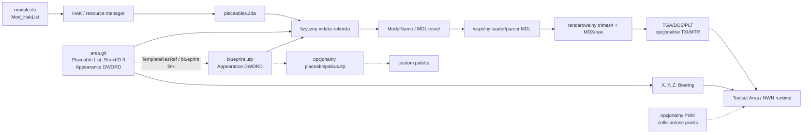
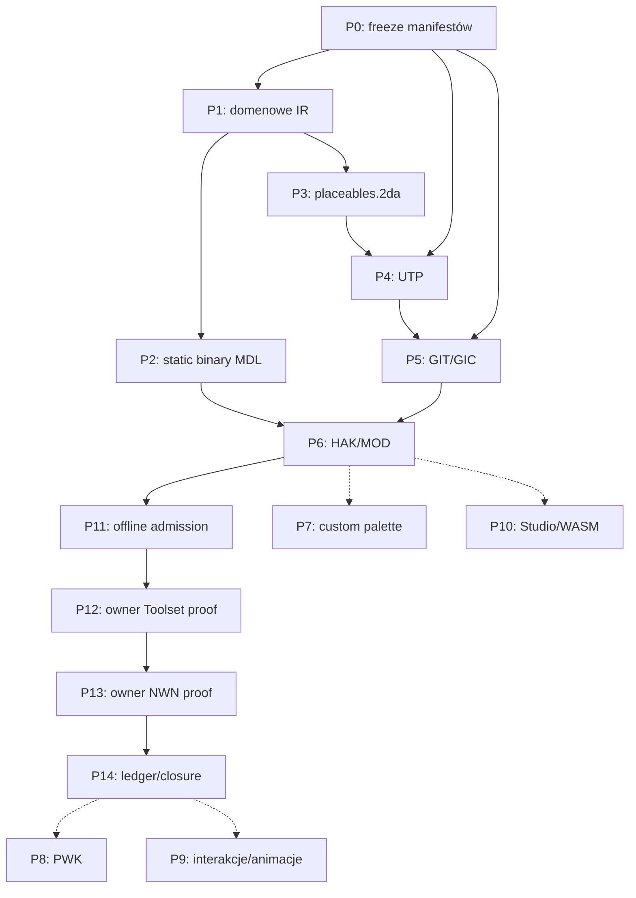

# Placeable widoczny w Aurora Toolset i NWN

## Audyt źródeł i etapowy plan implementacji

Data audytu: `2026-07-25`

Status: `AUDIT_COMPLETE / STATIC_PLACEABLE_IMPLEMENTED /
OWNER_VISUAL_PROOF_PASSED / P8_V1_OWNER_COLLISION_FAILED /
P8_V2_OWNER_COLLISION_FAILED / P8_ROOT_CAUSE_CONFIRMED /
P8_V3_ASCII_PWK_READY_FOR_OWNER_PROOF`

Zakres: statyczny placeable generowany przez `meshy2aurora`, umieszczony w
module testowym i widoczny zarówno w widoku Area Aurora Toolset, jak i w
runtime NWN:EE.

## 1. Decyzja wykonawcza

Placeable nie wymaga osobnego parsera formatu MDL. Aurora rozwiązuje jego
`ModelName` przez `placeables.2da`, a następnie przekazuje model do tego samego
loadera/parsera MDL, którego używają inne klasy modeli. Osobny musi być
natomiast kontrakt domenowy placeable: rekord `placeables.2da`, blueprint UTP,
instancja w `GIT Placeable List`, opcjonalna paleta ITP oraz opcjonalny
placeable walkmesh PWK.

Minimalny, kompletny autorsko statyczny vertical slice powinien obejmować:

- natywny binary MDL z co najmniej jednym renderowalnym `trimesh`;
- teksturę wskazaną przez model;
- dopisany fizycznie na końcu rekord `placeables.2da`;
- UTP, którego `Appearance` wskazuje dokładnie ten rekord;
- instancję StructID `9` w `GIT Placeable List`;
- zgodną pozycję w Area oraz wpis HAK w `IFO Mod_HakList`;
- własny readback każdego wygenerowanego formatu;
- osobny, wykonywany przez właściciela proof w Toolset i NWN.

Animacje, PWK, używalność, inventory i obecność w custom palette nie są
warunkiem pierwszego werdyktu „model jest widoczny”. Są kolejnymi warstwami
kompletności placeable.

UTP jest blueprintem potrzebnym do powtarzalnego workflow autora i palety.
Umieszczona instancja GIT zawiera jednak własne `Appearance` i pozostałe pola
obiektu. Dlatego ścisła diagnoza renderingu musi sprawdzać przede wszystkim
instancję GIT i rekord 2DA, a brak/usterkę UTP raportować osobno. Produkt nadal
ma emitować UTP w pierwszym kompletnym vertical slice.

## 2. Granice tego audytu

- [x] Przeanalizowano dekompilację Aurora First.
- [x] Porównano pierwotne specyfikacje BioWare dla UTP/GIT, ITP, ARE/GIT/GIC,
  IFO i KEY/BIF.
- [x] Przeanalizowano read-only retail `placeables.2da`.
- [x] Przeanalizowano przykładowe retail binary MDL używane przez placeables.
- [x] Porównano kod pomocniczego projektu RollNW.
- [x] Zmapowano luki obecnego kodu `meshy2aurora`.
- [x] Rozdzielono widoczność od palety, kolizji i interakcji.
- [x] Nie uruchamiano Aurora Toolset ani NWN.
- [x] W samym audycie nie utworzono nowego `rNN`, resrefu, HAK-a ani modułu;
  pierwszy kandydat powstał dopiero po przejściu gate'ów offline.
- [x] W samym audycie nie wykonano wizualnego proof; owner proof został
  dostarczony po implementacji i zamrożeniu kandydata.

Zgodnie z decyzją właściciela końcowy proof wizualny jest human-owned. Granicą
pracy agenta będzie `ready_for_owner_proof`, a nie deklaracja wizualnego
sukcesu w Toolset lub NWN.

## 3. Klasy dowodów

| Oznaczenie | Znaczenie |
|---|---|
| `DECOMP_FACT` | Fakt odczytany z dekompilacji Aurora. |
| `BIOWARE_SPEC` | Fakt z oryginalnej dokumentacji formatu BioWare. |
| `RETAIL_FACT` | Fakt odczytany z legalnej, lokalnej instalacji lub danych retail, bez kopiowania payloadu do produktu. |
| `PROJECT_FACT` | Fakt o aktualnym kodzie lub assetach `meshy2aurora`. |
| `EXTERNAL_PROJECT` | Informacja z projektu pomocniczego; dowód porównawczy, nie oracle. |
| `INFERENCE` | Wniosek wynikający ze zgodności co najmniej dwóch źródeł. |
| `OPEN_CONTRACT` | Kontrakt wymagający jeszcze zamrożenia na fixture retail/dekompilacji lub testu właściciela. |

## 4. Cztery różne znaczenia „placeable jest widoczny”

Nie wolno traktować poniższych stanów jako jednego gate'u:

| Poziom | Wymagany rezultat | Co go zapewnia |
|---|---|---|
| V0 — struktura offline | Wszystkie zasoby są parsowalne i wzajemnie zgodne. | Readback MDL/2DA/GFF/ERF i kontrola resrefów. |
| V1 — paleta Toolset | Blueprint można znaleźć w standardowej lub custom palette. | UTP, `PaletteID`, `LocName`, właściwe ITP albo skan palety. |
| V2 — Area Toolset | Już umieszczona instancja renderuje się w `TScrollBox`. | HAK, 2DA, MDL, tekstury i poprawna instancja GIT; UTP zachowuje blueprint/autorstwo. |
| V3 — runtime NWN | Model jest widoczny w uruchomionym module. | Ten sam zamrożony MOD/HAK/model, poprawne Area i pozycja. |
| V4 — obiekt gry | Działa kolizja, używanie, animacje, skrypty lub inventory. | PWK/use nodes oraz odpowiednie pola UTP i zasoby skryptów. |

Pierwszy etap produktu celuje w V0, następnie owner proof V2 i V3. V1 jest
potrzebne dla dobrego workflow autora, lecz nie jest warunkiem renderowania
obiektu już zapisanego w GIT. V4 jest rozszerzeniem po udowodnieniu widoczności.

## 5. Pipeline rozwiązania zasobu



Krytyczny łańcuch widoczności to:

`IFO -> HAK -> placeables.2da[row] -> ModelName -> MDL -> mesh/texture`

oraz równolegle:

`GIT Placeable List -> Appearance -> pozycja instancji`.

Paleta i PWK są bocznymi lane'ami, nie częścią minimalnego łańcucha renderingu.
`TemplateResRef -> UTP` jest wymaganym przez produkt łańcuchem
blueprint/autorstwo, ale nie należy nim zastępować diagnostyki pól zapisanych
w samej instancji GIT.

## 6. Wyniki audytu Aurora First

### 6.1. Resolver placeable

`DECOMP_FACT`

W lokalnej dekompilacji:

- `TNWPlaceableInstance::CreateModel()` rozwiązuje nazwę modelu, po czym woła
  wspólny `FUN_00a546cc`;
- `TNWPlaceableTemplate::BuildModel()` dochodzi do tego samego loadera;
- resolver odczytuje kolumnę `ModelName` z tabeli `placeables`;
- ustawia typ zasobu MDL na `0x7d2`, czyli `2002`;
- brak modelu prowadzi do komunikatów:
  `TNWPlaceableInstance::CreateModel(): Cannot find model '%s'` albo
  `TNWPlaceableTemplate::BuildModel(): Cannot find model '%s'`;
- `FUN_00a546cc` przechodzi dalej do wspólnego cache/parsera MDL i wspólnej
  fabryki typów node'ów.

`INFERENCE`

Implementacja ma współdzielić reader/parser/writer-layout MDL z creature.
Różnić się powinien profil wejściowy i resolver zasobów, a nie niskopoziomowy
parser kontenera lub node'ów.

### 6.2. Paleta

`DECOMP_FACT`

Aurora odwołuje się do:

- `placeablepalstd`;
- `placeablepalcus.itp`.

`BIOWARE_SPEC`

Dokumentacja ITP wskazuje:

- skeleton: `placeablepal.itp`;
- paleta standardowa: `placeablepalstd.itp`;
- paleta custom: `placeablepalcus.itp`;
- UTP ma Resource Type `2044`;
- węzeł blueprintu używa m.in. `RESREF` i nazwy przez `NAME` lub `STRREF`;
- paleta standardowa powstaje ze standardowych blueprintów;
- paleta custom powstaje przez skan blueprintów dostępnych w module.

Wniosek: brak wpisu w palecie nie dowodzi, że MDL jest niewidoczny. Dowodzi
tylko, że nie został ukończony workflow odkrywania blueprintu.

### 6.3. Instancja Area

`BIOWARE_SPEC`

- `GIT` zawiera `Placeable List`;
- każda instancja placeable ma StructID `9`;
- odpowiadająca lista istnieje również w `GIC`, w relacji jeden do jednego;
- historyczna specyfikacja NWN1 podaje pozycję jako `X`, `Y`, `Z` i `Bearing`;
- UTP i instancja korzystają z `Appearance` jako `DWORD`, indeksującego
  `placeables.2da`;
- `TemplateResRef` blueprintu powinien zgadzać się z kluczem/filename resrefu.

`DECOMP_FACT`

Odczyt i zapis instancji w Aurora potwierdza trzy wartości pozycji i
`Bearing`, zgodnie z dokumentacją BioWare.

`OPEN_CONTRACT`

Aktualny RollNW zapisuje dla placeable nazwy `PositionX`, `PositionY`,
`PositionZ`, `OrientationX`, `OrientationY`. Ponieważ Aurora First i pierwotna
specyfikacja BioWare są zgodne ze sobą, roboczym kierunkiem produktu jest
`X/Y/Z/Bearing`. Przed implementacją należy jednak zamrozić pełny, uporządkowany
manifest StructID `9` z jednego retail/toolset-generated GIT i przetestować go
we własnym writerze/readbacku. RollNW nie może rozstrzygać tego konfliktu.

## 7. Kontrakt `placeables.2da`

### 7.1. Zbadana baza

`RETAIL_FACT`

Zbadany plik:

`C:\Projects\Claude\NWN1EE_2DAs\base_2da.bif\placeables.2da`

- źródło: commit `417bf2bdadea8a6f3ff13b9f0d138d1b3a8008be`;
- SHA-256:
  `b772eafec5e6b380ad41e163e2a52585f2ddcec1c5bd7acea230b7e1a618df90`;
- liczba fizycznych rekordów: `16500`;
- indeksy: `0..16499`;
- nagłówki NWN:EE:
  `Label StrRef ModelName LightColor LightOffsetX LightOffsetY LightOffsetZ
  SoundAppType ShadowSize BodyBag LowGore Reflection Static`.

Pierwszy `OS_RESERVED` występuje przed ostatnimi niezastrzeżonymi rekordami.
Nie wolno więc wybierać „pierwszego wolnego” wiersza na podstawie samego
`Label`. Bezpieczna polityka produktu pozostaje append-only na fizycznym końcu
konkretnego wejściowego pliku.

### 7.2. Minimalny rekord statyczny

Poniższe wartości są profilem startowym, a nie uniwersalnym profilem każdego
placeable:

| Kolumna | Minimalna wartość | Uzasadnienie |
|---|---|---|
| `Label` | stabilna nazwa generowana | Diagnostyka i fallback UI. |
| `StrRef` | `****` bez własnego TLK | Nie przydzielamy obcego StrRef. |
| `ModelName` | dokładny resref MDL | Główny resolver modelu. |
| `LightColor` | `****` | Brak emitera światła w MVP. |
| `LightOffsetX/Y/Z` | `****` | Jak wyżej. |
| `SoundAppType` | `****` | Brak specjalnego profilu dźwięku w MVP. |
| `ShadowSize` | `1` | Wartość wskazana w specyfikacji i danych retail. |
| `BodyBag` | `0` | Brak bodybag w MVP. |
| `LowGore` | `****` | Brak alternatywy gore. |
| `Reflection` | `****` | Brak wymuszonego reflection profile w MVP. |
| `Static` | `1` | Pierwszy vertical slice jest dekoracją statyczną. |

### 7.3. Typ indeksu

`BIOWARE_SPEC`

UTP przechowuje `Appearance` jako `DWORD`.

`PROJECT_FACT`

Obecny raport/API 2DA projektu przechowuje indeks dopisywanego rekordu jako
`u16`, ponieważ powstał dla dotychczasowego pipeline creature. Bieżące `16500`
rekordów mieści się w tym zakresie, ale kontrakt placeable nie powinien
dziedziczyć tego ograniczenia bez decyzji.

Wymaganie: domenowy `PlaceableAppearanceRow` ma mieć semantykę `u32`; ewentualne
ograniczenie writera do mniejszego zakresu musi być jawnie walidowane i
raportowane, nie wynikać z przypadkowego castu.

## 8. Kontrakt modelu MDL

### 8.1. Co jest konieczne dla widoczności

- poprawny natywny nagłówek binary MDL;
- spójny core/raw (MDX) i wszystkie zakresy wewnątrz payloadu;
- `geometryType = 2` dla badanych modeli retail;
- poprawny root i hierarchia node'ów;
- co najmniej jeden renderowalny mesh;
- `render = 1`;
- niepuste wierzchołki, indeksy i faces;
- skończone pozycje, normalne i bounds;
- prawidłowe UV dla używanej tekstury;
- resref tekstury zgodny z zasobem w archiwum;
- model nie może być przesunięty daleko od własnego origin ani mieć
  niepraktycznej skali;
- nazwa modelu i resref zasobu muszą być spójne.

### 8.2. Czego nie należy wymagać w statycznym MVP

`RETAIL_FACT`

Przeskanowano `381` rozwiązywalnych natywnych modeli z pierwszych `500`
rekordów retail `placeables.2da`:

- wszystkie `381` miały `geometryType = 2`;
- `53` nie miały żadnej animacji;
- rozkład classification nie był jednolity:
  `4 => 348`, `0 => 30`, `2 => 2`, `1 => 1`.

Wnioski:

- brak animacji nie wyklucza widocznego statycznego placeable;
- classification nie może być bezrefleksyjnie skopiowane z profilu creature
  ani ustawione jako jedna rzekomo uniwersalna stała placeable;
- profil nagłówka powinien zostać wybrany z korpusu placeable i zamrożony
  osobnym testem konformancji.

### 8.3. Dwa detaliczne punkty odniesienia

`PLC_A01`:

- SHA-256:
  `7cdfd63327f23bac22d6cf152c4bbbabc0eb437ad12253b3d2d1a8ea63127634`;
- `geometryType = 2`, classification `4`;
- `22` node'y i `8` animacji;
- animacje obejmują m.in. `default`, `open`, `close`, `dead`.

`PLC_B08` (`LootBag5`, rekord `17`):

- SHA-256:
  `06470df8d38c720d6b508a19268265f72ffc9d0efc4c3e32e3e82a4d47d1e112`;
- `geometryType = 2`, classification `4`;
- `8` node'ów i `0` animacji;
- dwa renderowalne meshe;
- obecne faces, pozycje, normals, UV0 i texture binding.

`PLC_B08` jest lepszym strukturalnym punktem odniesienia dla pierwszego
statycznego vertical slice niż animowany `PLC_A01`. Payload retail pozostaje
wyłącznie read-only evidence; nie jest kopiowany do produktu ani fixture.

## 9. Kontrakt UTP

### 9.1. Tożsamość

- GFF type: `UTP `;
- wersja: zgodna z profilem NWN1 (`V3.2`);
- archive key/filename: resref blueprintu;
- `TemplateResRef`: dokładnie ten sam resref;
- `LocName`: własny embedded localized string;
- `Appearance`: `DWORD`, dokładny fizyczny indeks dopisanego rekordu 2DA;
- resref maksymalnie `16` znaków w przestrzeni zasobów Aurora.

### 9.2. Minimalny profil statyczny

- `AnimationState = 0`;
- `Static = 1`;
- `Useable = 0`;
- `HasInventory = 0`;
- `Type = 0` jako pole zgodności historycznego formatu;
- brak `ItemList`, jeśli `HasInventory = 0`;
- bez lock/trap/script behavior w pierwszym vertical slice;
- bez losowego StrRef i bez zależności od custom TLK.

Dokładny uporządkowany manifest pól i ich domyślne wartości musi zostać
zamrożony z retail UTP/dekompilacji. Minimalizowanie GFF „aż Toolset go
zaakceptuje” jest niewystarczające: writer i readback mają świadomie emitować
kontrakt, a nie polegać na nieudokumentowanych defaultach.

### 9.3. `Static` i stan animacji

`BIOWARE_SPEC`

Przy `Static = 1` obiekt jest dekoracją obsługiwaną po stronie klienta, nie
zachowuje pełnej semantyki skryptowalnego obiektu i używa tylko stanu
domyślnego. Dlatego profil statyczny musi używać `AnimationState = 0`.

Dla późniejszego interaktywnego placeable specyfikacja mapuje stany na nazwy
animacji:

| `AnimationState` | Oczekiwana animacja |
|---:|---|
| `0` | `default` |
| `1` | `open` |
| `2` | `close` |
| `3` | `dead` |
| `4` | `on` |
| `5` | `off` |

Nie należy deklarować stanu, którego model nie obsługuje.

## 10. Kontrakt GIT/GIC i położenia

### 10.1. GIT

Minimalna instancja:

- należy do top-level `Placeable List`;
- ma StructID `9`;
- `TemplateResRef` wskazuje UTP;
- `Appearance` zgadza się z UTP i rekordem 2DA;
- `X`, `Y`, `Z` i `Bearing` są skończone;
- object identity (`Tag`, nazwa/resref, ewentualny ID) jest stabilna i
  możliwa do odczytania w packet proof;
- pozycja leży w granicach Area;
- obiekt jest ustawiony w klarownym miejscu przed punktem wejścia gracza.

Pełny manifest nie może być zbudowany przez skopiowanie pól instancji creature.
Creature w obecnym kodzie używa innej listy, StructID i nazw pól transformacji.

### 10.2. GIC

- `Placeable List` istnieje także w GIC;
- liczba wpisów odpowiada GIT;
- każdy wpis ma StructID `9`;
- komentarz jest dozwolonym polem metadanych;
- własny validator sprawdza zgodność indeks po indeksie.

### 10.3. Kamera i judgeability

Offline validator ma sprawdzić tylko spójność geometryczną, nie może udawać
wizualnego proof. Do handoffu należy jednak przygotować:

- znany start gracza;
- znany kierunek patrzenia;
- placeable bezpośrednio przed graczem;
- brak zasłaniających obiektów;
- skalę i wysokość umożliwiającą jednoznaczny werdykt;
- tę samą Area i placement w Toolset oraz NWN.

## 11. HAK, MOD i priorytet zasobów

### 11.1. Zalecany podział

HAK:

- `placeables.2da` — Resource Type `2017`;
- MDL — Resource Type `2002`;
- TGA — Resource Type `3` lub DDS — Resource Type `2033`;
- opcjonalne TXI/MTR;
- opcjonalny PWK — Resource Type `2053`.

MOD:

- `module.ifo`;
- ARE/GIT/GIC jednej Area;
- UTP blueprint;
- opcjonalny `placeablepalcus.itp`;
- pozostałe zasoby modułu wymagane przez własny generator fixture.

UTP w MOD ułatwia deterministyczny custom-palette workflow opisany przez
BioWare. Najważniejsza jest jednak jedna, jawna polityka produktu oraz readback
kluczy `(resref, resource type)`.

### 11.2. Kolejność HAK

`BIOWARE_SPEC`

`IFO Mod_HakList` przechowuje wpisy `Mod_Hak` bez rozszerzenia `.hak`. Pierwsze
HAK-i na liście mają wyższy priorytet.

`BIOWARE_SPEC`

Resource manager rozróżnia zasoby parą `(ResRef, ResType)`. Źródła
enkapsulowane mają wyższy priorytet niż katalogi i KEY/BIF, a kolejność źródeł
tego samego rodzaju może rozstrzygnąć konflikt.

Pierwszy proof placeable powinien używać jednego HAK-a. To usuwa konflikt
priorytetu jako zmienną diagnostyczną.

## 12. Tekstury i materiały

- każde pole tekstury w MDL musi wskazywać istniejący resref;
- normalizacja nazwy musi odbyć się przed writerem, z kontrolą długości;
- writer HAK i readback mają potwierdzić ten sam typ zasobu i SHA-256;
- brak tekstury nie zawsze oznacza brak geometrii — może skutkować materiałem
  zastępczym, czernią lub innym artefaktem;
- diagnostyka musi rozróżniać:
  `model not resolved`, `model parse failed`, `mesh not rendered`,
  `texture not resolved` i `object outside judgeable view`;
- pierwszy profil może używać klasycznego TGA/DDS; TXI/MTR należy dodawać
  dopiero, gdy konkretny materiał tego wymaga.

## 13. PWK i use nodes

`BIOWARE_SPEC / RETAIL_FACT / DECOMP_FACT`

PWK ma Resource Type `2053` i jest pomocniczym modelem placeable walkmesh.
Audyt czterech plików PWK z lokalnych danych retail (`dag_applescene`,
`dag_batstatue`, `dag_blk`, `dag_brokenbrl`) wykazał płaski `trimesh` w
płaszczyźnie XY: cztery wierzchołki, dwie twarze i `surfaceId = 7`.
Oddzielne dummy `*_pwk_use01/02` występują opcjonalnie i służą interakcji, nie
samej kolizji.

`PROJECT_FACT / ROOT_CAUSE_CONFIRMED`

V1 i V2 wyliczają poprawny world-space XY footprint ze wspólnego
`AuroraModelIrV1`, ale błędnie przekazują go do wspólnego binary MDL writera.
Dokładne `nwmain.exe` i `nwserver.exe` `89.8193.37-17` pokazują, że
`CNWPlaceableSurfaceMesh::LoadWalkMesh` nie używa parsera binary MDL: czyta
Resource Type `2053` jako tekstowe linie i rozpoznaje `node`, `position`,
`orientation`, `verts`, `faces` oraz `endnode`.

Exact V2 zaczyna się od `00 00 00 00`, nie zawiera `LF` i daje temu parserowi
zero rekordów geometrii. To jest potwierdzona przyczyna braku kolizji.

Docelowy pipeline zachowuje wspólny import, IR, transformacje i footprint, ale
rozgałęzia serializację na granicy formatu:

1. render model: wspólny binary MDL writer/readback, Resource Type `2002`;
2. PWK: dedykowany ASCII PWK writer/readback, Resource Type `2053`;
3. oba zasoby zachowują ten sam bazowy resref;
4. HAK pakuje render MDL, teksturę, `placeables.2da` i tekstowy PWK.

`INFERENCE / IMPLEMENTATION_DECISION`

- `MdlNodeAABB` pozostaje wspólną rodziną parsera binary MDL, ale nie jest
  wymagany przez tekstową gramatykę statycznego placeable PWK.
- Statyczny profil ma `Useable = 0`, dlatego świadomie nie emituje use dummy.
- Prostokąt bounds jest bezpiecznym V1 dla prostych brył, lecz może nadmiernie
  blokować ruch przy obiektach wklęsłych. Dokładny obrys jest przyszłym
  ulepszeniem, nie warunkiem tego profilu.
- Dotychczasowy status `pwk_emitted_readback_passed` oznaczał tylko zgodność
  binary PWK z własnym binary readerem. Nie jest runtime-ready.
- Nowy gate musi odrzucać binary PWK i potwierdzać tekstową gramatykę używaną
  przez `CNWPlaceableSurfaceMesh`.

## 14. Stan obecnego projektu

### 14.1. Elementy możliwe do ponownego użycia

`PROJECT_FACT`

- istnieje binary MDL reader i semantic readback;
- istnieje binary MDL writer dla sztywnej geometrii;
- istnieje parser/writer 2DA z append-only;
- istnieje writer/readback HAK/ERF;
- istnieje writer/readback GFF;
- istnieje generator testowego MOD/Area dla creature;
- istnieje pipeline GLB -> wewnętrzne IR;
- istnieje przykładowy input Meshy dla placeable.

### 14.2. Luki blokujące placeable

| Obszar | Stan | Wymagana zmiana |
|---|---|---|
| GFF file types | Brak `UTP` i `ITP` w domenowym enumie. | Dodać typy, parse/write/readback i testy negatywne. |
| 2DA | API append indeksuje `u16`. | Dodać domenowy kontrakt placeable z semantyką DWORD/u32. |
| MDL writer | Wejście nazywa się `AuroraCreatureIrV1`. | Oddzielić wspólne geometry/model IR od profilu creature/placeable. |
| MDL profile | Istnieją nazwy `M0StaticRigidNativeV1` i creature-specific state projection. | Dodać corpus-bound statyczny profil placeable bez kopiowania creature state. |
| MOD generator | Builder i walidatory są creature-specific. | Dodać osobny builder placeable, StructID `9`, UTP i GIC pairing. |
| GIT | Listy placeable są puste w schemacie. | Materializować i walidować pełną instancję. |
| Palette | Brak ITP writera/manifestu. | Etap opcjonalny po widoczności albo jawny custom-palette vertical slice. |
| PWK | V1/V2 emitowały binary MDL jako PWK; exact runtime parser jest tekstowy, więc oba owner testy są `not_blocking`. V3 emituje i ponownie parsuje ASCII PWK nad wspólnym IR. | Offline zamknięte; pozostaje owner runtime verdict dla exact V3. |
| Studio/WASM | Brak komendy eksportu placeable. | Dodać dopiero po stabilnym core vertical slice. |
| Proof | Exact P1 ma owner visibility proof; exact P8 V3 jest zamrożony po gate'ach offline. | Właściciel musi wykonać runtime collision proof dla V3. |

### 14.3. Przykładowy input Meshy

`PROJECT_FACT`

Input:

`sample-3d/s1-placeable-ritual-pedestal-1500/source.glb`

Evidence:

`documentation/evidence/s1-placeable-ritual-pedestal-meshy-generation-2026-07-25.json`

- SHA-256:
  `dad22a5c3490242458cb7a81e50c53e265abf75886f57f6bd8a770938c2f7372`;
- GLB 2.0;
- jeden node, jeden mesh i jeden primitive;
- `1477` trójkątów;
- jeden materiał i cztery obrazy/tekstury;
- brak skin i animacji;
- rozmiar około `0.655 x 1.870 x 0.648 m`.

To jest dobry input dla statycznego vertical slice. Po przejściu gate'ów
offline został użyty do dokładnie jednego kandydata opisanego poniżej. Nadal
nie stanowi dowodu widoczności w Toolset/NWN.

### 14.4. Stan implementacji i evidence

`PROJECT_FACT`

Statyczny vertical slice jest zaimplementowany i zamrożony jako jeden lineage:

- test MOD: `m2a_s1_plc_mod.mod`;
- Toolset module name: `Meshy2Aurora S1 Placeable Proof`;
- Area: `Meshy2Aurora S1 Ritual Pedestal`;
- handoff status przed testem: `ready_for_owner_proof`;
- physical appearance row: `16500`;
- Toolset: `modelVisibility=visible`, `proofCompleteness=verified`;
- NWN: `modelVisibility=visible`, `proofCompleteness=verified`;
- collision dla zamrożonego P1: `pwk_not_implemented`; późniejszy niezależny
  lane P8 nie zmienia historycznego artefaktu P1 i ma osobny handoff;
- palette: `custom_itp_emitted`, bez osobnego owner verdict.
- exact MOD/HAK: zainstalowane w natywnych `modules`/`hak`, po instalacji
  zweryfikowane jako byte-identical.

Dokładne hashe, provenance, readback, stan testów i handoff zapisano w:

`documentation/evidence/s1-placeable-ritual-pedestal-p1-ready-for-owner-proof-2026-07-25.md`.

Owner verdict i screenshoty:

`documentation/evidence/s1-placeable-ritual-pedestal-p1-owner-visual-result-2026-07-25.json`.

Niezależny lane P8 z PWK ma zamknięty negatywny wynik exact V2:

- MOD: `m2a_s1_c2_mod.mod`;
- Toolset module name: `Meshy2Aurora S1 Collision V2`;
- exact Area: `Meshy2Aurora M0 binary vertical-slice area`;
- HAK: `m2a_s1_c2_hak.hak`;
- model i PWK resref: `m2a_s1_c2_ped`;
- offline status: `pwk_emitted_readback_passed`;
- runtime collision verdict: `not_blocking`;
- collision proof completeness: `verified_by_owner_report`.

V1 `m2a_s1_col_mod.mod` otrzymał owner verdict `not_blocking`. Minimalna
iteracja V2 dodaje wyliczone face adjacency w wspólnym binary writerze i
semantic readback, bez zmiany render modelu, powierzchni, footprintu lub
placementu. V2 nadal nie blokuje, więc adjacency zostało odrzucone jako root
cause.

Dokładne hashe, wynik właściciela i audyt dekompilacji V2:

- `documentation/evidence/p8-s1-collision-v2-adjacency-ready-for-owner-proof-2026-07-25.md`;
- `documentation/evidence/p8-s1-collision-v2-owner-runtime-result-2026-07-25.json`;
- `documentation/evidence/p8-s1-collision-v2-aurora-decomp-audit-2026-07-25.md`.

Audyt potwierdził konkretną przyczynę: dokładne runtime `nwmain` i `nwserver`
parsują PWK wyłącznie jako tekst, natomiast V2 dostarcza binary MDL. Pełny
lokalny corpus zawiera `9 752` zewnętrzne ASCII PWK i zero zewnętrznych binary
PWK; jedyne dwa binarne zasoby to niedziałające V1/V2 Meshy2Aurora. Różnice
binarnej hierarchii oraz pola `0x268` są prawdziwe, lecz nie mogą sterować tym
objawem, ponieważ parser kolizji nie czyta binarnego layoutu.

Exact V3 został utworzony po zielonych gate'ach offline:

- MOD: `m2a_s1_c3_mod.mod`;
- Toolset module name: `Meshy2Aurora S1 Collision V3 ASCII PWK`;
- Area: `Meshy2Aurora M0 binary vertical-slice area`;
- HAK: `m2a_s1_c3_hak.hak`;
- model/PWK resref: `m2a_s1_c3_ped`;
- `collisionCompleteness = ascii_pwk_emitted_runtime_readback_passed`;
- `collisionRuntimeVerdict = not_tested`;
- status: `ready_for_owner_proof`;
- kanoniczne artefakty pozostają w `proof-output`; po osobnym poleceniu
  właściciela exact MOD/HAK zainstalowano w natywnych `modules`/`hak` i
  zweryfikowano byte-for-byte.

Handoff i hashe:

`documentation/evidence/p8-s1-collision-v3-ascii-pwk-ready-for-owner-proof-2026-07-25.md`.

## 15. Etapy implementacji

Poniższe checkboxy są źródłem prawdy dla prac implementacyjnych. Checkbox może
zostać zaznaczony dopiero po zapisaniu wskazanego evidence.

### P0 — zamrożenie kontraktu źródłowego

- [x] Wybrać jeden read-only retail UTP placeable jako manifest pól.
- [x] Zapisać commit/pochodzenie, resref, Resource Type i SHA-256 źródła.
- [x] Wybrać odpowiadającą instancję StructID `9` z retail/toolset GIT.
- [x] Zamrozić kolejność, nazwy i typy pól UTP.
- [x] Zamrozić kolejność, nazwy i typy pól GIT.
- [x] Zamrozić odpowiadający wpis GIC.
- [x] Rozstrzygnąć `X/Y/Z/Bearing` kontra nazwy RollNW na podstawie
  Aurora First/retail readback.
- [ ] Wybrać minimalny profil MDL na podstawie korpusu placeable, z
  `PLC_B08` tylko jako punktem porównawczym. `OPEN_CONTRACT`: statyczny
  profil używa wspólnego zweryfikowanego writera native, ale exact
  corpus-bound placeable geometry header nie został jeszcze zamrożony.
- [x] Zapisać zakaz kopiowania retail payloadów do fixtures.
- [x] Dodać test, który wykryje zmianę hashy/manifestu źródłowego.

Definition of Done:

- [x] Istnieje jeden dokument/fixture manifest z pochodzeniem i bez
  niejawnych pól.
- [x] Wszystkie rozbieżności mają status `resolved` albo jawny `OPEN_CONTRACT`.

### P1 — domenowe IR placeable

- [x] Wydzielić wspólne `AuroraModelIr` z obecnego creature-specific wejścia
  writera.
- [x] Dodać `AuroraPlaceableIrV1`.
- [x] Dodać typ `PlaceableAppearanceRow(u32)`.
- [x] Dodać typy dla UTP identity, ustawień statycznych i placement.
- [x] Dodać walidację resref `1..16`, normalizacji case i znaków.
- [x] Dodać walidację skończonych transformacji i bounds.
- [x] Nie duplikować binary MDL parsera.
- [x] Utrzymać creature testy bez zmian semantycznych.

Definition of Done:

- [x] Ten sam model IR zasila wspólny writer MDL.
- [x] Profile creature i placeable są rozdzielone na poziomie domeny.
- [x] Błędny resref/appearance/transform kończy się stabilnym kodem błędu.

### P2 — statyczny native binary MDL

- [x] Zmapować input pedestal GLB do sztywnego placeable IR.
- [x] Zachować hierarchy/root bez creature-specific dummy state.
- [ ] Ustawić placeable corpus-bound geometry header.
- [x] Emitować przynajmniej jeden `trimesh` z `render = 1`.
- [x] Emitować positions, normals, UV0, indices i faces.
- [x] Wyliczyć finite bounding box/radius.
- [x] Ustawić origin i skalę przeznaczoną do Area.
- [x] Powiązać dokładny resref tekstury.
- [x] Użyć natywnego binary MDL jako produktu; ASCII tylko diagnostycznie.
- [x] Nie dodawać sztucznych animacji do statycznego MVP.

Testy:

- [x] Binary parse round-trip.
- [x] Semantic readback zgodny z wejściem.
- [x] Kontrola wszystkich core/raw ranges.
- [x] Co najmniej jeden mesh ma faces i `render = 1`.
- [x] Wszystkie indeksy leżą w zakresie vertex buffer.
- [x] Bounds i transformacje są skończone.
- [x] Test regresji nie zmienia zachowania creature.

Definition of Done:

- [x] Raport MDL jednoznacznie rozróżnia parse, geometry i texture binding.

### P3 — domenowy writer `placeables.2da`

- [x] Parsować wymagane nagłówki NWN:EE.
- [x] Nie zakładać, że pierwszy `OS_RESERVED` jest wolnym rekordem.
- [x] Dopisywać dokładnie jeden rekord na fizycznym końcu.
- [x] Zwracać fizyczny indeks jako `PlaceableAppearanceRow(u32)`.
- [x] Emitować minimalny statyczny rekord opisany w sekcji 7.
- [x] Zachować wszystkie istniejące rekordy byte-stable poza dozwolonym
  newline/append contract.
- [x] Raportować `baseRows`, `appendedRow`, `ModelName` i hash wejścia/wyjścia.

Testy:

- [x] Parser akceptuje zbadany retail plik.
- [x] Append round-trip zachowuje dokładny rekord i indeks.
- [x] Brak kolumny kończy się stabilnym błędem.
- [x] Zbyt długi `ModelName` kończy się przed materializacją HAK.
- [x] Test z `OS_RESERVED` przed aktywnymi rekordami nadal dopisuje na końcu.

Definition of Done:

- [x] UTP `Appearance` i raport 2DA mają ten sam indeks DWORD.

### P4 — UTP writer/readback

- [x] Dodać `GffFileTypeV1::Utp`.
- [x] Zaimplementować pełny zamrożony manifest UTP.
- [x] Ustawić root StructID zgodnie z fixture.
- [x] Ustawić `TemplateResRef` równe archive key.
- [x] Ustawić embedded `LocName`.
- [x] Ustawić `Appearance` jako DWORD.
- [x] Ustawić `AnimationState = 0`, `Static = 1`, `Useable = 0`.
- [x] Ustawić bezpieczne wartości pozostałych pól z manifestu.
- [x] Nie emitować `ItemList`, gdy inventory jest wyłączone.
- [x] Dodać własny semantic readback UTP.

Testy:

- [x] Parse/write/parse zachowuje typy i wartości.
- [x] Mismatch archive key/`TemplateResRef` jest odrzucany.
- [x] Appearance poza kontraktem jest odrzucane.
- [x] `Static = 1` z niedozwolonym state jest odrzucane.
- [x] Nieznany lub brakujący wymagany field ma stabilny błąd.

Definition of Done:

- [x] UTP, 2DA i MDL tworzą jedną rozwiązywalną tożsamość offline.

### P5 — instancja placeable w GIT/GIC

- [x] Dodać builder `Placeable List`.
- [x] Emitować StructID `9`.
- [x] Wskazać dokładny `TemplateResRef`.
- [x] Powtórzyć zgodny `Appearance`.
- [x] Emitować zamrożony komplet pól instancji.
- [x] Emitować `X/Y/Z/Bearing` zgodnie z rozstrzygniętym kontraktem.
- [x] Umieścić obiekt w judgeable position przed startem gracza.
- [x] Dodać równoległy StructID `9` do `GIC Placeable List`.
- [x] Zachować wszystkie inne listy Area bez regresji.

Testy:

- [x] GIT semantic readback odnajduje dokładnie jedną instancję po identity.
- [x] GIC count i StructID odpowiadają GIT.
- [x] Mismatch UTP/GIT appearance jest odrzucany.
- [x] Mismatch template resref jest odrzucany.
- [x] NaN/Infinity i placement poza profilem proof są odrzucane.
- [x] Creature fixture nadal przechodzi testy.

Definition of Done:

- [x] Raport wyświetla Area, object identity, template, appearance i pełną
  transformację.

### P6 — deterministyczne pakowanie HAK/MOD

- [x] Przydzielić resrefy dopiero po spełnieniu gate'u iteracji modelu.
- [x] HAK zawiera dokładnie 2DA, MDL, tekstury i zadeklarowane auxilia.
- [x] MOD zawiera IFO, ARE/GIT/GIC i UTP.
- [x] `Mod_HakList` wskazuje HAK bez rozszerzenia.
- [x] Pierwszy proof używa jednego HAK-a.
- [x] Zweryfikować unikalność każdej pary `(resref, resource type)`.
- [x] Zapisać SHA-256 każdego payloadu i obu archiwów.
- [x] Wykonać readback HAK i MOD własnymi readerami.
- [x] Nie instalować artefaktów w katalogach NWN w ramach pracy agenta bez
  osobnej, bezpośredniej zgody właściciela. Zgoda stała została udzielona
  `2026-07-25`; exact S1 MOD/HAK zainstalowano i zweryfikowano hashami.

Testy:

- [x] Każdy zasób można odnaleźć po dokładnej parze key/type.
- [x] `ModelName` rozwiązuje istniejący MDL type `2002`.
- [x] Każda tekstura z MDL rozwiązuje właściwy resource type.
- [x] UTP z MOD rozwiązuje appearance i model.
- [x] Modyfikacja jednego bajtu wykrywana jest przez hash/readback.
- [x] Kolejność i lista zasobów są deterministyczne.

Definition of Done:

- [x] Powstaje jeden immutable lineage kwalifikujący się do owner proof.

### P7 — custom palette Toolset

Ten etap może nastąpić po P6 albo po pierwszym V2/V3, ale jego wynik musi być
raportowany oddzielnie.

- [x] Dodać `GffFileTypeV1::Itp`.
- [x] Zamrozić manifest `placeablepalcus.itp`.
- [x] Powiązać blueprint przez `RESREF`.
- [x] Powiązać nazwę przez poprawny `NAME`/`STRREF`.
- [x] Przypisać właściwą kategorię/`PaletteID`.
- [x] Umieścić UTP w zakresie skanowanym przez custom palette.
- [x] Nie uznawać V1 za substytut V2.

Definition of Done:

- [ ] Właściciel może znaleźć blueprint w custom palette.
- [x] Ten sam blueprint pozostaje rozwiązywalny w już umieszczonej instancji.

### P8 — PWK i collision completeness

- [x] Wybrać placeable PWK corpus i opisać jego provenance.
- [x] Wyprowadzić geometrię `trimesh` walkmesh ze wspólnego
  `AuroraModelIrV1`; AABB nie jest wymagany przez potwierdzony statyczny profil
  PWK.
- [x] Powiązać PWK tym samym bazowym resrefem co MDL.
- [x] Zdefiniować use dummy policy: brak node'ów dla statycznego `Useable = 0`;
  będą wymagane dopiero przez jawny profil interaktywny.
- [x] Dodać historyczny binary readback geometrii kolizji; po audycie jest
  sklasyfikowany jako self-consistency check, nie runtime gate.
- [x] Walidować orientację, world-space bounds i surface/face data.
- [x] Wyliczać i walidować `adjacentFaces` dla współdzielonych krawędzi PWK.
- [x] Utrzymać osobny status `collisionCompleteness`.

Definition of Done:

- [x] Brak PWK nie może już być mylony z brakiem renderingu.
- [x] Exact PWK znajduje się w HAK jako Resource Type `2053`, przechodzi
  readback i ma hash związany z handoffem.
- [x] Owner test V1 wykazał `not_blocking`; wynik zachowano jako evidence i
  znaleziono brak adjacency jako hipotezę do V2.
- [x] Owner test V2 wykazał `not_blocking`; adjacency odrzucono jako root
  cause, a wynik zachowano jako evidence.
- [x] Przeprowadzić audyt exact `nwmain.exe`, `nwserver.exe` i binary PWK V2.
- [x] Potwierdzić root cause: `CNWPlaceableSurfaceMesh::LoadWalkMesh` jest
  tekstowym parserem PWK bez gałęzi binary MDL.
- [x] Zasymulować exact V2 przez kontrakt runtime: zero rozpoznanych
  `node`/`verts`/`faces`.
- [x] Przeskanować pełny lokalny corpus: `9 752` zewnętrzne ASCII PWK, zero
  zewnętrznych binary PWK.
- [x] Odrzucić binary hierarchy i `m_fFaceNormalSumDiv2` jako przyczynę tego
  failure, ponieważ runtime ich nie parsuje.
- [x] Dodać `PlaceableWalkmeshIrV1` wyprowadzany z tego samego
  `AuroraModelIrV1`.
- [x] Dodać deterministyczny ASCII PWK writer z `node`, `parent`, `position`,
  `orientation`, `verts`, `faces` i `endnode`.
- [x] Dodać ASCII PWK parser/readback i test negatywny odrzucający binary PWK
  z runtime-ready placeable package.
- [x] Utworzyć jeden exact V3 dopiero po przejściu jego offline golden/readback.
- [ ] Owner test V3 potwierdza oczekiwane blokowanie/przechodzenie. Punkt
  użycia nie dotyczy statycznego profilu `Useable = 0`.

### P9 — animowany lub interaktywny placeable

- [ ] Zmienić `Static` na `0` tylko dla świadomie interaktywnego profilu.
- [ ] Zdefiniować wspierane `AnimationState`.
- [ ] Zapewnić odpowiadające im animacje nazwane zgodnie z Aurora.
- [ ] Dodać `Useable`, scripts, faction, HP/damage tylko według feature scope.
- [ ] Dodać inventory tylko z poprawnym `HasInventory` i `ItemList`.
- [x] Nie rozszerzać MVP wszystkimi polami jednocześnie.

Definition of Done:

- [ ] Każda funkcja ma osobny test offline i osobny owner runtime verdict.

### P10 — API WASM i Studio

- [x] Dodać jawny tryb eksportu `placeable`.
- [x] Pokazać rozdzielone statusy MDL, 2DA, UTP, GIT, package i proof.
- [x] Pokazać physical appearance row.
- [x] Pokazać wszystkie resrefy oraz resource types.
- [x] Pokazać statyczny/interaktywny profil.
- [x] Udostępnić wygenerowany HAK, MOD i machine-readable report.
- [x] Nie wyświetlać `Aurora compatible`, zanim nie ma owner proof V2/V3.
- [x] Nie nazywać obecności w palecie dowodem renderowania.

Definition of Done:

- [x] Browser/WASM generuje byte-identyczny wynik jak core dla tego samego
  wejścia i konfiguracji.

### P11 — offline admission i zamrożenie kandydata

- [ ] Wszystkie testy jednostkowe i integracyjne są zielone.
- [ ] Pełny workspace build/test jest zielony w wymaganym toolchainie.

Powyższe dwa punkty pozostają świadomie otwarte: pełny
`cargo test -p m2a-wasm` ma `19 passed / 4 failed` na wcześniejszych
zamrożonych hashach Profile A/M7. Placeable boundary, pełny core, Studio,
typecheck i real Worker/WASM są zielone; szczegóły i exact nazwy testów są w
evidence ledger.

- [x] Raport nie zawiera unresolved `OPEN_CONTRACT`.
- [x] HAK/MOD readback jest bezbłędny.
- [x] Exact source GLB hash jest zapisany.
- [x] Exact MDL/texture/2DA/UTP/GIT/GIC/IFO hashes są zapisane.
- [x] Exact HAK/MOD hashes są zapisane.
- [x] Zapisano model resref, texture resrefs, appearance row i UTP resref.
- [x] Zapisano module filename, module display name i Area name.
- [x] Zapisano object identity i placement.
- [x] Zamrożono jedną lineage; nie tworzyć równoległego kandydata.

Definition of Done:

- [x] Status dokładnie `ready_for_owner_proof`.

### P12 — owner proof w Aurora Toolset

- [x] Właściciel otwiera dokładny, zahashowany MOD.
- [ ] Toolset pokazuje dokładny module name.
- [x] Właściciel otwiera dokładną Area. Exact resref `m2a_s1_plc_ar` jest
  widoczny; display name Area ma osobno zapisaną rozbieżność.
- [x] Odczytuje dokładny obiekt/placeable identity.
- [ ] Odczytuje Appearance row i template.
- [x] Zaznacza dokładny obiekt.
- [x] Dostarcza świeży, judgeable capture `TScrollBox`.
- [x] Rejestruje:
  `modelVisibility = visible | not_visible | not_tested`.
- [x] Rejestruje:
  `proofCompleteness = verified | failed | missing`.
- [ ] Opcjonalnie osobno rejestruje obecność w palette.

Definition of Done:

- [x] Werdykt jest związany z exact candidate hash i exact object identity.

### P13 — owner proof w NWN

Ten sam MOD/HAK/model lineage przechodzi do NWN bez regeneracji.

- [x] Właściciel uruchamia dokładny moduł.
- [x] Potwierdza exact Area i start przez ciągłość exact Toolset test session.
- [x] Scena przed graczem jest czytelna i niezasłonięta.
- [x] Oczekiwany placeable znajduje się w zadeklarowanej pozycji.
- [x] Rejestruje:
  `modelVisibility = visible | not_visible | not_tested`.
- [x] Rejestruje:
  `proofCompleteness = verified | failed | missing`.
- [x] Zapisuje screenshot/evidence związane z hashami.

Definition of Done:

- [x] `visible + verified` zamyka podstawowy runtime visibility gate.
- [ ] Czytelna scena z wyraźnym brakiem modelu daje `not_visible`; nie wolno
  przepisać tego na `not_tested` przez błąd pomocniczego capture tooling.

### P14 — ledger, diagnoza i ewentualna iteracja

- [x] Zapisać niezależne osie Toolset i NWN.
- [x] `missing` występuje tylko w `proofCompleteness`, nigdy w
  `modelVisibility`.
- [x] Zachować wcześniejszy pozytywny dowód monotonicznie.
- [x] Oddzielić failure pakowania, otwarcia modułu, kamery i proof od
  `modelVisibility=not_visible`.
- [ ] Przy `not_visible` zapisać exact candidate hashes i fresh capture.
- [ ] Zdiagnozować przyczynę przed zmianą payloadu.
- [ ] Opisać minimalną zamierzoną deltę.
- [ ] Dopiero wtedy dopuścić nową iterację zgodnie z model iteration gate.

Definition of Done:

- [ ] Każda iteracja ma pojedynczą przyczynę, deltę i wynik związany z hashami.

## 16. Krytyczna kolejność prac



Najkrótsza ścieżka do widocznego statycznego placeable:

`P0 -> P1 -> P2/P3/P4/P5 -> P6 -> P11 -> P12 -> P13 -> P14`.

PWK, paleta oraz interakcje nie powinny opóźniać pierwszego jednoznacznego
werdyktu renderingu.

## 17. Macierz typowych awarii

| Objaw | Prawdopodobna warstwa | Klasyfikacja |
|---|---|---|
| Brak rekordu lub zły `ModelName` | 2DA / HAK precedence | Resolver failure, nie parser MDL. |
| `Cannot find model` | Brak `(resref, 2002)` albo zła nazwa | Resource failure. |
| Model znaleziony, parser odrzuca payload | Binary MDL/core/raw | Model load failure. |
| Model parsuje się, ale brak faces lub `render=0` | Mesh | Render contract failure. |
| Model ma bardzo małą/dużą skalę albo zły origin | Konwersja geometrii | Judgeability/geometry failure. |
| Obiekt poza sceną | GIT placement | Fixture failure, nie model visibility. |
| Brak/inna tekstura | Texture resolver | Material failure; geometria może nadal istnieć. |
| UTP nie pojawia się w palecie | UTP/PaletteID/ITP | Palette failure, nie viewport verdict. |
| Instancja ignorowana | GIT StructID/fields/template | GFF instance failure. |
| Toolset zachowuje się inaczej niż runtime | Static/client behavior lub resource precedence | Rozdzielić V2 od V3. |
| Brak kolizji, model widoczny | PWK | V3 pass, V4 collision missing. |
| Static placeable nie odtwarza `open/on` | Błędne oczekiwanie stanu | Feature/profile failure. |
| HAK build/readback nie przechodzi | Packaging | Lane failure; nie uprawnia do nowej iteracji modelu. |
| Capture nie identyfikuje obiektu | Proof packet | `not_tested + missing`, nie `not_visible`. |

## 18. Wymagany raport maszynowy

Minimalny raport eksportu placeable powinien zawierać:

```json
{
  "schemaVersion": 1,
  "assetKind": "placeable",
  "profile": "static",
  "source": {
    "name": "input.glb",
    "sha256": "<sha256>"
  },
  "identity": {
    "modelResref": "<resref>",
    "textureResrefs": ["<resref>"],
    "utpResref": "<resref>",
    "appearanceRow": 0
  },
  "module": {
    "fileName": "<exact.mod>",
    "displayName": "<exact Toolset name>",
    "areaResref": "<resref>",
    "areaName": "<exact Area name>",
    "objectTag": "<tag>",
    "position": {"x": 0.0, "y": 0.0, "z": 0.0, "bearing": 0.0}
  },
  "resources": [
    {"resref": "<resref>", "type": 2002, "sha256": "<sha256>"}
  ],
  "offlineAdmission": "passed",
  "toolset": {
    "modelVisibility": "not_tested",
    "proofCompleteness": "missing"
  },
  "nwn": {
    "modelVisibility": "not_tested",
    "proofCompleteness": "missing"
  }
}
```

`appearanceRow` w schemacie logicznym ma być liczbą bez zawężenia do `u16`.

## 19. Szablon handoffu dla właściciela

Każdy handoff musi zaczynać się dokładnie od tych trzech pozycji:

1. Exact test-module `.mod` filename: `<wartość>`
2. Module name shown in Toolset: `<wartość>`
3. Exact Area name: `<wartość>`

Dalej:

- exact Area resref;
- exact HAK filename i SHA-256;
- exact MOD SHA-256;
- model resref i MDL SHA-256;
- wszystkie texture resrefs i SHA-256;
- UTP resref;
- `placeables.2da` physical row;
- object Tag/identity;
- `X/Y/Z/Bearing`;
- oczekiwany wygląd i przybliżony rozmiar;
- instrukcja identyfikacji obiektu w Toolset;
- oczekiwany kadr w NWN;
- puste pola werdyktu Toolset i NWN.

## 20. Kryterium ukończenia funkcji

Podstawowa implementacja placeable jest ukończona dopiero, gdy:

- [x] jeden pipeline modelu jest współdzielony z creature;
- [x] istnieje placeable-specific 2DA/UTP/GIT/GIC/package pipeline;
- [x] wszystkie formaty przechodzą własny readback;
- [x] zamrożono jeden exact candidate lineage;
- [x] właściciel potwierdził
  `Toolset: visible + verified`;
- [x] ten sam lineage uzyskał
  `NWN: visible + verified`;
- [x] wynik i hashe zapisano w evidence ledger;
- [x] brak PWK/palety/interakcji jest raportowany osobno, jeśli pozostaje poza
  zakresem.

Samo wygenerowanie poprawnego HAK/MOD nie oznacza widoczności. Sama obecność
blueprintu w palecie również nie oznacza widoczności. Sam poprawny parse MDL
nie oznacza, że renderer otrzymał renderowalną geometrię.

## 21. Źródła

### 21.1. Aurora First i lokalny retail

- `C:\Projects\New Folder\export\decompiled_all.c` — resolver i wspólny loader
  modeli, GIT placeable load/save.
- `C:\Projects\New Folder\export\strings.tsv` — komunikaty i nazwy zasobów
  placeable/palette.
- `C:\Program Files (x86)\Steam\steamapps\common\Neverwinter Nights\data\nwn_base.key`
  oraz odpowiadające BIF — read-only analiza retail modeli.
- `C:\Program Files (x86)\Steam\steamapps\common\Neverwinter Nights\bin\win32\nwmain.exe`
  `89.8193.37-17`, SHA-256
  `3b7cb1252e0edb2ce22d7971f333aade027039ae30a45b4bc64732c3e6bec73a`
  — bezpośredni parser `CNWPlaceableSurfaceMesh::LoadWalkMesh`.
- `C:\Program Files (x86)\Steam\steamapps\common\Neverwinter Nights\bin\win32\nwserver.exe`
  `89.8193.37-17`, SHA-256
  `98951511ae7d06a251355f12d4f3e4b96269a2414fa3058e641afd70098690f6`
  — niezależne potwierdzenie tego samego tekstowego parsera PWK po stronie
  dedicated server.
- `C:\Projects\Claude\NWN1EE_2DAs\base_2da.bif\placeables.2da` — retail tabela
  NWN:EE.

### 21.2. Pierwotne specyfikacje BioWare

- [Door and Placeable GFF format](https://github.com/xoreos/xoreos-docs/blob/4e1c197aa09b532ef466ff8ceccfd6221e80c3c9/specs/bioware/DoorPlaceableGFF.pdf)
- [Palette ITP format](https://github.com/xoreos/xoreos-docs/blob/4e1c197aa09b532ef466ff8ceccfd6221e80c3c9/specs/bioware/PaletteITP_Format.pdf)
- [Area ARE/GIT/GIC format](https://github.com/xoreos/xoreos-docs/blob/4e1c197aa09b532ef466ff8ceccfd6221e80c3c9/specs/bioware/AreaFile_Format.pdf)
- [Module IFO format](https://github.com/xoreos/xoreos-docs/blob/4e1c197aa09b532ef466ff8ceccfd6221e80c3c9/specs/bioware/IFO_Format.pdf)
- [KEY/BIF and resource manager format](https://github.com/xoreos/xoreos-docs/blob/4e1c197aa09b532ef466ff8ceccfd6221e80c3c9/specs/bioware/KeyBIF_Format.pdf)

### 21.3. Dane i projekty pomocnicze

- [NWN1EE base `placeables.2da`](https://github.com/calgacus/NWN1EE_2DAs/blob/417bf2bdadea8a6f3ff13b9f0d138d1b3a8008be/base_2da.bif/placeables.2da)
- [RollNW `Placeable.cpp`](https://github.com/jd28/rollnw/blob/b3512c14e9100eb858a3ec6a3c158da15a687392/lib/nw/objects/Placeable.cpp)
- [RollNW `Placeable.hpp`](https://github.com/jd28/rollnw/blob/b3512c14e9100eb858a3ec6a3c158da15a687392/lib/nw/objects/Placeable.hpp)
- [xoreos NWN1 MDL template](https://github.com/xoreos/xoreos-docs/blob/4e1c197aa09b532ef466ff8ceccfd6221e80c3c9/templates/NWN1MDL.bt)
- [xoreos NWN `WalkmeshLoader`](https://github.com/xoreos/xoreos/blob/89c99d2a93c23f3ba2b1218759e38775e4f2bdf9/src/engines/nwn/walkmeshloader.cpp)
- [NwnExplorer `ModelView.cpp`](https://github.com/dunahan/nwnexplorer/blob/56da6dc2fe94da6bbabe83ad18670f47fccd7dfb/nwnexplorer/ModelView.cpp)
- [gmax NWN MDL exporter reference](https://github.com/xoreos/xoreos-docs/blob/4e1c197aa09b532ef466ff8ceccfd6221e80c3c9/specs/gmax_nwn_mdl_0.3b.ms)

RollNW, xoreos i historyczne skrypty są źródłami porównawczymi. Nie zastępują
dekompilacji Aurora, retail evidence ani własnego Toolset/NWN proof i nie są
kopiowane do produktu.

## 22. Powiązane dokumenty projektu

- [Audyt wspólnego pipeline parserów MDL](audyt-wspolnego-pipeline-parserow-mdl-creature-placeable-tile-2026-07-25.md)
- [HAK/2DA/GFF crosswalk](hak-2da-gff-crosswalk-codex.md)
- [Binary MDL crosswalk](mdl-binary-crosswalk-codex.md)
- [Kontrakt GFF/module](m6-gff-module-kontrakt-suplement-codex.md)
- [Reguły projektu](PROJECT_RULES.md)
- [Evidence inputu Meshy](evidence/s1-placeable-ritual-pedestal-meshy-generation-2026-07-25.json)

## 23. Niezależny stress-test P20K

Lane `P20K_SINGLE_MESH_STRESS_V1` sprawdza granicę pojedynczego mesha bez
zmiany zamrożonego, widocznego S1 Ritual Pedestal.

- [x] Dodać wspólny limit `65 535` wpisów indeksowych na segment.
- [x] Wyprowadzić odpowiadający limit `21 845` trójkątów.
- [x] Dodać test TDD przyjmujący `20 000` trójkątów.
- [x] Dodać test odrzucający `21 846` trójkątów kodem `M4-MESH-LIMIT`.
- [x] Wygenerować jeden zamknięty mesh z dokładnie `20 000` trójkątów.
- [x] Przeprowadzić model przez wspólny `AuroraModelIrV1` i binary MDL writer.
- [x] Przeprowadzić wynik przez placeable-specific
  `placeables.2da -> UTP/GIT/GIC -> HAK/MOD`.
- [x] Potwierdzić własnym readbackiem `10 102` vertices, `20 000` faces i
  `60 000` indices.
- [x] Zamrozić dokładnie jeden lineage oraz jego hashe.
- [x] Uruchomić pełne `cargo test -p m2a-core`.
- [x] Zainstalować exact `m2a_p20k_mod.mod` i `m2a_p20k_hak.hak`
  natychmiast po zamrożeniu proof artifacts, zgodnie z `AGENTS.md`.
- [x] Potwierdzić absent-target, no-clobber i byte-identical SHA-256 obu kopii.
- [ ] Właściciel potwierdza widoczność w Aurora Toolset.
- [ ] Właściciel potwierdza widoczność tego samego lineage w NWN.
- [ ] Dopiero owner proof rozstrzyga praktyczną granicę renderera dla P20K.

Pełny handoff:
[P20K placeable stress V1](evidence/p20k-placeable-stress-v1-ready-for-owner-proof-2026-07-25.md).

## 24. Trzy placeable Meshy P20K w kierunku The Last City

Lane `TLC_MESHY_P20K_PLACEABLE_TRIO_V1` rozszerza wcześniejszy syntetyczny
stress-test o trzy rzeczywiste źródła z Meshy 6 i pełny wspólny ingest GLB.

- [x] Wygenerować trzy różne modele przez Meshy 6.
- [x] Zachować dokładne task ID preview/refine i SHA-256 źródeł.
- [x] Nie kopiować geometrii, tekstur ani UV z modułu referencyjnego.
- [x] Zredukować każdy model deterministycznie do dokładnie `20 000` trójkątów.
- [x] Usunąć po redukcji wierzchołki nieużywane przez indeksy.
- [x] Odrzucić trójkąty poniżej progu bezpieczeństwa Aurory.
- [x] Dopuścić dla placeable skompilowany profil `10 000 / 21 845`.
- [x] Zachować domyślny profil creature `5 000 / 10 000`.
- [x] Przeprowadzić wszystkie modele przez wspólny
  `GLB -> Profile A -> AuroraModelIrV1 -> binary MDL writer`.
- [x] Potwierdzić dla każdego MDL `20 000` faces i `60 000` indeksów.
- [x] Wygenerować trzy PWK i potwierdzić ich readback offline.
- [x] Zbudować jeden HAK, jeden MOD, trzy wpisy `placeables.2da`, trzy UTP,
  trzy instancje GIT/GIC i trzy wpisy palety.
- [x] Zainstalować exact MOD/HAK do natywnych katalogów NWN.
- [x] Potwierdzić absent-target, no-clobber i byte-identical SHA-256.
- [ ] Właściciel potwierdza widoczność wszystkich trzech modeli w Toolsecie.
- [ ] Właściciel potwierdza widoczność tego samego lineage w NWN.
- [ ] Właściciel potwierdza kolizję wszystkich trzech PWK w NWN.

Pełny handoff:
[TLC Meshy P20K Placeables V1](evidence/tlc-meshy-p20k-placeables-v1-ready-for-owner-proof-2026-07-25.md).
