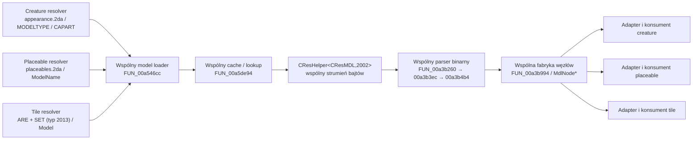

# Audyt wspólnego pipeline parserów modeli: creature, placeable i tile

Data: 2026-07-25

Status: `DIRECTION_LOCKED / PWK_SERIALIZATION_CORRECTED`; wspólny IR i binary
writer render MDL są zaimplementowane, statyczna geometria PWK jest
wyprowadzana ze wspólnego IR, a ASCII PWK writer/readback i runtime-ready
package gate są zaimplementowane; adapter tile/AABB pozostaje otwarty

Zakres: statyczny audyt dekompilacji Aurora Toolset oraz porównanie z kodem Meshy2Aurora

Poza zakresem: uruchamianie Aurora Toolset/NWN, proof wizualny, modyfikacja instalacji gry

Aktualizacja 2026-07-26: dedykowany
[audyt wymagań pipeline tile](audyt-wymagan-pipeline-tile-aurora-nwn-2026-07-26.md)
zamyka podstawową relację SET/MDL/WOK na pełnym lokalnym corpusie retail.
WOK typu `2016` ma resref równy `SET.[TILEn].Model`; wartość pola
`SET.[TILEn].WalkMesh` nie jest resrefem WOK. Binary MDL AABB i ASCII WOK są
potwierdzone, ale ich writer oraz cały adapter tile nadal nie są
zaimplementowane.

## 1. Werdykt

Aurora nie ma trzech niezależnych parserów geometrii dla creature, placeable i
tile. W badanym eksporcie wszystkie trzy ścieżki dochodzą do wspólnego loadera
modelu `FUN_00a546cc`, wspólnego cache/lookup `FUN_00a5de94`, wspólnego odczytu
zasobu MDL typu `2002`, wspólnego parsera binarnego modelu i wspólnej fabryki
węzłów `MdlNode*`.

Różnice domenowe występują przed i po parserze MDL:

- creature rozwiązuje appearance przez 2DA, `MODELTYPE`, `CAPART`, body parts,
  `WINGMODEL` i `TAILMODEL`, po czym może złożyć wiele modeli;
- placeable rozwiązuje `ModelName` z `placeables.2da`, a potem tworzy instancję
  tego samego typu modelu;
- tile najpierw parsuje osobny zasób tilesetu `SET` typu `2013`; wpis kafla
  dostarcza między innymi `Model`, `WalkMesh`, orientacje i nazwy węzłów, ale
  sam model jest następnie ładowany tym samym loaderem MDL;
- zachowanie, kolizja, animacje stanów i umieszczenie w scenie są konsumentami
  wspólnego drzewa modelu, a nie osobnymi parserami geometrii.

Kierunek dla Meshy2Aurora:

> Jeden wspólny `BinaryMdlReader` i jeden wspólny model IR. Osobne resolvery,
> assemblery, profile walidacji i koperty pakowania dla creature, placeable i
> tile.

Nie należy tworzyć `CreatureMdlParser`, `PlaceableMdlParser` i
`TileMdlParser`.

## 2. Metoda i klasyfikacja twierdzeń

Główne źródło Aurora First:

- `C:\Projects\New Folder\export\decompiled_all.c`;
- `C:\Projects\New Folder\export\strings.tsv`;
- pomocniczo `C:\Projects\New Folder\AUDYT_CREATURES.md` i
  `C:\Projects\New Folder\AUDYT_AREA.md`.

Porównany kod projektu:

- `crates/m2a-core/src/mdl/parse_binary_mdl.rs`;
- `crates/m2a-core/src/mdl/types.rs`;
- `crates/m2a-core/src/mdl/write_binary_mdl.rs`;
- `crates/m2a-core/src/mdl/writer_types.rs`;
- `crates/m2a-core/src/model_pipeline.rs`;
- `crates/m2a-core/src/profile_a.rs`.

Oznaczenia używane w dokumencie:

- **[DECOMP FACT]** — bezpośrednio widoczne wywołanie, stała, RTTI albo pole w
  eksporcie dekompilacji;
- **[PROJECT FACT]** — bezpośrednio widoczny stan kodu Meshy2Aurora;
- **[INFERENCE]** — wniosek architektoniczny z co najmniej dwóch faktów;
- **[OPEN]** — wymaga dalszego corpus/fixture lub dokładniejszego xref.

Nazwy `FUN_*` i numery wierszy dotyczą wyłącznie badanego snapshotu. Nie są API
i nie mogą być kodowane w aplikacji.

## 3. Wspólny pipeline w dekompilacji



### 3.1. Wspólny zasób MDL i cache bajtów

**[DECOMP FACT]**

| Kotwica | Obserwacja |
|---|---|
| `strings.tsv:593-599` | RTTI zawiera `CAuroraModel`, `CResMDL` i `CResHelper<CResMDL,2002>`. |
| `decompiled_all.c:169768`, `FUN_0050bbe8` | Wrapper wyszukuje/rejestruje zasób przez typ `0x7d2`, czyli `2002`. |
| `decompiled_all.c:169895`, `FUN_0050bed0` | Zwraca wskaźnik do danych `CResMDL`. |
| `decompiled_all.c:169909`, `FUN_0050bef0` | Zwraca długość danych `CResMDL`. |
| `decompiled_all.c:169923`, `FUN_0050bf0c` | Demand zasobu i zapis metadanych typu `0x7d2`. |
| `decompiled_all.c:932687-932688` | Globalne callbacki odczytu/zwolnienia są ustawiane na `FUN_00aa5fc4` i `FUN_00aa7490`. |
| `decompiled_all.c:933667`, `FUN_00aa5fc4` | Globalny loader korzysta z cache helperów; gałąź MDL tworzy/demanduje `CResHelper<CResMDL,2002>` i zwraca bajty oraz długość. |
| `decompiled_all.c:934542`, `FUN_00aa7490` | Wspólny release dispatchuje po typie zasobu; `0x7d2` zwalnia helper MDL. |

**[INFERENCE]** Cache warstwy zasobów nie jest cache'em creature, placeable ani
tile. Kluczem tej warstwy jest tożsamość zasobu/resref i jego typ, więc powinna
pozostać wspólna w Meshy2Aurora.

### 3.2. Wspólny loader i cache sparsowanego modelu

**[DECOMP FACT]**

`FUN_00a546cc` (`decompiled_all.c:880307`) przyjmuje nazwę/resref modelu. Gdy
nie przekazano już sparsowanego obiektu, woła `FUN_00a5de94`, a następnie
tworzy instancję sceny na podstawie wspólnego obiektu modelu.

`FUN_00a5de94` (`decompiled_all.c:886838`):

1. odrzuca pusty resref;
2. sprawdza cache sparsowanych modeli przez `FUN_00a5dd84`;
3. na cache miss uruchamia wspólną ścieżkę ładowania przez
   `FUN_00a3af40` → `FUN_00a3afe0` → `FUN_00a3b260`;
4. po udanym parse zapamiętuje model pod resrefem.

W funkcjach tych nie ma argumentu typu `creature/placeable/tile`.

### 3.3. Wspólny parser binarnego MDL

**[DECOMP FACT]**

`FUN_00a3b260` (`decompiled_all.c:862765`) otwiera zasób przez wspólny
mechanizm bufora i sprawdza jego początek. Dla binarnego MDL prowadzi do:

1. `FUN_00a3b3ec` (`decompiled_all.c:862866`) — rozdzielenie bloków i
   przygotowanie danych core/raw;
2. `FUN_00a3b4b4` (`decompiled_all.c:862902`) — utworzenie wspólnego obiektu
   `Model`, odczyt model headera, animacji i root node;
3. `FUN_00a3b874` — odczyt nagłówków animacji;
4. `FUN_00a3b994` (`decompiled_all.c:863053`) — wspólna fabryka konkretnych
   typów węzłów i rekurencyjne odtworzenie drzewa.

RTTI w `strings.tsv:5616-5625` i `5640-5649` potwierdza jeden zestaw klas:

- `MdlNodeAABB`;
- `MdlNodeAnimMesh`;
- `MdlNodeCamera`;
- `MdlNodeDanglyMesh`;
- `MdlNodeEmitter`;
- `MdlNodeLight`;
- `MdlNodeReference`;
- `MdlNodeSkin`;
- `MdlNodeTrigger`;
- `MdlNodeTriMesh`.

**[INFERENCE]** Jest to parser formatu/nodów, a nie parser konkretnej kategorii
obiektu. Creature, placeable i tile mogą wymagać różnych podzbiorów tych samych
węzłów, lecz nie zmienia to struktury readera.

### 3.4. Wspólny parser tekstowego MDL

**[DECOMP FACT]**

Ścieżka tekstowa również jest wspólna:

- `FUN_00a3b304` rozróżnia strumień binarny i tekstowy;
- `FUN_00a569c0` (`decompiled_all.c:881720`) rozpoznaje polecenia najwyższego
  poziomu, m.in. `newmodel`, `newanim`, `beginmodelgeom`, `setsupermodel`,
  `classification`, `ignorefog`;
- `FUN_00a56b54` (`decompiled_all.c:881796`) rejestruje handlery gramatyki;
- `FUN_00a5d224` (`decompiled_all.c:886208`) jest wspólną tekstową fabryką
  node'ów, rozpoznającą m.in. camera, emitter, light, trimesh, animmesh,
  danglymesh i reference.

**[INFERENCE]** Jeśli Meshy2Aurora kiedykolwiek doda import tekstowego MDL,
powinien on produkować ten sam wspólny `MdlDocument/CommonModelIr`, co reader
binarny. Nie powinien trafiać bezpośrednio do adaptera creature.

## 4. Ścieżki domenowe

### 4.1. Creature

**[DECOMP FACT]**

| Etap | Dowód |
|---|---|
| Wybór typu appearance | `decompiled_all.c:334324-334355` pobiera `MODELTYPE` z danych 2DA. |
| Model składany | `decompiled_all.c:334396` otwiera `CAPART`; dalsza funkcja buduje resrefy części. |
| Model pełny/części | `decompiled_all.c:334541`, `334553`, `334618`, `334807`, `334856` wywołuje wspólny `FUN_00a546cc`. |
| Ogon | `decompiled_all.c:335541` otwiera `TAILMODEL`; `335648` ładuje wynik przez `FUN_00a546cc`. |
| Skrzydła | `decompiled_all.c:335777` otwiera `WINGMODEL`; `335884` ładuje wynik przez `FUN_00a546cc`. |

Wniosek: creature ma najbogatszy resolver i assembler, ale każda rozstrzygnięta
część kończy jako zwykłe żądanie wspólnego modelu MDL.

### 4.2. Placeable

**[DECOMP FACT]**

| Etap | Dowód |
|---|---|
| Tabela appearance | `decompiled_all.c:376844` otwiera `placeables`. |
| Wybór modelu | `decompiled_all.c:377931-377959` pobiera kolumnę `ModelName`. |
| Sprawdzenie zasobu | bezpośrednio po lookupie wykonywane jest sprawdzenie zasobu typu `0x7d2` (`2002`). |
| Instancja modelu | `decompiled_all.c:378010` wywołuje `FUN_00a546cc` dla rozstrzygniętego `ModelName`. |
| Placeable instance | `decompiled_all.c:330380` wywołuje ten sam `FUN_00a546cc`. |
| Placeable template | `decompiled_all.c:340231` wywołuje ten sam `FUN_00a546cc`. |

Stringi diagnostyczne dodatkowo identyfikują:

- `TNWPlaceableInstance::CreateModel(): Cannot find model '%s'`
  (`strings.tsv:12656`);
- `TNWPlaceableTemplate::BuildModel(): Cannot find model '%s'`
  (`strings.tsv:12897`).

Wniosek: placeable potrzebuje osobnego resolvera `placeables.2da` i osobnego
profilu semantycznego stanów, ale nie osobnego parsera MDL.

### 4.3. Tile

Tile ma dodatkowy parser danych domenowych, lecz nadal współdzieli parser
modelu.

**[DECOMP FACT]**

| Etap | Dowód |
|---|---|
| Zasób tilesetu | RTTI zawiera `CResHelper<CResSET,2013>` (`strings.tsv:927`, `966`). |
| Lookup SET | `decompiled_all.c:255530-255536` szuka/rejestruje zasób typu `0x7dd`, czyli `2013`. |
| Parser wpisu kafla | `FUN_005dfa50` (`decompiled_all.c:279314`) odczytuje sekcję tile. |
| Resref modelu | początek `FUN_005dfa50` pobiera pole `Model` przez token zainicjalizowany z `s_Model_00c3ab26` (`decompiled_all.c:276837`). |
| Dane dodatkowe | ta sama funkcja czyta `WalkMesh`, orientacje, `PathNode`, `VisibilityNode`, światła i `AnimLoop1..3`. |
| Przeniesienie resrefu do instancji | `FUN_00712100` (`decompiled_all.c:452870`) pobiera nazwę z `TTileSetTile` przez `FUN_005ddc4c`. |
| Instancja modelu | `FUN_00712380` (`decompiled_all.c:452973`) wywołuje `FUN_00a546cc` dla tego resrefu. |

`SET` jest zatem parserem manifestu/tilesetu, a nie zamiennikiem parsera MDL.
Jego wynik `Model` jest wejściem do wspólnej ścieżki modelu.

**[OPEN]** Ten audyt nie dowodzi, że każdy tile korzysta z każdej rodziny
węzłów. Potwierdza jedynie, że `MdlNodeAABB` należy do wspólnej fabryki modelu,
a tile ma osobne dane `WalkMesh`/path/visibility w SET. Dokładny minimalny
profil tile należy zamknąć na reprezentatywnym corpusie binarnych modeli tile.

## 5. Macierz: wspólne i domenowe

| Warstwa | Creature | Placeable | Tile | Decyzja dla Meshy2Aurora |
|---|---|---|---|---|
| Normalizacja resref | wspólna | wspólna | wspólna | jedna implementacja |
| Lookup zasobu MDL 2002 | wspólny | wspólny | wspólny | jeden `ResourceProvider` |
| Cache bajtów MDL | wspólny | wspólny | wspólny | jeden cache po tożsamości zasobu |
| Detekcja binary/text | wspólna | wspólna | wspólna | jeden front door readera |
| File/core/raw header | wspólny | wspólny | wspólny | jeden parser |
| Drzewo i node factory | wspólne | wspólne | wspólne | jeden `MdlNode` enum/IR |
| Kontrolery i animacje | wspólny format | wspólny format | wspólny format | wspólny parser, różne zasady użycia |
| Materiały/tekstury | wspólny format | wspólny format | wspólny format | wspólny parser/writer |
| Auxiliary walkmesh | n/d dla render MDL | PWK type `2053`, tekstowy parser runtime | WOK/SET, osobny kontrakt | wspólne IR/geometria, serializer per parser zasobu |
| Resolver appearance | 2DA, złożony | `placeables.2da` | ARE + SET | trzy adaptery domenowe |
| Składanie wielu modeli | body parts, wings, tail, equipment | zwykle jeden model | model kafla + dane tilesetu | osobne assemblery |
| Semantyka runtime | rig, supermodel, animacje creature | stany placeable i interakcja | orientacja, siatka, path/walkmesh | trzy profile walidacji |
| Koperta/pakowanie | appearance/UTC/HAK/MOD | placeables.2da/UTP/HAK/MOD | SET/ARE/HAK/MOD | osobne packagery |

## 6. Stan obecny Meshy2Aurora

### 6.1. Co już jest zgodne z dekompilacją

**[PROJECT FACT]**

- `inspect_binary_mdl` jest publicznym, niezależnym od kategorii obiektu
  readerem (`parse_binary_mdl.rs:96`);
- reader ma jeden `InspectionReport`, `NodeReport`, `MeshReport` i `SkinReport`
  (`types.rs:27`, `101`, `138`, `196`);
- parser wspólnie odczytuje file header, core/raw, model header, drzewo,
  kontrolery i animacje;
- writer wykonuje własny readback przez ten sam `inspect_binary_mdl`
  (`write_binary_mdl.rs:274`).

To jest dobry fundament wspólnego pipeline.

### 6.2. Sprzężenia i stan ich rozcięcia

**[PROJECT FACT]**

Stan wejściowy audytu:

1. `write_binary_mdl.rs` przyjmował bezpośrednio `AuroraCreatureIrV1`
   (`write_binary_mdl.rs:8`, `181`, `205`, `213` i dalsze).
2. Wspólny writer ma profil stanu nazwany
   `RetailDirectCreatureType5DummyV1`
   (`writer_types.rs:42`).
3. Główny `model_pipeline.rs` przekazuje ten profil w ścieżkach emisji
   (`model_pipeline.rs:658`, `1820`, `2244`).
4. Reader zna flagi light, emitter, camera, reference, mesh, skin, animmesh,
   dangly i AABB, lecz za wspierane uznaje obecnie tylko
   `HEADER | MESH | SKIN`
   (`parse_binary_mdl.rs:38-49`).
5. `NodeReport` ma dedykowane pola tylko dla `mesh` i `skin`, więc nie może
   jeszcze semantycznie reprezentować AABB ani pozostałych rodzin.

**[INFERENCE]**

- Placeable można rozpocząć na wspólnym profilu rigid/trimesh, ale nie należy
  kopiować `AuroraCreatureIrV1` pod nową nazwą.
- Tile jest zablokowany na pełnej semantyce przez brak obsługi AABB i brak
  resolvera/IR dla SET.
- Rozszerzanie `SUPPORTED_NODE_FLAGS` bez dodania parsera struktury i testów
  zakresów byłoby fałszywym wsparciem.

**[PROJECT FACT — aktualizacja 2026-07-25]**

- neutralny `AuroraModelIrV1` zasila ten sam binary writer dla render MDL
  creature i placeable;
- geometria pomocniczego PWK jest wyprowadzana z tego samego IR, ale exact
  `CNWPlaceableSurfaceMesh::LoadWalkMesh` w `nwmain`/`nwserver`
  `89.8193.37-17` wymaga osobnego tekstowego serializera PWK;
- `AuroraCreature*` pozostają kompatybilnymi aliasami publicznymi;
- wspólny segment ma opcjonalne `faceSurfaceIds`, pomijane w serializacji
  starych modeli i walidowane jeden-do-jednego względem trójkątów;
- statyczny PWK jest tekstowym `trimesh` o Resource Type `2053`, a nie
  binarnym MDL/AABB;
- AABB pozostaje otwartym wymaganiem tile/corpusu, nie blokerem placeable P8.

## 7. Docelowa architektura

### 7.1. Granice modułów

```text
source GLB / existing MDL / 2DA / SET / GFF
                    |
                    v
        domain resolver / model requests
                    |
                    v
     ResourceProvider<ResourceKey(resref,type)>
                    |
                    v
       BinaryMdlReader -> CommonModelIr
                    |
          +---------+---------+
          |         |         |
          v         v         v
      Creature   Placeable   Tile
      adapter    adapter     adapter
          |         |         |
          v         v         v
    profile validator / assembler / packager
                    |
          +---------+------------------+
          |                            |
          v                            v
 wspólny BinaryMdlWriter      ASCII PlaceablePwkWriter
       type 2002                       type 2053
```

Zalecany podział odpowiedzialności:

```text
mdl/
  resource_key
  parse_binary_mdl
  parse_text_mdl          # opcjonalnie, później
  common_model_ir
  node_ir
  write_binary_mdl
  semantic_readback

domain/creature/
  appearance_resolver
  model_assembler
  validation_profile
  package_envelope

domain/placeable/
  appearance_resolver
  model_adapter
  walkmesh_ir
  write_ascii_pwk
  parse_ascii_pwk
  state_profile
  package_envelope

domain/tile/
  set_reader
  tile_resolver
  navigation_adapter
  validation_profile
  package_envelope
```

### 7.2. Minimalne interfejsy

Poniższy pseudokontrakt jest rekomendacją, nie gotowym API:

```rust
struct ResourceKey {
    resref: ResRef,
    resource_type: u16,
}

trait ResourceProvider {
    fn read(&self, key: &ResourceKey) -> Result<ResourceBytes, ResourceError>;
}

struct ModelRequest {
    key: ResourceKey,       // dla MDL: resource_type = 2002
    role: ModelRole,        // base, body_part, wing, tail, tile_visual...
    source: Provenance,
}

fn parse_binary_mdl(bytes: &[u8]) -> Result<CommonModelIr, MdlParseError>;

trait DomainModelAdapter {
    type Output;
    fn adapt(
        &self,
        request: &ModelRequest,
        model: &CommonModelIr,
    ) -> Result<Self::Output, DomainModelError>;
}
```

Parser nie powinien przyjmować `AssetKind`. Rodzaj obiektu wpływa na resolver,
adapter i walidator, nie na interpretację bajtów MDL.

### 7.3. Kolejność refaktoru

1. Wyodrębnić neutralny `CommonModelIr` spod nazw `AuroraCreature*`.
2. Pozostawić `AuroraCreatureIrV1` jako wynik adaptera creature albo zgodną
   warstwę przejściową.
3. Zmienić writer, aby przyjmował neutralny model IR plus jawny profil emisji.
4. Dodać `PlaceableAppearanceResolver` dla `placeables.2da`.
5. Dodać minimalny profil placeable rigid/trimesh bez rozszerzania readera o
   niepotrzebne rodziny node'ów.
6. Dodać osobny `SetReader` i `TileResolver`.
7. Dopiero na podstawie corpus tile zaimplementować `MdlNodeAABB` w tym samym
   readerze i writerze.

## 8. Wymagane testy i bramki

### 8.1. Wspólny parser

- jeden publiczny entrypoint parsuje fixture creature, placeable i tile;
- parser nie ma warunku po `AssetKind`;
- ten sam błąd offset/range ma ten sam kod niezależnie od pochodzenia modelu;
- cache odróżnia co najmniej resref i resource type;
- cykle node'ów, overlap zakresów, overflow i wyjście poza core/raw są
  odrzucane;
- nieobsługiwany typ node'a daje stabilną diagnostykę, nie ciche pominięcie.

### 8.2. Resolver creature

- whole-model i part-based są osobnymi przypadkami;
- `MODELTYPE`, `CAPART`, `WINGMODEL`, `TAILMODEL` mają testy braków i
  fallbacków;
- każdy wynik resolvera jest listą `ModelRequest`, a nie już sparsowanym
  modelem.

### 8.3. Resolver placeable

- `Appearance`/wiersz 2DA prowadzi do dokładnego `ModelName`;
- brak `ModelName` i brak zasobu 2002 są różnymi błędami;
- ten sam MDL sparsowany jako fixture wspólny daje identyczny `CommonModelIr`
  niezależnie od tego, czy zażądał go resolver placeable czy test parsera.

### 8.4. Resolver tile i AABB

- `SET` typu 2013 jest parsowany oddzielnie od MDL;
- wpis `Model` prowadzi do żądania typu 2002;
- `WalkMesh`, `PathNode`, `VisibilityNode`, orientacje i anim loops pozostają
  w `TileDescriptor`, nie w parserze MDL;
- fixture AABB ma jawny layout, bounds i testy uszkodzonych wskaźników;
- brak AABB wymagany przez wybrany profil tile jest błędem walidacji profilu,
  a nie błędem rozpoznania formatu pliku.

### 8.5. Writer i readback

- writer wspólny nie przyjmuje typu `Creature` jako jedynego wejścia;
- creature/placeable/tile wybierają jawny `MdlEmissionProfile`;
- każdy render profil przechodzi wspólny binary MDL semantic readback;
- PWK zachowuje wspólne IR, transformacje i dane face, ale przechodzi osobny
  ASCII writer/readback odpowiadający parserowi `CNWPlaceableSurfaceMesh`;
- dwa identyczne wejścia dają byte-identical MDL;
- dwa identyczne footprinty dają byte-identical PWK;
- różnice domenowe są sprawdzane po wspólnym readbacku.

## 9. Otwarte pytania

1. **[PARTIAL] Minimalny corpus placeable.** Format statycznego PWK jest
   potwierdzony przez exact runtime parser oraz pełny lokalny corpus:
   `9 752` zewnętrzne PWK są tekstowe, zero jest binary. Animowane i używalne
   placeable nadal wymagają osobnych reprezentatywnych próbek.
2. **[PARTIAL] Minimalny corpus tile.** Audyt z 2026-07-26 związał
   `12 342` wpisy tile z lokalnymi MDL/WOK, potwierdził reprezentatywny,
   przechodni `tms01` tile `12`, binary AABB i ASCII WOK. Specjalne wyjątki
   bez AABB oraz opcjonalne node'y light/emitter pozostają poza pierwszym
   profilem.
3. **[DONE dla statycznego placeable / DIRECTION_LOCKED dla tile] Auxiliary walkmesh.**
   Relacja MDL/PWK jest zaimplementowana:
   ten sam resref, typy odpowiednio `2002` i `2053`, wspólne źródło geometrii.
   Błędny binary PWK writer V1/V2 jest odrzucony; ASCII writer/readback oraz
   HAK package readback są gotowe. Dla tile potwierdzono osobny ASCII WOK typu
   `2016` pod resrefem `Model`; writer/readback WOK pozostaje do implementacji.
4. **[OPEN] ASCII model import vs ASCII PWK.** Ogólny tekstowy reader render
   MDL może pozostać późniejszym zadaniem. Tekstowy writer/readback PWK jest
   wymagany teraz, ponieważ exact runtime ma dla tego zasobu osobny parser
   liniowy. Dla statycznego placeable to zadanie jest zakończone; ogólny
   tekstowy import render MDL pozostaje niezależnym późniejszym zakresem.
5. **[OPEN] Profile writera.** Dokładne wartości klasyfikacji, geometry type,
   node routine/state projection i wymagane auxiliary assets muszą być
   zamykane per profil na lokalnych referencjach i owner proof, nie przez
   skopiowanie profilu creature.

## 10. Decyzje trwałe

```yaml
aurora_parser_audit:
  common_resource_type:
    mdl: 2002
    set: 2013
  common_mdl_loader: true
  common_binary_mdl_parser: true
  common_ascii_mdl_parser: true
  common_node_factory: true
  separate_creature_mdl_parser: false
  separate_placeable_mdl_parser: false
  separate_tile_mdl_parser: false
  domain_specific:
    creature:
      - "2DA appearance resolver"
      - "body-part/wings/tail assembler"
      - "creature validation and runtime envelope"
    placeable:
      - "placeables.2da resolver"
      - "placeable state/interaction profile"
      - "ASCII PWK serializer/readback for resource type 2053"
      - "UTP/2DA/package envelope"
    tile:
      - "SET reader"
      - "tile descriptor and orientation"
      - "walkmesh/path/visibility consumer"
      - "ARE/SET/package envelope"
  current_project_gap:
    - "state projection is creature-named"
    - "AABB is recognized but unsupported"
    - "no tile resolver in m2a-core"
  implementation_order:
    - "neutral CommonModelIr [DONE]"
    - "placeable resolver + rigid render profile [DONE_OFFLINE]"
    - "ASCII placeable PWK writer/readback [DONE_OFFLINE]"
    - "SET reader + tile resolver"
    - "AABB support from candidate-bound corpus"
```

## 11. Ograniczenia twierdzenia

Dokument nie twierdzi, że wszystkie trzy kategorie używają identycznych
modeli, identycznych node'ów ani identycznych zasad runtime. Twierdzi wężej i
na podstawie dekompilacji:

1. wszystkie trzy ścieżki tworzą model przez `FUN_00a546cc`;
2. ta funkcja korzysta ze wspólnego cache/loadera i wspólnego parsera modelu;
3. creature i placeable wybierają resref przez własne 2DA;
4. tile wybiera resref przez osobny parser SET;
5. po wyborze resrefu format MDL oraz jego fabryka node'ów są wspólne.
6. Twierdzenie o wspólnym parserze dotyczy render MDL typu `2002`; pomocniczy
   placeable PWK typu `2053` trafia do osobnego, tekstowego
   `CNWPlaceableSurfaceMesh::LoadWalkMesh`.

To wystarcza do zablokowania architektonicznego antywzorca trzech parserów MDL,
ale nie zastępuje fixture-driven implementacji profili placeable i tile.
