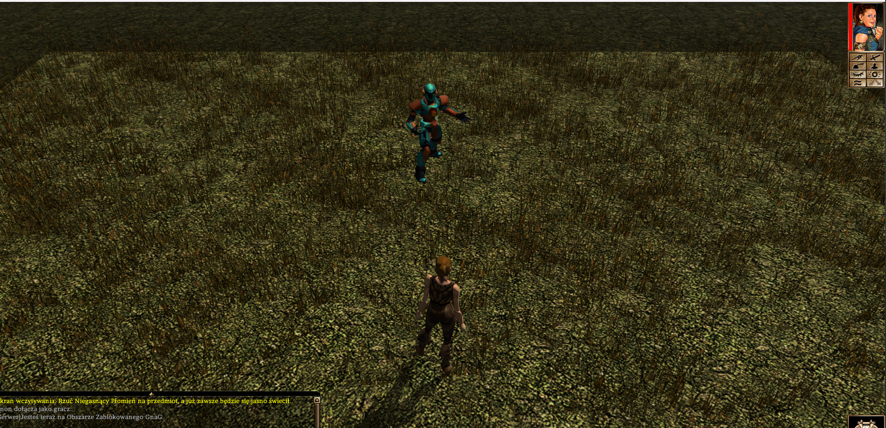
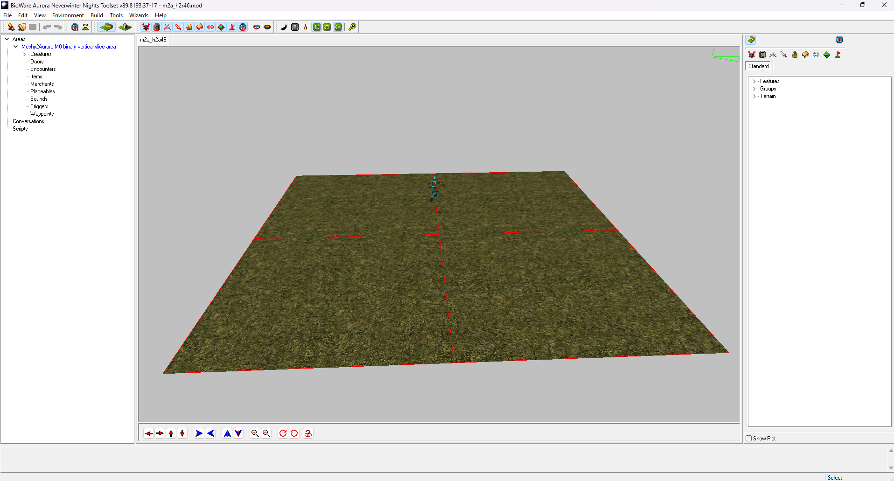

# MOD: `m2a_h2r46.mod`

Toolset module name: `Meshy2Aurora procedural humanoid proof`

Area: `Meshy2Aurora M0 binary vertical-slice area`

Status: `OWNER NWN VISUAL SUCCESS / VISIBILITY STAGE CLOSED`

Właściciel podał wynik `ładnie zadziałało <3` i dostarczył dwa świeże obrazy.
W NWN exact proceduralny humanoid jest wyraźnie narysowany bezpośrednio przed
graczem. To zamyka główny problem: generowane creature jest widoczne w NWN.

## Werdykt

```text
Toolset modelVisibility = visible
Toolset proofCompleteness = missing

NWN modelVisibility = visible
NWN proofCompleteness = verified
```

Toolset pokazuje właściwy `m2a_h2r46.mod`, właściwe Area i widoczny model.
Packet Toolset pozostaje formalnie niepełny wyłącznie dlatego, że obraz nie
pokazuje zaznaczenia/readbacku exact obiektu. Nie wpływa to na końcowy wynik
NWN.

W NWN scena jest czytelna: widać gracza oraz proceduralnego humanoida przed
nim. Humanoid ma artykułowaną pozę, więc nie jest pustym placeholderem ani
nieruchomą geometrią w bind pose.

## Co faktycznie naprawiło problem

Pomiędzy niewidocznym r45 i widocznym r46 zachowano source GLB, teksturę,
geometrię, skin, 42 stany type 5, 23 callbacki, bazowe controllery SkinMesh,
profil creature, `Phenotype=INT 0`, Area i placement.

r46 zmienił:

1. numerację na root-first: model root i każdy animation root mają `part 0`,
   a parent links i skin maps zostały spójnie przemapowane;
2. sparse direct-S appearance na pełny 35-komórkowy klon działającego donor
   row `102`, ze zmianą wyłącznie `LABEL/RACE`;
3. resrefy na świeżą, immutable linię r46.

Udowodniony wniosek:

> Połączona naprawa root-first numbering oraz pełnego direct-S appearance
> przywróciła widoczność generowanego creature w NWN.

Nie wolno twierdzić, że tylko jedna z tych zmian była samodzielną root cause,
ponieważ obie weszły do tego samego dopuszczonego kandydata. Hipoteza
brakującego phenotype jest wykluczona.

## Evidence

### NWN



SHA-256:
`5ac7e2ae1579473e209cdb1538835dce31cd7e014d5efc3133e56be67319805a`

### Aurora Toolset



SHA-256:
`1b8f2053908d51ecedd6afa2a15745f35ed7e84ae92693d63989e172daffdda1`

Pełny maszynowy zapis wyniku:
`documentation/evidence/h2-r46-owner-toolset-nwn-visual-result-2026-07-27.json`.

Agent nie uruchamiał ani nie sterował Toolsetem/NWN; zapisał wyłącznie
właścicielski wynik i dostarczone obrazy.
