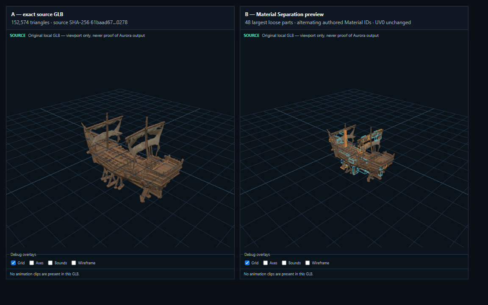

# Material Separation V1 — walidacja offline

Data: 2026-08-01
Status: `MS0-MS8_IMPLEMENTED / MS1_OWNER_PROOF_FAILED / MS2_GATE_PENDING_LANE_CLASSIFICATION`

## Zakres

Weryfikacja wspólnej funkcji Material Separation dla Creature, Placeable i
Tile. Nie uruchamiano Aurora Toolset ani NWN. Nie wykonano wywołania Meshy API i
nie zużyto tokenów/kredytów Meshy.

## Dokładne wejście realnego modelu

- plik: `sample-3d/tlc-ship-under-construction-s1-p150k-v1/source.glb`;
- SHA-256: `61baad674f9509e9e7f1718aa415dc12411b099ffedaea6484f68ceb3bf10278`;
- trójkąty: 152 574;
- connected components: 21 936;
- primitives: 1.

## Offline preview A/B

- PNG: `material-separation-offline-ab-2026-08-01.png`;
- rozmiar: 229 446 bajtów;
- SHA-256: `56111df12fa8abba6a104ec16a3a5c4d483806ce70d962230ad2c5f9daa0671d`;
- lewa strona: exact source GLB;
- prawa strona: ta sama geometria z dwoma naprzemiennymi authored Material IDs
  pokazanymi dla 48 największych loose parts;
- UV0 nie jest zmieniane;
- obraz jest dowodem preview Studio, nie dowodem poprawności w Aurorze/NWN.

Capture jest odtwarzalny przez test
`tests/browser/material-separation-preview.integration.ts`. Test sam sprawdza
exact SHA-256 źródła oraz oczekiwane liczby trójkątów i komponentów przed
zapisaniem obrazu.

## Zielone bramki funkcji

| Bramka | Wynik |
|---|---|
| canonical workspace i canonical Meshy asset layout | PASS |
| Core resolver i limity Material Separation | PASS |
| exact 300 000 / 300 001 triangle budget | PASS / poprawnie zablokowane |
| neutral texture authoring SOURCE/OVERRIDE, dedup SHA i jawna utrata PBR | 3/3 PASS |
| Profile A Rigid/Skin material projection, exact geometry, identity i animation/readback | PASS |
| Placeable copy/buckets oraz PWK invariant | PASS |
| Placeable V6: dwa TGA i byte-identical PWK | PASS |
| Tile V2: dwa material slots i byte-identical WOK/SET | PASS |
| package manifest z wieloma TGA | 7/7 PASS |
| pełny `cargo test -p m2a-core --tests` | PASS; env-gated testy referencyjne pominięte zgodnie z kontraktem |
| pełny `cargo test -p m2a-wasm` | 38/38 PASS |
| wygenerowane aktualne web bindings WASM | PASS |
| TypeScript typecheck | PASS |
| React/App/identity testy skupione na funkcji | 9/9 PASS |
| pełny zestaw web unit/integration | 256/256 PASS w 45 plikach |
| produkcyjny build Studio | PASS |
| real browser Worker/WASM testy materiałowe na finalnym WASM | 2/2 PASS; 10 poza filtrem |
| real browser A/B preview na kanonicznym statku | 1/1 PASS |
| exact synthetic MOD/HAK materialization i binary readback | PASS |
| native MOD/HAK installation z kontrolą byte identity | PASS |

Aktualny `crates/m2a-wasm/pkg/m2a_wasm_bg.wasm` ma SHA-256
`1cdf1d6ac45b0468a2b4d08d1c28d12427690c52058de4e45944d4c2eaca777b`
i rozmiar `3 987 757` bajtów.

## Domknięcie pełnego MS8

Poprzednia blokada niezależnych testów Creature została usunięta w zastanym
zakresie zmian. Stary Skin golden adaptera Profile A został poddany osobnemu
sprawdzeniu: nowy test dowodzi byte-exact no-op pustej receptury zarówno dla
Rigid, jak i Skin. Dopiero po tym dowodzie zamrożony Skin SHA został
zaktualizowany do aktualnego, zgodnego wyniku Core/WASM
`8017ea957de0e7a47426fa004063996762772589847604c628d4cfbd1b27f79b`.
Pełne zestawy Core i WASM są zielone.

## Exact owner-proof handoff

Pierwszy, osobny fixture funkcji nie jest iteracją istniejącego statku. Używa
projektowej geometrii syntetycznej z dwoma rozłącznymi komponentami i nie
wywołuje Meshy API. Jeden panel dziedziczy czerwony source texture, drugi używa
niebieskiego override. Binary readback potwierdza dwa trójkąty, dwa material
slots i dwa resrefy tekstur bez zmiany UV0.

- test module: `m2a_ms1_mod.mod`;
- Toolset module name: `Meshy2Aurora Material Separation V1`;
- Area: `Material Separation Two Material Proof`;
- ordered HAK: `m2a_ms1_hak.hak`;
- MOD SHA-256: `f0ebb252a86a399e7b458716dcfbc8051280ea9639a1f03a5302814fa063b287`;
- HAK SHA-256: `d6dd8dcc711b9ef449be67d868126b15cea436039a56e0f5725c702b56199664`;
- model resref: `m2a_ms1_mdl`;
- texture resrefs: `m2a_ms1_tex`, `m2a_ms1_tex_m1`;
- Appearance row: `3`;
- object tag: `m2a_ms1_two_material_panels`;
- placement: `(10.0, 14.5, 0.0)`, bearing `0.0`;
- exact handoff:
  `proof-output/material-separation-placeable-v1-20260801/ready-for-owner-proof.json`.

Oba natywne cele były nieobecne. MOD i HAK zapisano bez overwrite, a następnie
potwierdzono ich byte-identical SHA-256 względem źródeł w `proof-output`.
Nie uruchamiano ani nie kontrolowano Aurora Toolset lub NWN. Pozostaje wyłącznie
właścicielski werdykt wizualny; obecne osie to
`modelVisibility=not_tested`, `proofCompleteness=missing`.

## Amendment 2026-08-02 — owner proof failure

Właściciel zgłosił dla exact `m2a_ms1_mod.mod`: „nic w tym module nie ma”.
Offline inspekcja potwierdza, że MOD zawiera Area i jeden wpis Placeable w GIT,
więc nie jest to pusty ERF. Znaleziono jednak błąd proof materializera: użył
miniaturowego unit-test `placeables.2da`, przez co custom wpis otrzymał
Appearance `3`. Sprawdzone produkcyjne lineage Placeable używają pełnego
baseline'u SHA-256
`b772eafec5e6b380ad41e163e2a52585f2ddcec1c5bd7acea230b7e1a618df90`
i dopisują wiersz `16500`.

MS1 pozostaje zamrożony. Nie utworzono MS2. Raport właściciela nie podaje,
czy pusty wynik dotyczy Toolsetu, czy NWN, dlatego osie nie zostały
samowolnie przypisane. Exact zapis:
[`material-separation-ms1-owner-empty-module-result-2026-08-02.json`](material-separation-ms1-owner-empty-module-result-2026-08-02.json).
