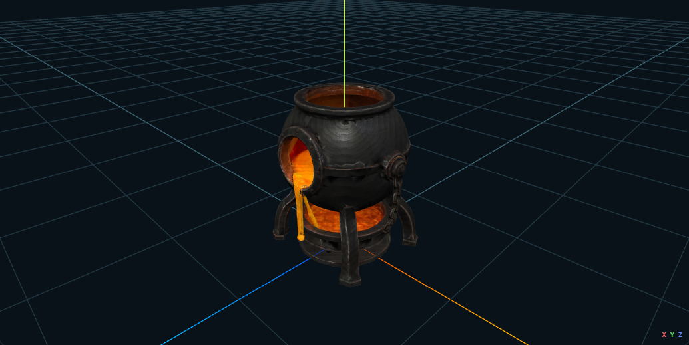

# `m2a_tlcw2_mod.mod` — korekta misy reaktora gotowa do proofu właściciela

Nazwa modułu w Toolset: `Meshy2Aurora TLC Loot Workstations V2`  
Area: `Meshy2Aurora TLC Loot Workstations V2`

Status: `ready_for_owner_proof`

Agent nie uruchamiał Aurora Toolset ani NWN. Dokładny MOD i HAK zostały
zainstalowane oraz zweryfikowane byte-for-byte; końcową ocenę wizualną wykonuje
właściciel.

## Cel i źródło iteracji

V1 był widoczny w NWN, ale właściciel odrzucił geometrię reaktora kodem
`UPGRADING-REACTOR-LAVA-MISSES-LOWER-BASIN`. Źródłowy wynik i screenshot są
zapisane w:

`documentation/evidence/tlc-meshy-loot-workstations-v1-owner-nwn-result-2026-07-26.json`

V2 zachowuje ten sam model Meshy:

- GLB SHA-256:
  `cf2f6a7b43c6ccaf09ebb2d560a62bed0245ec4734b8c8df5d9b9e4dd0776ebd`;
- 20 000 trójkątów;
- 17 879 wierzchołków;
- jeden mesh i 60 000 indeksów.

Minimalna delta jest wyłącznie authoringiem geometrii reaktora. Parser GLB,
wspólny IR, writer MDL, adjacency cieni, PWK, 2DA, UTP, GIT/GIC/ITP oraz
pakowanie HAK/MOD nie zostały rozgałęzione.

## Korekta przestrzenna

Dolna misa pozostaje wycentrowana w osiach X/Z pod kotłem i pomiędzy nogami.
Grupa 16 komponentów misy została podniesiona o `Y = +0,05 m`.

Główny strumień lawy, komponent `C766`:

- zachowuje punkt zaczepienia przy otworze dzięki pivotowi
  `[0.010017341, 0.32637691, 0.22687239]`;
- został pochylony do wnętrza o `+20°` wokół osi X;
- został wydłużony w osi Y do `1,12`;
- nie otrzymał translacji całego elementu.

Po transformacji dolny punkt głównego strumienia wynosi w przybliżeniu:

- `Y = 0,10178456`;
- `Z = 0,14512746`.

Podniesiona powierzchnia misy obejmuje:

- Y od `0,101654562` do `0,11293875`;
- Z od `-0,16121443` do `0,16158299`.

Dolny punkt strumienia znajduje się więc wewnątrz powierzchni misy w obu
sprawdzanych osiach, a misa nie została wysunięta przed nogi.

Dokument authoringu:

`C:\Projects\meshy2aurora\proof-output\tlc-meshy-loot-workstations-v2-20260726\generated\m2a_tlcw2_upg-authoring.json`

- authoring SHA-256:
  `3f25ba38a75c13ff0238b2423ccb130e456f91747bdff422cb05cb6f94db76fc`;
- hash pliku JSON:
  `d912035c85d1d1d81aaa2b944d6670a42558aa0bc7711e2640e215c9459978ee`.

## Wspólny pipeline i readback

Pipeline V2:

`GLB -> wspólny parser/IR -> authoring -> binarny MDL -> TGA -> PWK -> placeables.2da -> UTP -> GIT/GIC/ITP -> HAK/MOD`

Raport authoringu potwierdza:

- źródło: 20 000 trójkątów;
- wynik: 20 000 trójkątów;
- render: 810 elementów;
- kolizja: 810 elementów;
- cień: 810 elementów;
- ten sam hash authoringu dla projekcji renderu i kolizji.

Reaktor V2:

- model resref: `m2a_tlcw2_upg`;
- blueprint resref: `m2a_tlcw2_uu`;
- Appearance row: `16502`;
- placement: `X=13.5`, `Y=14.5`, `Z=0.0`, bearing `0.0`;
- MDL SHA-256:
  `2a7b18e63a7be183d4784b4441d1c6b2600b10cc5424ee9e44d15398aa5c4d36`;
- PWK SHA-256:
  `60803fd1df12ee30ce466903228310e056cea03ba0e8a768d1335782dfe18bc4`;
- binarny MDL i ASCII PWK przeszły readback.

## MOD, HAK i instalacja

Kanoniczny MOD:

`C:\Projects\meshy2aurora\proof-output\tlc-meshy-loot-workstations-v2-20260726\generated\m2a_tlcw2_mod.mod`

- SHA-256:
  `457e25b4c45c20b4fcb51d5a3d219d09df49caf40f2c2b0b83fa6abfe28c6bbd`;
- zainstalowany jako:
  `C:\Users\enonw\Documents\Neverwinter Nights\modules\m2a_tlcw2_mod.mod`;
- hash docelowy identyczny.

Kanoniczny HAK:

`C:\Projects\meshy2aurora\proof-output\tlc-meshy-loot-workstations-v2-20260726\generated\m2a_tlcw2_hak.hak`

- SHA-256:
  `a816091f442d12e759013a7d062b5fcfb7d36e750c7695dec0aa2b33634b38c9`;
- zainstalowany jako:
  `C:\Users\enonw\Documents\Neverwinter Nights\hak\m2a_tlcw2_hak.hak`;
- hash docelowy identyczny.

Maszynowy handoff:

`C:\Projects\meshy2aurora\proof-output\tlc-meshy-loot-workstations-v2-20260726\ready-for-owner-proof.json`

## Dowód viewportu offline

Screenshot SHA-256:
`ee73d54dd99d53a6928a3515fac24def12830f7202021dcafd870d34e8adf852`.

Jest to kontrola viewportu aplikacji, nie końcowy werdykt Toolset/NWN.

## Test właściciela

- [ ] Otworzyć `m2a_tlcw2_mod.mod`.
- [ ] Potwierdzić nazwę modułu
  `Meshy2Aurora TLC Loot Workstations V2`.
- [ ] Otworzyć Area `Meshy2Aurora TLC Loot Workstations V2`.
- [ ] Wybrać `TLC V2 Upgrading Reactor 20K`.
- [ ] Potwierdzić, że dolna misa jest pod kotłem i pomiędzy nogami.
- [ ] Potwierdzić, że główny strumień lawy kończy się wewnątrz misy.
- [ ] Uruchomić ten sam MOD/HAK w NWN bez przebudowy modułu.
- [ ] Powtórzyć ocenę geometrii reaktora w kamerze gry.
- [ ] Osobno ocenić kolizję, cień i skalę fizyczną.

## Otwarte ograniczenie

Ta iteracja poprawia wyłącznie układ misy i strumienia. Skala fizyczna wszystkich
trzech urządzeń pozostaje taka sama jak w V1 i nadal wymaga osobnej decyzji
właściciela o docelowych wysokościach.
