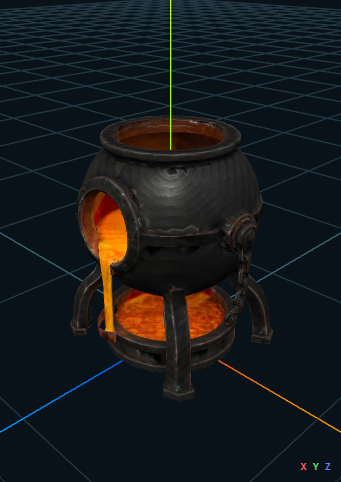

# `m2a_tlcw3_mod.mod` — poprawiony reaktor gotowy do testu właściciela

Nazwa modułu w Toolset: `Meshy2Aurora TLC Loot Workstations V3`  
Area: `Meshy2Aurora TLC Loot Workstations V3`  
HAK: `m2a_tlcw3_hak.hak`  
Status: `ready_for_owner_proof`

## Wynik

- [x] Dolna misa/podstawa jest osobnym zespołem 17 komponentów.
- [x] Podstawa została podniesiona o `Y = +0,05`, przesunięta pod pionowy
      strumień o `Z = +0,08` i zwężona w osi X do `0,54`.
- [x] Skraj obręczy podstawy kończy się przed najbliższą wewnętrzną granicą
      nogi: `|X| = 0,10318534 < 0,10528878`.
- [x] Nogi nie zostały przesunięte i ich stopy pozostają poza obręczą.
- [x] Oryginalna lawa `C766` nie została przesunięta, obrócona, wydłużona ani
      zduplikowana.
- [x] Dwa istniejące zespoły łańcuchów zostały jawnie zidentyfikowane i
      zachowane: prawy ma 186 komponentów, lewy 194.
- [x] Cały reaktor otrzymał wspólną skalę `2,5`, co daje wysokość fizyczną
      dokładnie `1,50 m` bez zmiany wzajemnego układu korpusu i lawy.

Podgląd jest kontrolą authoringu Three.js. Nie jest dowodem renderera Aurora ani
NWN.

## Wspólny pipeline

Model nie ma osobnej ścieżki eksportu:

`GLB -> wspólny parser/IR -> PlaceableAuthoringDocumentV1 -> Profile A -> binary MDL -> shadow adjacency -> ASCII PWK -> placeables.2da -> UTP -> GIT/GIC/ITP -> HAK/MOD`

- [x] wejście: 20 000 trójkątów;
- [x] wyjście: 20 000 trójkątów i 60 000 indeksów;
- [x] limit pojedynczego mesha Aurora: 21 845 trójkątów;
- [x] headroom: 1 845 trójkątów;
- [x] binarny MDL przeszedł readback;
- [x] adjacency cieni przeszło readback;
- [x] ASCII PWK przeszedł readback;
- [x] 2DA, UTP, GIT/GIC/ITP, HAK i MOD przeszły readback.

Dokument authoringu:

[m2a_tlcw3_upg-authoring.json](../../proof-output/tlc-meshy-loot-workstations-v3-20260726/generated/m2a_tlcw3_upg-authoring.json)

- authoring SHA-256:
  `6b933c67f20af4818d4550e4657c0be9cc3761313a9cdf8a5aab3d2b50c749c3`;
- SHA-256 pliku JSON:
  `6cb01f51de377eb88db9ff143212c120bc53ef2d46463fa3dd2ddff2a7f626ed`.

## Artefakty i instalacja

Kanoniczny MOD:

[m2a_tlcw3_mod.mod](../../proof-output/tlc-meshy-loot-workstations-v3-20260726/generated/m2a_tlcw3_mod.mod)

- SHA-256:
  `06e51513f8e7543ab3d8d9d6b1fa571f8383cd80378e025ce38ec3816b4789fd`;
- zainstalowany:
  `C:\Users\enonw\Documents\Neverwinter Nights\modules\m2a_tlcw3_mod.mod`;
- hash docelowy jest identyczny.

Kanoniczny HAK:

[m2a_tlcw3_hak.hak](../../proof-output/tlc-meshy-loot-workstations-v3-20260726/generated/m2a_tlcw3_hak.hak)

- SHA-256:
  `3906389593039f96118a1ef393cfe2bcc1f1456f6385491a50d3f90e63f41055`;
- zainstalowany:
  `C:\Users\enonw\Documents\Neverwinter Nights\hak\m2a_tlcw3_hak.hak`;
- hash docelowy jest identyczny.

Model reaktora:

- resref: `m2a_tlcw3_upg`;
- blueprint: `m2a_tlcw3_uu`;
- Appearance row: `16502`;
- pozycja: `X=13.5`, `Y=14.5`, `Z=0.0`, bearing `0.0`;
- MDL SHA-256:
  `7c8f4dd334176c35cc0cde5e08320a72d7a0710f3322ca0ab4d8da43f3d49e11`;
- PWK SHA-256:
  `a1cd670c4bb82a89d514dd4e6fb4b3073423e84ff8fe74c9b5ce572f48fe339c`.

Maszynowy handoff:

[ready-for-owner-proof.json](../../proof-output/tlc-meshy-loot-workstations-v3-20260726/ready-for-owner-proof.json)

## Test właściciela

- [ ] Otworzyć `m2a_tlcw3_mod.mod`.
- [ ] Potwierdzić nazwę modułu `Meshy2Aurora TLC Loot Workstations V3`.
- [ ] Otworzyć Area `Meshy2Aurora TLC Loot Workstations V3`.
- [ ] Wybrać `TLC V3 Upgrading Reactor 20K`.
- [ ] Potwierdzić wysokość około 1,50 m względem postaci.
- [ ] Potwierdzić, że pionowa lawa kończy się wewnątrz dolnej misy.
- [ ] Potwierdzić, że żadna stopa nogi nie stoi wewnątrz obręczy misy.
- [ ] Obejrzeć oba boki i potwierdzić dwa łańcuchy korpus–podstawa.
- [ ] Sprawdzić cień w Toolset i NWN.
- [ ] Sprawdzić kolizję PWK z kilku kierunków w NWN.

Agent nie uruchamiał Toolsetu ani NWN. Do wyniku właściciela pozostaje:
`modelVisibility = not_tested`, `proofCompleteness = missing` i
`collisionRuntimeVerdict = not_tested`.
