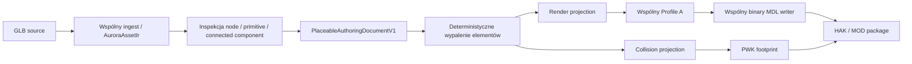

# Edytor elementów placeable — stan implementacji

Data: 2026-07-26  
Status: `IMPLEMENTED_OFFLINE`

Ten dokument jest wykonawczą checklistą rozszerzenia opisanego w
[audycie UI/UX manipulacji placeablem](audyt-ui-ux-manipulacji-placeablem-2026-07-26.md).
Obejmuje edycję całego modelu oraz jego logicznych elementów w istniejącym
viewportcie 3D. Nie obejmuje sculptingu, booleanów ani edycji pojedynczych
polygonów.

## 1. Wynik

- [x] Aplikacja po inspekcji GLB tworzy wersjonowany dokument authoringu.
- [x] Ten sam dokument steruje podglądem, geometrią renderowaną, cieniami i
      geometrią wejściową PWK.
- [x] Operacje elementów nie są tylko stanem UI: worker przekazuje dokument do
      WASM, a wspólny rdzeń Rust wypala go przed Profile A i binary MDL writerem.
- [x] Stary placeable entrypoint V1 zachowuje dotychczasową semantykę.
- [x] Nowy entrypoint V2 jest jawny, wersjonowany i rygorystycznie walidowany.
- [x] Domyślne `Cast shadow=true` nie zmienia zamrożonych JSON-ów ani hashy
      istniejących pipeline’ów creature i tile.
- [x] Jawne `Cast shadow=false` dociera do pola `shadow=0` konkretnego mesh node
      w binary MDL bez wyłączania renderowania.

## 2. Wspólny pipeline

Nie ma drugiej implementacji transformacji w React. Viewport używa dokumentu
do interaktywnego podglądu, ale artefakty wyjściowe tworzy wyłącznie wspólny
rdzeń Rust uruchamiany natywnie albo przez WASM.

## 3. Kontrakt i deterministyczność

- [x] `PlaceableAuthoringDocumentV1` ma jawne `schemaVersion`.
- [x] Nieznane pola są odrzucane.
- [x] Każdy element ma stabilne ID, typ, selektor źródła, parent, transform,
      pivot, flagi i stan usunięcia.
- [x] Selektory obejmują source node, primitive i connected component.
- [x] Kopie i grupy są reprezentowane w tym samym dokumencie.
- [x] Walidowane są liczby skończone, niezerowa skala, poprawne quaterniony,
      referencje źródłowe, unikalne ID, rodzice i brak cykli.
- [x] Nakładające się pokrycie tej samej geometrii źródłowej jest odrzucane.
- [x] Dokument ma kanoniczny JSON i SHA-256 niezależny od ustawienia kamery.
- [x] Identyczny source i dokument dają identyczne bajty oraz raport.
- [x] Source nie jest mutowany przed zatwierdzonym etapem projekcji.

## 4. Viewport i wybór

- [x] Viewport jest prawdziwym WebGL/Three.js, a nie statycznym obrazem.
- [x] Kamera obraca się przez `OrbitControls`.
- [x] Gizmo korzysta ze standardowego `TransformControls`.
- [x] Kliknięcie raycastem wybiera element modelu.
- [x] Outliner pokazuje elementy i ich hierarchię.
- [x] Działa wybór pojedynczy, wielokrotny i zaznaczenie wszystkiego.
- [x] Zaznaczenie jest widoczne jako bounds.
- [x] `Original / Edited` przełącza źródło i wynik bez zmiany dokumentu.
- [x] Nie dodano sylwetki człowieka ani innej niestandardowej referencji skali.
- [x] Viewport ma grid, osie, oświetlenie i lokalny podgląd cieni.
- [x] GLB pozostaje lokalny; zewnętrzne URL-e są odrzucane.

## 5. Transformacje

- [x] `W / E / R` przełącza Move / Rotate / Scale.
- [x] Te same tryby mają jawne przyciski.
- [x] Działa `World / Local`.
- [x] Gizmo i pola numeryczne korzystają z jednego stanu.
- [x] Location można ustawiać osobno dla X/Y/Z.
- [x] Rotation można ustawiać osobno dla X/Y/Z w stopniach.
- [x] Scale można ustawiać uniform oraz osobno dla X/Y/Z.
- [x] Pivot można ustawiać numerycznie.
- [x] `Set Origin` zmienia origin bez przesunięcia geometrii w świecie.
- [x] Multi-select używa wspólnego proxy i zachowuje relacje elementów.
- [x] Jeden ciągły drag tworzy jeden wpis historii.
- [x] Transformacja rodzica jest uwzględniana przy edycji potomka.
- [x] Parent/Unparent zachowuje world transform.
- [x] Mirror X/Y/Z zachowuje poprawny winding.
- [x] Normalne są przeliczane macierzą inverse-transpose i normalizowane.
- [x] Tangenty są transformowane macierzą liniową, ortogonalizowane względem
      nowej normalnej i normalizowane.
- [x] Przy odbiciu zmienia się handedness tangenta.
- [x] Bounds są wyliczane ponownie po wypaleniu transformacji.

## 6. Snapping i pozycjonowanie

- [x] Grid snapping.
- [x] Surface snapping.
- [x] Vertex snapping.
- [x] Element snapping.
- [x] Osobne kroki dla translation, rotation i scale.
- [x] `Ground` ustawia dolną granicę zaznaczenia na płaszczyźnie podłoża.
- [x] `Align` działa dla osi X/Y/Z i trybów min/center/max w reducerze.
- [x] Operacje snappingu wykluczają zaznaczone obiekty z celu raycastu.

## 7. Operacje na elementach

- [x] `Split by connected components` ma stabilną kolejność i stabilne ID.
- [x] Duplicate.
- [x] Delete.
- [x] Group.
- [x] Ungroup.
- [x] Parent.
- [x] Unparent.
- [x] Hide.
- [x] Show.
- [x] Isolate.
- [x] Lock.
- [x] Unlock.
- [x] Copy transform.
- [x] Paste transform.
- [x] Reset całego dokumentu.
- [x] Pełne Undo.
- [x] Pełne Redo.

## 8. Flagi render/collision/shadow

- [x] Każdy element ma osobne `Renderable`.
- [x] Każdy element ma osobne `Include in collision`.
- [x] Każdy element ma osobne `Cast shadow`.
- [x] Wyłączenie renderowania usuwa element tylko z projekcji render.
- [x] Wyłączenie collision usuwa element tylko z projekcji PWK.
- [x] Wyłączenie cienia tworzy deterministyczny osobny material bucket i zapisuje
      `shadow=0` w mesh node binary MDL.
- [x] Render i collision są liczone z tego samego source i dokumentu.
- [x] Raport zawiera liczbę elementów render/collision/shadow oraz ich bounds.
- [x] Writer ponownie buduje shadow adjacency z wypalonej geometrii.
- [x] Pipeline odrzuca dokument bez żadnej geometrii renderowanej.
- [x] Pipeline odrzuca dokument bez żadnej geometrii kolizyjnej zamiast
      generować pozornie poprawny, pusty PWK.

## 9. Pomiary i diagnostyka

- [x] Inspector pokazuje authored width, height i depth.
- [x] Inspector pokazuje minimum i maksimum bounds.
- [x] Diagnostyka wykrywa element poniżej podłoża.
- [x] Diagnostyka wykrywa element wiszący nad podłożem.
- [x] Diagnostyka wykrywa element odległy od reszty modelu.
- [x] Diagnostyka wykrywa szczelinę między elementami.
- [x] Diagnostyka pokazuje liczbę rozłącznych komponentów źródła.
- [x] Kliknięcie diagnostyki wybiera powiązany element.
- [x] Status nie polega wyłącznie na kolorze; komunikat ma tekst i identyfikator.

## 10. Stan sesji i Review

- [x] Dokument authoringu jest częścią stanu sesji placeable.
- [x] Zmiana authoringu nie cofa użytkownika do Source.
- [x] Zmiana authoringu zachowuje ważną inspekcję GLB i 2DA.
- [x] Zmiana authoringu unieważnia wyłącznie wcześniejszy build, Review i
      download.
- [x] Zmiana source resetuje dokument, więc stary authoring nie może zostać
      zastosowany do innego GLB.
- [x] Build request przenosi dokładny aktualny JSON dokumentu.
- [x] Review pokazuje source hash, authoring hash, liczbę elementów i bounds.

## 11. Testy

- [x] Rust unit/integration: stabilna inspekcja i split connected components.
- [x] Rust unit/integration: transformacja jednego komponentu nie przesuwa
      drugiego.
- [x] Rust unit/integration: duplicate i niezależne projekcje flag.
- [x] Rust unit/integration: cykle i overlap fail closed.
- [x] Rust unit/integration: non-uniform scale zachowuje ortonormalną ramę
      normal/tangent.
- [x] Rust integration: authored MDL readback ma niezależne `shadow=0/1`.
- [x] Rust integration: render i collision powstają ze wspólnego dokumentu.
- [x] Binary writer: `shadow=0` nie zmienia `render=1`.
- [x] WASM: wynik V2 jest byte-identical z bezpośrednim core.
- [x] WASM: błędny i nieznany JSON jest odrzucany.
- [x] Reducer: transformacje, historia, hierarchia i pivot.
- [x] Reducer: jeden drag daje jeden undo.
- [x] React: struktura edytora, pola numeryczne, flagi, Original/Edited.
- [x] React/App: edytowany dokument trafia do `BUILD_PLACEABLE`.
- [x] Worker/WASM integration: realny worker wykonuje inspect, edit i build V2.
- [x] Pełny `cargo test -p m2a-core`.
- [x] Pełny `cargo test -p m2a-wasm --lib`: 30/30.
- [x] Pełny `npm test`: 200/200.
- [x] `npm run test:worker-integration`: 9/9.
- [x] `npm run typecheck`.
- [x] `npm run build`.
- [x] `cargo fmt --all -- --check`.
- [x] Dogfood na rzeczywistym reaktorze Meshy: 20 000 trójkątów,
      810 komponentów, przesunięcie grupy misy i transformacja strumienia
      względem własnego pivotu.
- [x] Dogfood V2: render, PWK i shadow zbudowane z jednego dokumentu
      authoringu; zapisany readback i zamrożone hashe MOD/HAK.
- [x] Dogfood V3 na dokładnym reaktorze Meshy: dolna podstawa jako osobna
      grupa 17 komponentów, dwa semantyczne zespoły łańcuchów i niezmieniona
      lokalnie lawa `C766`.
- [x] Dogfood V3: wspólna skala fizyczna modelu `2,5` daje wysokość `1,50 m`,
      a transform podstawy zachowuje stopy nóg poza obręczą.
- [x] Dogfood V3: pełny pipeline MDL/PWK/shadow/2DA/UTP/GIT/GIC/ITP/HAK/MOD
      przeszedł readback, a dokładne MOD/HAK zostały zainstalowane i
      zweryfikowane byte-for-byte.

## 12. Świadomie poza zakresem

- [x] Brak sculptingu.
- [x] Brak booleanów.
- [x] Brak edycji pojedynczych polygonów, wierzchołków i krawędzi.
- [x] Brak obietnicy, że lokalny cień WebGL jest proofem renderera Aurora.
- [x] Brak automatycznego uruchamiania Toolset/NWN.

## 13. Granica proofu

Implementacja i testy offline są zakończone. Zgodnie z decyzją właściciela
Aurora Toolset i NWN pozostają human-owned. Pierwotny etap implementacji
edytora nie tworzył MOD/HAK. Następnie przeprowadzono dogfood na konkretnym
reaktorze 20k i zamrożono osobny kandydat V2. Jego dokładne MOD/HAK są
zainstalowane i gotowe do candidate-bound owner proof; nie stanowi to jeszcze
twierdzenia o sukcesie wizualnym w Toolset/NWN. Handoff:
`evidence/tlc-meshy-loot-workstations-v2-reactor-alignment-ready-for-owner-proof-2026-07-26.md`.

Po odrzuceniu zakresu V2 przygotowano poprawkę V3 bez transformowania lawy.
Aktualny handoff:
`evidence/tlc-meshy-loot-workstations-v3-reactor-base-ready-for-owner-proof-2026-07-26.md`.

Właściciel odrzucił układ V3, ponieważ sam warunek AABB dopuszczał trafienie
strumienia w skrajny rant. Odrzucenie i dokładny obraz wejściowy zapisano w:
`evidence/tlc-meshy-loot-workstations-v3-owner-lava-miss-2026-07-26.md`.

- [x] Dogfood V4 odrzuca poprzedni warunek „punkt jest w AABB” i wymaga
      znormalizowanego marginesu radialnego `<= 0,60`.
- [x] Dogfood V4 używa 16 komponentów właściwej misy; dolny pierścień `C37`
      pozostaje przy nogach.
- [x] Dogfood V4 zachowuje lokalne identity `C37`, `C766`, `C809` i obu grup
      łańcuchów.
- [x] Dogfood V4 ustawia wyłącznie transform misy:
      translation `[0, 0.05, 0.14]`, scale `[0.54, 1, 1.50]`.
- [x] Webowy viewport 3D potwierdził, że pionowy strumień kończy się na
      pomarańczowej tafli misy.
- [x] Wspólny pipeline MDL/PWK/shadow/2DA/UTP/GIT/GIC/ITP/HAK/MOD przeszedł
      readback.
- [x] Dokładne V4 MOD/HAK zostały od razu zainstalowane w katalogach NWN i
      zweryfikowane byte-for-byte.

Aktualny handoff V4:
`evidence/tlc-meshy-loot-workstations-v4-lava-catch-ready-for-owner-proof-2026-07-26.md`.
