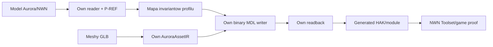

# Korpus referencyjny MDL

Data: 2026-07-10 | Status: AKTYWNY KONTRAKT TESTOW REGRESYJNYCH

## 1. Decyzja

Jeden model nie jest dowodem zgodnosci implementacji binary MDL. Jest tylko dowodem, ze jeden konkretny uklad pol i pointerow zostal obsluzony.

Modele NWN nie sa wejsciem produktu ani zrodlem dla konwersji. Wejsciem produktu pozostaje GLB z Meshy. Model NWN jest **okazem referencyjnym formatu docelowego**: nasz reader/preview go odczytuje, aby udowodnic kompatybilnosc z realnym outputem engine'u.

Dlatego projekt ma trzy rozdzielne klasy danych testowych:

| Klasa | Miejsce | Commitowana | Cel |
|---|---|---:|---|
| Synthetic fixtures | przyszle `crates/*/tests` | tak | wlasciwe test inputs: pelne TDD, bledy graniczne, CI |
| Reference corpus | zainstalowany NWN i lokalne HAK, czytane in-place | nie | proof kompatybilnosci na wielu realnych rodzinach modelu |
| Generated proof assets | output `meshy2aurora` | tylko manifest/evidence | Toolset/game proof wlasnego outputu |

Retail/CEP modelu nie przenosimy, nie wypakowujemy do repo i nie commitujemy. Kazdy model referencyjny ma jednak obowiazkowy proof naszej implementacji: nie wystarcza sam manifest albo zielony wynik testu. W razie potrzeby lokalny test czyta go ze wskazanej przez zmienna srodowiskowa instalacji/HAK i pomija przypadek, gdy zrodla brak.

## 2. Lokalizacja i konfiguracja

```yaml
committed:
  - "synthetic fixture builders and tests"
  - "reference corpus manifest: resref, type, source class, SHA-256 observed locally, expected capabilities"
  - "reports and evidence without external payloads"
never_committed:
  - "retail/CEP MDL, MDX, textures, animations, skeletons"
  - "extracted BIF/HAK payloads"
reference_sources:
  nwn_base_key: "M2A_REFERENCE_NWN_KEY; e.g. <NWN EE>/data/nwn_base.key"
  cep_hak: "M2A_REFERENCE_CEP_HAK; e.g. cep3_core1.hak"
  optional_direct_file: "M2A_REFERENCE_MDL_FILE; user-selected local file only"
ci: "synthetic fixtures only; reference corpus tests skip cleanly when env is absent"
```

Nie tworzymy kopii modeli w folderze repo tylko po to, aby skrocic sciezke testu. Gdy kiedys potrzebny bedzie lokalny cache, musi byc poza repo, jawnie oznaczony jako niecommitowany i miec provenance/hash; nie jest jeszcze potrzebny do M1A.

## 3. Packet proofu referencyjnego

Kazdy uruchomiony model z R1-R6 tworzy lokalny packet `P-REF-<id>`:

```yaml
reference_proof_packet:
  identity:
    - "source class: base NWN or named HAK"
    - "resref, resource type and SHA-256 of bytes read in-place"
    - "reader version, command and timestamp"
  structural_proof:
    - "own reader JSON report: header, core/volatile ranges, node/mesh/animation inventory"
    - "explicit invariant results and stable diagnostics"
  semantic_proof:
    - "capability matrix: supported, unsupported or not-present per feature"
    - "comparison of the expected model class with the own reader report"
  visual_proof_when_preview_exists:
    - "screenshot from our own debug preview for geometry-capable models"
    - "short motion capture for animation-capable models"
  storage:
    repository: "only manifest, hash, report summary and commands"
    local_ignored: "raw JSON, screenshots and videos derived from external assets"
```

Screenshot Toolsetu z niezmienionym retailowym modelem jest tylko referencja wizualna; nie dowodzi dzialania naszego kodu. Proof referencyjny musi pokazywac wynik naszego readera/preview. Z kolei proof wygenerowanego przez nas HAK/modulu pozostaje osobnym, koncowym dowodem M6.

## 4. Pierwsza macierz modeli

| ID | Zasob read-only | Co pokrywa | Stan |
|---|---|---|---|
| R0 | syntetyczny minimalny MDL | header, core/volatile range, OOB, overflow, cycle | wymagany od M1A |
| R1 | `c_kocrachn`, `cep3_core1.hak`, type 2002 | `12 + core + volatile`, `supermodel=c_Horror`, animationScale `0.72`, zero wlasnych animacji | potwierdzony metadata |
| R2 | `c_horror`, base NWN `nwn_base.key -> data/models_01.bif`, type 2002 | model bazowego supermodelu; funkcje ustalane dopiero przez own reader | potwierdzony locator |
| R3 | `c_phod_horror_b` i `c_phod_horror_p`, `cep3_core1.hak`, type 2002 | 42 wlasne animacje, animroot, transition time, eventy | potwierdzony metadata |
| R4 | prosty trimesh bez skin/animacji | mesh-only path | do znalezienia automatycznym inventory M1B |
| R5 | skin mesh z niezerowym bind pose | skin header, weights, bone refs, 17/64 variant | do znalezienia automatycznym inventory M1B |
| R6 | model z nieobslugiwanym node family | structured unsupported diagnostic | do znalezienia automatycznym inventory M1B |

R1-R3 nie sa payloadami projektu. Zapisane sa jedynie ich locator, typ, cechy i hash odczytany lokalnie podczas evidence run.

## 5. Zasada pokrycia

```yaml
coverage_rule:
  parser_feature: "synthetic fixture required"
  real_world_claim: "at least one named P-REF packet with recorded hash, own report and invariant results"
  profile_A_writer_feature: "synthetic write/readback plus at least two non-identical reference families when that feature exists in the corpus"
  unsupported_feature: "one reference report or a synthetic fixture must yield a stable diagnostic"
  visual_reader_claim: "own-preview screenshot required once the preview supports that model class"
  animation_reader_claim: "own-preview motion capture required once the animation path supports that model class"
  runtime_acceptance: "generated own asset in Toolset/game; reference corpus does not replace it"
no_single_model_rule: "A green result for one model can never promote a feature to universally supported."
```

`c_kocrachn` jest R1, nie calym corpus. Jego rola to sprawdzenie konkretnego derived-model/MDX chain, a nie walidacja geometrii, skina, eventow ani wszystkich node families.

W konsekwencji sa dwa rozne, ale polaczone przeplywy. Referencyjny model Aurory nie jest zrodlem danych dla Meshy, lecz tworzy mape invariantow dla implementacji writera:



Przyklad: `c_kocrachn` ustala dla profilu R1, ze model ma header z core/volatile blockiem, `supermodel=c_Horror`, `animationScale=0.72` i zero wlasnych animacji. Writer nie przepisuje `c_kocrachn`; ma jawnie obsluzyc albo odrzucic ten profil i - gdy go obsluguje - wyemitowac wlasny model spelniajacy te same istotne invarianty.

## 6. Kolejnosc pracy

1. M1A buduje syntetyczne fixture i bezpieczny structural reader.
2. M1B wykonuje in-place inventory R1-R3, tworzy P-REF structural packets, wybiera R4-R6 na podstawie rzeczywistych flags/layoutow i zapisuje manifest bez payloadow.
3. M1B zamyka `GB-001-SKIN` dopiero po porownaniu co najmniej dwoch skin candidates lub po nazwanym braku takiego corpus.
4. M1C dodaje locator HAK; odczyt base KEY/BIF dla R2 pozostaje optional reference adapter, nie wymaganiem produktu HAK.
5. M4+ laczy AuroraAssetIR z mapa invariantow z P-REF, waliduje writer na synthetic fixtures i macierzy referencyjnej, a M6 dowodzi wlasnym wygenerowanym contentem.

## 7. Definition of Done corpus run

```yaml
evidence_packet:
  required:
    - "manifest z resref/type/source class/hash i bez sciezek prywatnych, jezeli raport ma byc commitowany"
    - "P-REF packet z own reader JSON, invariant results i stable diagnostics dla kazdego faktycznie uruchomionego modelu"
    - "capability matrix R0-R6 z PASS/UNSUPPORTED/NOT_PRESENT"
    - "preview screenshot/motion capture lokalnie, gdy dana klasa preview jest juz obslugiwana"
    - "stable diagnostics dla przypadkow nieobslugiwanych"
    - "explicit statement, ze payloady nie zostaly dodane do Git"
  forbidden_claims:
    - "one successful model proves universal format support"
    - "reference parser result replaces own generated Toolset/game proof"
```
