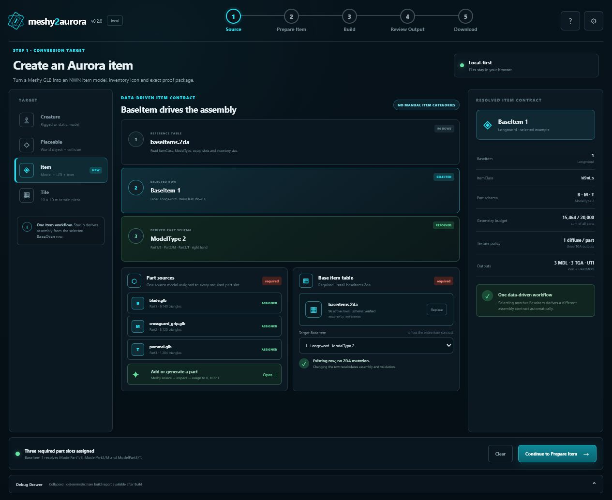
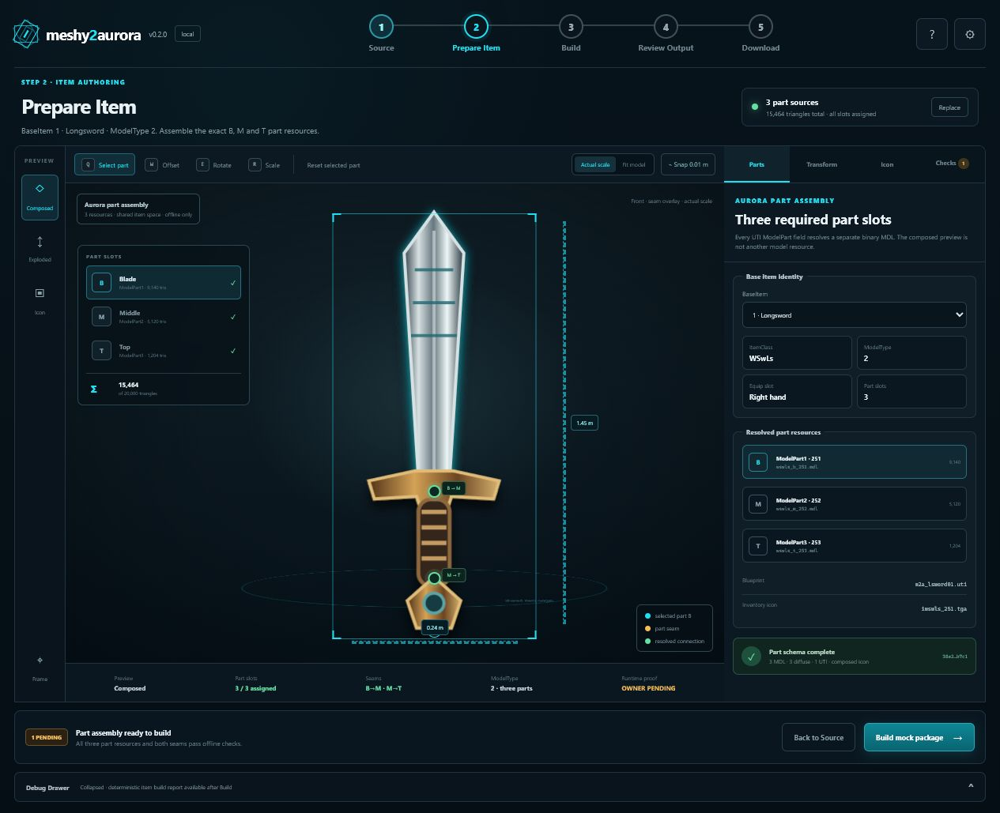
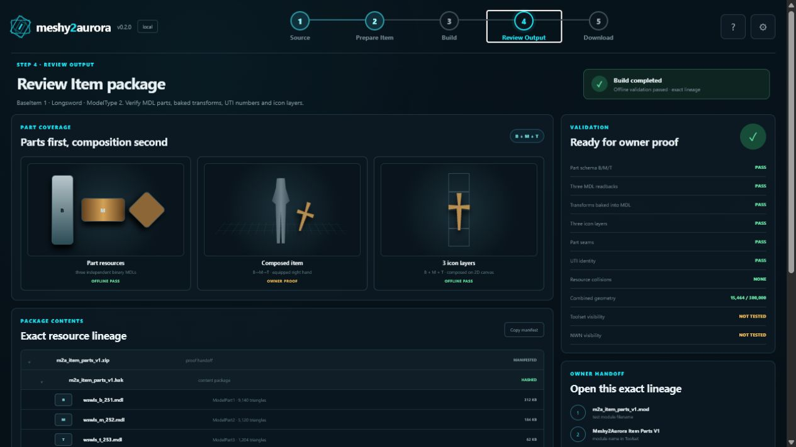
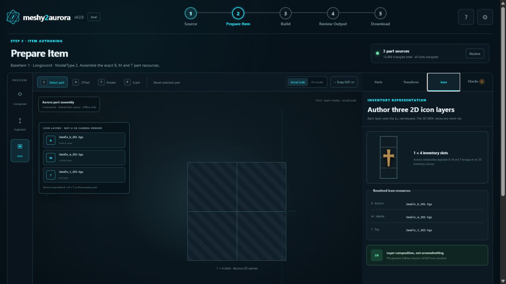
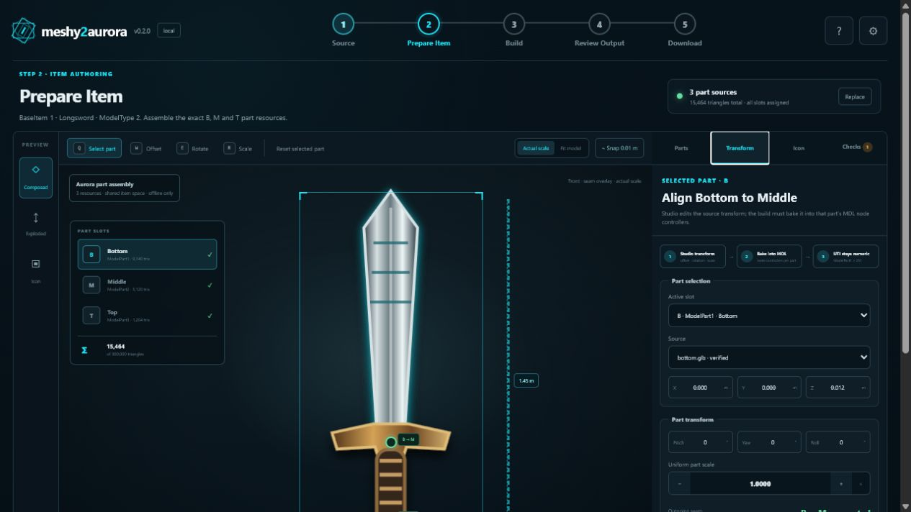

# Item Authoring V1 — mockup

Status: `DESIGN_MOCKUP_COMPLETE_NOT_IMPLEMENTATION`

Data: 2026-07-29

Następna implementacja tego projektu mocka w prawdziwym Studio jest opisana w
[Item Studio V1 — implementacja mocka](../../item-studio-v1-implementation-2026-07-30.md).
Ten katalog pozostaje historycznym, samodzielnym prototypem dokumentacyjnym.

Mockup przedstawia rekomendowaną opcję `Item` w webowym Studio po audycie
możliwości Meshy oraz kontraktu przedmiotów Aurora.

## Zakres

Prototyp obejmuje trzy stany:

1. `Source` — jeden target Item, wybór `BaseItem` oraz przypisanie źródła do
   każdego wymaganego slotu partu;
2. `Prepare Item` — osobne zasoby partów, ich transformy, szwy i podgląd
   złożonego przedmiotu;
3. `Review Output` — readback każdego MDL partu, UTI oraz handoff do owner-run
   proof złożonego przedmiotu.

Najważniejsze decyzje:

- nie ma osobnych trybów `Shield`, `Weapon` ani innych kategorii użytkowych;
- użytkownik wybiera rekord `BaseItem`, a Studio odczytuje z `baseitems.2da`
  `ItemClass`, `ModelType`, slot wyposażenia i rozmiar ikony;
- Aurora ma cztery formalne profile `ModelType`: własna geometria wymaga `1`
  albo `3` GLB, natomiast armor `ModelType 3` ma `19` numerycznych selektorów
  retailowych i `0` niezależnych Meshy GLB;
- `ModelType 0` oznacza jeden `ModelPart1` bez kanałów kolorów, `ModelType 1`
  ten sam jednopartowy schemat z sześcioma kanałami materiałowymi,
  `ModelType 2` trzy party `Bottom/Middle/Top`, a `ModelType 3` dziewiętnaście
  pól `ArmorPart_*` wybierających `CAPART/PARTS_ROBE` oraz sześć kanałów
  kolorów;
- `ModelType` wyznacza schemat wymaganych slotów, ale nie tworzy jednego
  zbiorczego modelu; tarcza jest demonstracyjnie `ModelType 0`, a potion
  `ModelType 2`, więc klasy użytkowe nie mogą sterować pipeline’em;
- mock pokazuje osobne, automatycznie wybrane przypadki resolvera `CAPART` i
  `CloakModel`, ale nie zamienia ich w ręcznie wybierane kategorie produktu;
- `CAPART` wiąże każdy z 19 selektorów z dokładnym `MDLNAME`, `NODENAME`,
  tabelą `PARTS_*` oraz rzeczywistym, zahashowanym zasobem MDL kontekstu;
- `CloakModel` wymaga rzeczywistych, niepustych bajtów wskazanego MDL i TGA,
  a raport utrwala ich rozmiary i SHA-256;
- fixture dowodowy dla `CAPART` i `Cloak` nie kładzie UTI na ziemi: tworzy
  jedno stworzenie o jawnym kontekście `Appearance / Race / Gender /
  Phenotype` i wyposaża UTI odpowiednio w `Equip_ItemList[2]` albo
  `Equip_ItemList[8192]`; pokazany wariant `pmh0` używa dokładnie
  `6 / 6 / 0 / 0`;
- każdy własny part ModelType `0/1/2` ma źródło, numer wariantu, resref MDL,
  teksturę i transform; selektory ModelType `3` nie mają własnych GLB/MDL;
- UTI zapisuje numery partów, a runtime składa odpowiadające im zasoby MDL;
- transformy ze Studio są wypalane do kontrolerów węzłów każdego MDL; UTI
  pozostaje wyłącznie numerycznym wyborem wariantów;
- złożony podgląd nie jest dodatkowym zasobem MDL;
- ikona nie jest renderem kamery 3D: Aurora składa na płótnie ekwipunku osobne
  warstwy `i…_b_…`, `i…_m_…` i `i…_t_…`;
- wybrany w mockupie `BaseItem 1 · Longsword · ModelType 2` jest scenariuszem
  demonstracyjnym pokazującym trzy sloty `B/M/T`;
- sposób składania modelu wynika z `ModelType`, nie z ręcznie wybranej rodziny;
- MDL, warstwy ikon i UTI mają osobne tożsamości zasobów; resrefy modeli 3D
  nie mają prefiksu `i`, a resrefy ikon go mają;
- tryby `Composed`, `Exploded` oraz `Icon` pokazują odpowiednio wynik złożenia,
  osobne zasoby partów i kompozycję trzech warstw 2D;
- transform i pivot są rozwiązywane per part, wypalane do MDL i nie zależą od
  Meshy `auto_size`;
- AABB w podglądzie jest wyłącznie wskazówką i nie blokuje Build; autorytatywny
  gate szwu działa w Worker/core na przetransformowanych powierzchniach
  trójkątów i utrwala hashe źródeł, transformów oraz samego pomiaru;
- limit produktu wynosi 300 000 trójkątów;
- budżet geometrii jest liczony dla sumy partów jednego przedmiotu;
- niezależna granica strumienia binarnego pozostaje równa 65 535 indeksom,
  czyli 21 845 trójkątom na jeden strumień; większa geometria jest dzielona
  deterministycznie bez kasowania trójkątów;
- interfejs nie deklaruje sukcesu wizualnego Toolset/NWN;
- końcowy proof pozostaje po stronie właściciela.

Nazwy i numery wariantów pokazane w mockupie są danymi demonstracyjnymi, nie
zarezerwowanymi wartościami produkcyjnymi. Implementacja musi wykonać kontrolę
kolizji zasobów przed ich przydzieleniem.

## Pliki

- `index.html` — trzy stany workflow;
- `styles.css` — wygląd zgodny z aktualnym Studio;
- `app.js` — lokalna nawigacja, zakładki i tryby podglądu;
- `01-item-target.png` — wybór opcji Item;
- `02-prepare-item.png` — przygotowanie przykładowego przedmiotu;
- `03-review-package.png` — przegląd paczki;
- `04-icon-layers.png` — trzy osobne warstwy ikon `B/M/T`;
- `05-transform-bake.png` — projekcja transformu ze Studio do MDL i UTI.

Mockup jest samodzielnym prototypem dokumentacyjnym. Nie uruchamia Meshy API,
nie tworzy MDL/UTI/HAK/MOD i nie jest dowodem Aurora Toolset ani NWN.

## Uruchomienie

```powershell
python -m http.server 43129 --bind 127.0.0.1
```

Następnie otwórz:

`http://127.0.0.1:43129/index.html`

## Zweryfikowane widoki

### Wybór targetu Item



### Przygotowanie przedmiotu



### Przegląd paczki



### Warstwy ikony



### Bake transformacji



Kontrola 2026-07-30:

- [x] trzy stany wyrenderowane i sprawdzone w lokalnej przeglądarce;
- [x] nawigacja Source → Prepare Item → Review Output działa;
- [x] widoki Composed, Exploded oraz Icon przełączają się;
- [x] zakładki Parts, Transform, Icon i Checks przełączają się;
- [x] konsola przeglądarki bez błędów i ostrzeżeń;
- [x] ekran Source pokazuje 4 profile `ModelType`, `1/3` własne GLB oraz
  `19` selektorów CAPART bez własnych GLB;
- [x] ekran Source pokazuje byte-backed CAPART/Cloak jako przypadki resolvera
  wyprowadzone z `BaseItem`, bez przełącznika kategorii przedmiotu;
- [x] ekran Review odróżnia standardowy fixture z UTI na ziemi od osobnego
  fixture’u CAPART/Cloak z UTI wyposażonym na stworzeniu;
- [x] transform jest jawnie wypalany do MDL, a UTI pozostaje numeryczne;
- [x] ikona używa osobnych warstw `i…_b`, `i…_m` i `i…_t` na płótnie 2D;
- [x] mock rozdziela MDL, ikonę, UTI i proof package;
- [x] mock nie deklaruje sukcesu wizualnego Toolset/NWN.
