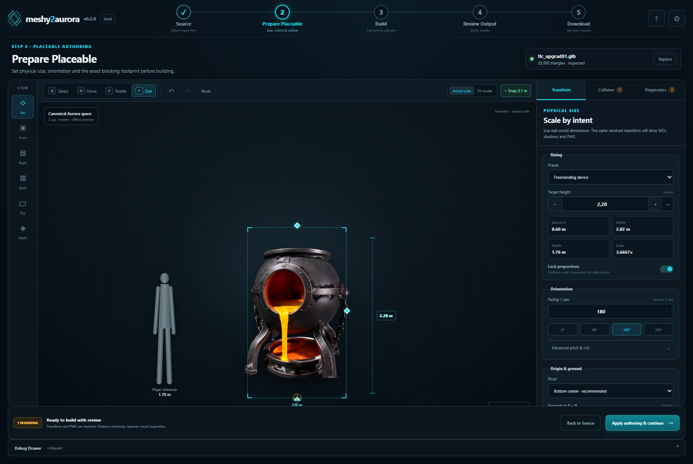
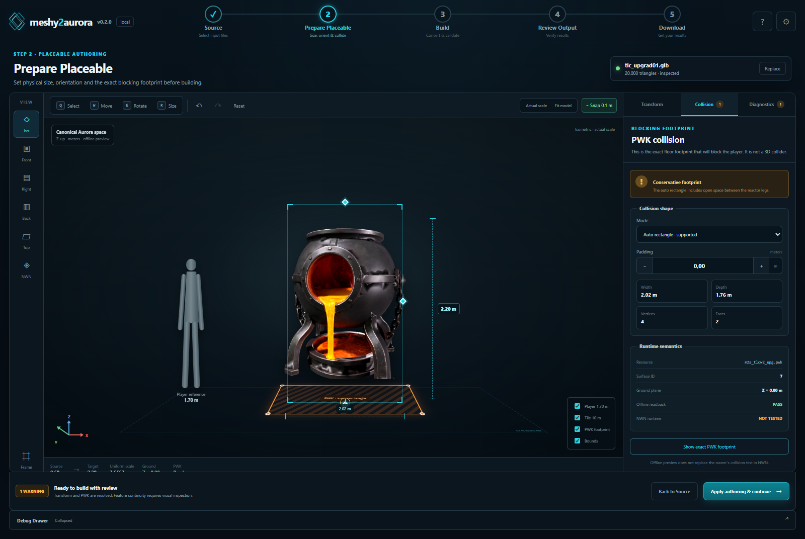
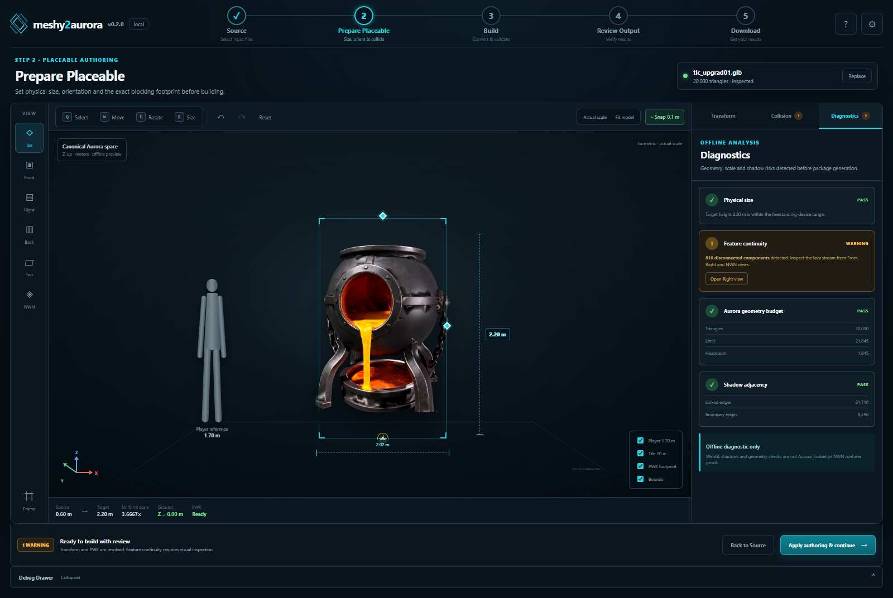

# Placeable Authoring V1 — mockup

Status: `DESIGN_MOCKUP_COMPLETE_NOT_IMPLEMENTATION`

Data: 2026-07-26

Ten katalog wizualizuje rekomendacje z:

`documentation/audyt-ui-ux-manipulacji-placeablem-2026-07-26.md`

## Zakres

Mockup obejmuje jeden ekran `Prepare Placeable` i trzy stany prawego panelu:

1. `Transform`;
2. `Collision`;
3. `Diagnostics`.

Najważniejsze decyzje:

- fizyczna wysokość zamiast surowej skali;
- kanoniczna przestrzeń Aurory `Z-up` i metry;
- wyraźne rozdzielenie `Actual scale` od `Fit model`;
- sylwetka gracza 1,70 m oraz obrys tile'a 10×10 m;
- uniform scale;
- yaw jako podstawowy obrót;
- bottom-center oraz ground at Z=0;
- dokładny footprint PWK;
- diagnostyka rozłącznych komponentów i adjacency;
- wyraźne oznaczenie, że viewport nie jest runtime proof.

## Interakcje

- zakładki `Transform`, `Collision`, `Diagnostics`;
- tryby `Q/W/E/R`;
- presety oraz pole target height;
- szybkie kąty yaw;
- `Actual scale / Fit model`;
- presety kamer;
- przełączniki player/tile/PWK/bounds;
- reset;
- pokazanie PWK;
- przejście z ostrzeżenia diagnostycznego do widoku Right.

## Pliki

- `index.html` — struktura ekranu;
- `styles.css` — kompletny wygląd;
- `app.js` — lokalne interakcje demonstracyjne;
- `assets/upgrading-reactor.png` — rzeczywisty thumbnail modelu Meshy użyty
  wyłącznie jako zawartość viewportu.

Mockup nie uruchamia pipeline'u, nie tworzy MDL/PWK i nie jest dowodem
Aurora Toolset ani NWN.

## Uruchomienie

Otwórz `index.html` bezpośrednio w przeglądarce albo uruchom z tego katalogu
prosty serwer statyczny:

```powershell
python -m http.server 43121 --bind 127.0.0.1
```

Następnie przejdź do `http://127.0.0.1:43121/index.html`.

## Zweryfikowane widoki

### Transform



### Collision



### Diagnostics



Kontrola 2026-07-26:

- [x] widok `Transform` wyrenderowany w Chromium 1600×1000;
- [x] widok `Collision` wyrenderowany po rzeczywistej zmianie zakładki;
- [x] widok `Diagnostics` wyrenderowany po rzeczywistej zmianie zakładki;
- [x] konsola przeglądarki bez błędów i ostrzeżeń;
- [x] grafika reaktora pochodzi z istniejącego artefaktu projektu;
- [x] mockup jasno oddziela offline preview od dowodu Toolset/NWN.
