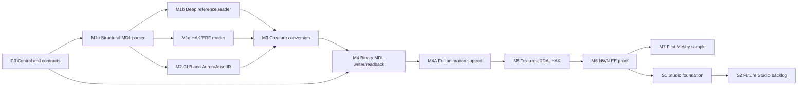

# plan-implementacji-orkiestrator-codex.md

Data: 2026-07-10 | Autor: Codex | Status: AKTYWNY PLAN WYKONAWCZY

## 1. Cel

Ten dokument opisuje kolejnosc implementacji standalone `meshy2aurora`:

```text
Meshy GLB -> own converter -> binary MDL + 2DA + HAK -> NWN EE Toolset/game proof
```

Jest przeznaczony dla orkiestratora. Nie wolno traktowac etapu jako zakonczonego tylko dlatego, ze kod istnieje albo test jednostkowy przeszedl. Kazdy etap wymaga obiektywnego dowodu wskazanego w jego Definition of Done.

## 2. Plan, stan i evidence

Najlepszy model dokumentacji to hybryda, nie jeden ogromny dziennik ani osobny plik dla kazdej drobnej zmiany.

```yaml
documentation_model:
  plan:
    file: "documentation/plan-implementacji-orkiestrator-codex.md"
    role: "staly kontrakt etapow, zaleznosci, Definition of Done i zakres"
    update_when: "zmienia sie plan, kontrakt etapu albo kolejnosc"
  live_state:
    file: "documentation/orchestrator-state.yaml"
    role: "kanoniczny aktualny stan dla orkiestratora"
    update_when: "przed rozpoczeciem pracy, po odkryciu problemu, po kazdym gate i przy zmianie statusu"
  evidence:
    file_pattern: "documentation/evidence/<stage-id>-evidence.md"
    role: "append-only dowody, komendy, screenshoty, hashe, decyzje i zamkniete problemy"
    update_when: "po istotnym proofie albo zamknieciu etapu"
```

Zasada: `orchestrator-state.yaml` pokazuje tylko stan teraz. Historia i szczegoly nie znikaja: trafiaja do jednego pliku evidence dla jednego etapu. Nie tworzymy osobnych dokumentow dla pojedynczych malych bledow.

## 3. Wspolny kontrakt etapu

Kazdy etap ma ponizsze pola. Pola `current_problems`, `bugs`, `next_actions`, `evidence` i `status_reason` sa dynamiczne i musza zmieniac sie wraz z postepem.

```yaml
stage_contract:
  id: "staly identyfikator, np. M1A"
  status: "NOT_STARTED | READY | IN_PROGRESS | BLOCKED | VERIFYING | DONE | SUPERSEDED"
  goal: "jedno sprawdzalne zdanie"
  owner: "odpowiedzialny agent lub osoba"
  dependencies: "etapy, decyzje i artefakty wymagane przed startem"
  scope: "co wolno implementowac"
  out_of_scope: "co jest zakazane, aby uniknac scope creep"
  definition_of_done: "wymagane testy, artefakty i proof"
  current_problems: "braki, blokery i ryzyka; pusta lista gdy nie ma"
  bugs: "zaobserwowane odchylenia od oczekiwanego zachowania; nie mylic z brakiem funkcji"
  next_actions: "najmniejszy bezpieczny krok"
  evidence: "sciezki do testow, raportow, hashy, screenow i runbookow"
  documentation: "plan, evidence i odpowiedzi Cloud/Codex"
  status_reason: "dlaczego etap ma obecny status"
```

## 4. Reguly dla orkiestratora

```yaml
orchestrator_rules:
  source_of_truth: "documentation/orchestrator-state.yaml"
  one_active_stage: true
  start_rule: "etap mozna zaczac tylko gdy dependencies sa DONE albo jawnie oznaczone jako non-blocking assumption"
  done_rule: "DONE tylko po przejsciu wszystkich definition_of_done i zapisaniu evidence"
  blocked_rule: "BLOCKED gdy brak decyzji, Aurora anchor albo zewnetrzny stan uniemozliwia kolejny bezpieczny krok"
  bug_rule: "bug wymaga repro, expected, actual, severity, owner i nastepnej akcji"
  problem_rule: "brak implementacji lub brak danych zapisuj jako current_problem, nie jako bug"
  no_guessing: "nie odblokowuj etapu przez hipotetyczne offsety, limity albo formaty"
  scope_rule: "nie promuj future Studio features przed M6 proof"
  documentation_rule: "kazda zmiana statusu ma aktualizowac YAML; kazdy wazny proof dopisuje evidence"
  proof_rule: "NWN EE Toolset/game jest koncowym proofem native output; preview nigdy go nie zastepuje"
  git_checkpoint_rule: "po kazdej wiekszej funkcjonalnosci, ktora przeszla swoje gate'y, wykonaj osobny spojny commit i push z opisem zakresu, testow i evidence; nie lacz kilku duzych funkcji w jeden commit"
```

## 5. Mapa etapow



## 6. Etapy implementacji

### P0. Kontrola projektu i kontrakty

```yaml
id: "P0"
initial_status: "IN_PROGRESS"
goal: "zamknac decyzje i stan dokumentacji potrzebne do bezpiecznego startu kodu"
owner: "Codex + Mateusz"
dependencies: []
scope:
  - "kanoniczny repo C:\\Projects\\meshy2aurora"
  - "Aurora First anchors"
  - "stack i test runner zapisane jako decyzja albo jawna provisional assumption"
  - "M1a parser prompt and orchestration state"
  - "start-readiness audit, toolchain bootstrap and real WASM/JavaScript smoke gate"
  - "full-pipeline knowledge matrix plus MDL/MDX/animation/HAK/2DA/GFF direction contracts"
out_of_scope:
  - "parser/writer implementation"
  - "Meshy asset production"
definition_of_done:
  - "orchestrator-state.yaml exists and names one active stage"
  - "M1a scope, tests and no-go rules are accepted"
  - "Rust 1.96.1 core decision D11 is recorded and the toolchain blocker has an owner"
  - "wasm-pack is pinned and the M1A DoD executes the public adapter in Node"
  - "writer/animation/2DA runtime-evidence gaps and the resolved profile-A MDX direction have owner, evidence and a named closure test"
current_problems_initial:
  - "Rust 1.96.1 toolchain is not installed on the current machine"
resolved_initial_problems_2026_07_10:
  - "initial documentation baseline committed and pushed as 1747b29"
  - "full-pipeline direction contracts recorded; runtime evidence remains staged"
current_knowledge_status_2026_07_10:
  direction: "READY"
  runtime_evidence: "staged in M4/M4A/M5/M6"
bugs_initial: []
documentation:
  - "documentation/PROJECT_RULES.md"
  - "documentation/architektura-meshy2aurora-codex.md"
  - "documentation/decyzje-i-zadania-cloud.md"
  - "documentation/orchestrator-state.yaml"
  - "documentation/macierz-gotowosci-wiedzy-codex.md"
  - "documentation/mdl-binary-crosswalk-codex.md"
  - "documentation/mdx-polityka-codex.md"
  - "documentation/animacje-kontrakt-profil-a-codex.md"
  - "documentation/hak-2da-gff-crosswalk-codex.md"
```

### M1a. Structural binary MDL parser prototype

```yaml
id: "M1A"
initial_status: "BLOCKED"
goal: "bezpiecznie wczytac header, model header i node tree binary MDL do deterministycznego JSON report"
owner: "Claude"
dependencies: ["P0 scope accepted"]
scope:
  - "Rust Cargo workspace scaffold (m2a-core + m2a-wasm)"
  - "little-endian BinaryReader with bounds checks"
  - "binary header, MDX range, root node and child tree"
  - "cycle detection and stable diagnostics"
  - "WASM inspect API accepting selected-file bytes and returning JSON"
  - "synthetic fixture builder and unit tests"
out_of_scope:
  - "mesh/skin/controllers/animation parsing"
  - "HAK/ERF, 2DA, GLB, writer, GUI and Toolset automation"
definition_of_done:
  - "cargo fmt --all --check passes"
  - "cargo clippy --workspace --all-targets -- -D warnings passes"
  - "cargo test --workspace passes"
  - "cargo build -p m2a-wasm --target wasm32-unknown-unknown passes"
  - "wasm-pack test --node crates/m2a-wasm executes the public adapter and passes"
  - "WASM adapter emits deterministic report or stable error code"
  - "invalid header, pointer OOB and node cycle tests pass"
  - "arithmetic overflow, parser limit and truncated-input no-panic tests pass"
  - "no game/CEP payload exists in repository"
  - "documentation/prototyp-parsera-m1a-claude.md is written"
current_problems_initial:
  - "no Cargo workspace, Rust source or tests exist yet"
  - "no synthetic MDL fixture exists yet"
bugs_initial: []
documentation:
  - "documentation/prompt-dla-claude-prototyp-parsera.md"
  - "documentation/standalone-odpowiedz-codex.md"
  - "documentation/evidence/M1A-evidence.md"
```

### M1b. Deep binary MDL reference reader

```yaml
id: "M1B"
initial_status: "NOT_STARTED"
goal: "odczytac potwierdzone sekcje geometrii, skin, controllerow i animacji jako reference inspection"
owner: "implementation agent"
dependencies: ["M1A DONE", "Aurora First layout anchors"]
scope:
  - "mesh vertices, faces, normals and tverts"
  - "skin weights and bone indices"
  - "controller keys/data"
  - "animation headers, events and animation node trees"
  - "read-only local reference integration when available"
  - "multi-model reference corpus inventory according to korpus-referencyjny-mdl-codex.md"
out_of_scope:
  - "writer"
  - "semantic support for unconfirmed unknown fields"
definition_of_done:
  - "synthetic fixtures cover every supported section"
  - "all pointers and counts have bounds checks"
  - "unsupported node families report structured diagnostics"
  - "local reference test is env-gated, optional/clean-skip in CI and never writes extracted payload; recorded canonical local evidence run is mandatory before M1B DONE"
  - "P-REF packets cover named models from more than one family and record own-reader invariants and unsupported diagnostics"
current_problems_initial:
  - "no reader beyond M1A exists"
  - "unknown fields and non-core node semantics require explicit deferral"
bugs_initial: []
documentation:
  - "documentation/standalone-odpowiedz-codex.md"
  - "documentation/aurora-mdl-format-codex.md"
  - "documentation/evidence/M1B-evidence.md"
  - "documentation/korpus-referencyjny-mdl-codex.md"
  - "documentation/m1b-canonical-corpus-suplement-codex.md"
```

### M1c. Read-only HAK/ERF resource locator

```yaml
id: "M1C"
initial_status: "NOT_STARTED"
goal: "znalezc zasob MDL po resref/type w HAK V1.0 bez kopiowania go do repo"
owner: "implementation agent"
dependencies: ["M1A DONE"]
scope:
  - "ERF/HAK V1.0 header and resource table reader"
  - "lookup by resref and resource type"
  - "read-only stream into M1B parser"
  - "env-gated CEP/local integration test"
out_of_scope:
  - "HAK writer"
  - "retail/CEP fixture payload in git"
definition_of_done:
  - "synthetic HAK read test passes"
  - "missing resource returns stable diagnostic"
  - "optional CEP inspection skips cleanly when env is absent"
current_problems_initial:
  - "no own HAK reader exists"
bugs_initial: []
documentation:
  - "documentation/aurora-hak-erf-codex.md"
  - "documentation/standalone-odpowiedz-codex.md"
  - "documentation/evidence/M1C-evidence.md"
```

### M2. GLB ingest and canonical AuroraAssetIR

```yaml
id: "M2"
initial_status: "NOT_STARTED"
goal: "wczytac GLB i utworzyc kanoniczny, serializowalny AuroraAssetIR z raportem wejscia"
owner: "implementation agent"
dependencies: ["M1A DONE", "GB-003 resolved"]
scope:
  - "GLB only for first implementation"
  - "nodes, primitives, materials, textures, skin and animation inventory"
  - "axis, UV and geometry statistics"
  - "AuroraAssetIR schema and JSON report"
  - "synthetic axis and UV probes"
out_of_scope:
  - "FBX native support"
  - "Meshy API calls"
  - "native MDL output"
definition_of_done:
  - "valid minimal GLB produces stable report"
  - "missing UV, non-triangle primitive and over-budget geometry produce gates"
  - "all source data remains unmodified"
current_problems_initial:
  - "no source GLB fixture exists"
  - "no canonical IR schema exists"
bugs_initial: []
documentation:
  - "documentation/konwersja-meshy-analiza-cloud.md"
  - "documentation/viewport-walidacja-animacje-plan-codex.md"
  - "documentation/evidence/M2-evidence.md"
```

### M3. Creature conversion profile A

```yaml
id: "M3"
initial_status: "NOT_STARTED"
goal: "przeksztalcic default-scene Meshy geometry z source-preserving AuroraAssetIR do osobnego writer-ready AuroraCreatureIrV1 z potwierdzona osia, skala, budzetem i clean-room rig profile"
owner: "implementation agent"
dependencies: ["M1B DONE", "M1C DONE or equivalent read-only reference path", "M2 DONE"]
scope:
  - "axis and scale normalization"
  - "triangle/material budget gates"
  - "UV V flip policy"
  - "owned/synthetic/user-provided rig segmentation and max four normalized weights"
  - "default-scene reachable mesh instance bake; source hierarchy does not enter output"
out_of_scope:
  - "own retargeted animation clips; they are required in M4A"
  - "manual rig authoring"
definition_of_done:
  - "axis and UV fixtures pass"
  - "conversion report names every transformation"
  - "over-budget or invalid skin input is blocked"
  - "no reference payload is packaged or committed"
current_problems_initial:
  - "clean-room rig profile segmentation/weight transfer is not implemented"
  - "first real Meshy GLB is not yet supplied"
progress_2026_07_12:
  - "M3A RIGID single-segment conversion implemented and independently reviewed: NO FINDINGS P1=0/P2=0"
  - "118 workspace tests, 22 Profile-A tests and 12 Node/WASM tests pass"
  - "M3B segment assignment/SKIN/top-four weights and public WASM conversion parity remain required before M3 DONE"
bugs_initial: []
documentation:
  - "documentation/kierunek-implementacji-cloud.md"
  - "documentation/konwersja-meshy-odpowiedz-codex.md"
  - "documentation/m3-profile-a-conversion-kontrakt-suplement-codex.md"
  - "documentation/evidence/M3-evidence.md"
```

### M4. Native binary MDL writer and readback

```yaml
id: "M4"
initial_status: "NOT_STARTED"
goal: "wyemitowac native binary MDL z writer-ready AuroraCreatureIrV1 i odczytac go ponownie wlasnym parserem"
owner: "implementation agent"
dependencies: ["M1B DONE", "M3 DONE", "GB-001 direction defined", "GB-002 profile-A decision recorded"]
scope:
  - "consume only validated M3 AuroraCreatureIrV1; never reinterpret source-preserving AuroraAssetIR directly"
  - "deterministic binary layout writer"
  - "pointer/offset planner"
  - "profile-A appended MDX block inside the type-2002 MDL resource"
  - "semantic readback diff"
out_of_scope:
  - "own animation clip import and mapping; M4A owns that scope"
  - "unconfirmed emitter/light/dangly/aabb semantics"
  - "ASCII as runtime output"
definition_of_done:
  - "synthetic writer/readback tests pass"
  - "all emitted pointers are in bounds"
  - "readback semantic diff has no unexpected change"
  - "supported profile satisfies its linked Aurora P-REF invariant map or records an explicit deviation"
  - "writer contract evidence is linked"
current_problems_initial:
  - "writer and Aurora invariant-map conformance are not implemented"
bugs_initial: []
documentation:
  - "documentation/engine-mdl-pytania-cloud.md"
  - "documentation/aurora-mdl-format-codex.md"
  - "documentation/korpus-referencyjny-mdl-codex.md"
  - "documentation/evidence/M4-evidence.md"
```

### M4A. Full animation support

```yaml
id: "M4A"
initial_status: "NOT_STARTED"
goal: "obsluzyc wszystkie animacje wymagane przez wybrany profil Aurora/NWN, przez supermodel albo wlasne klipy"
owner: "implementation agent"
dependencies: ["M4 DONE", "Aurora First animation contract resolved"]
scope:
  - "inventory source GLB clips and skeleton bindings"
  - "validate keyframes, durations, node names and weights"
  - "map confirmed Aurora/NWN animation names and events"
  - "emit and read back own animation controllers when the profile requires them"
  - "validate inherited supermodel animation route without copying retail assets"
out_of_scope:
  - "inventing missing animation names or events"
  - "manual animation authoring UI"
definition_of_done:
  - "every animation required by the selected profile has a confirmed source: inherited or emitted"
  - "own emitted clips pass parser readback and deterministic report comparison"
  - "Toolset/game proof exercises the required route before M6 is DONE"
  - "unmapped source clips are BLOCKED or explicitly excluded with evidence"
current_problems_initial:
  - "required animation inventory and event semantics are not fully confirmed"
  - "own animation emission is not implemented"
bugs_initial: []
documentation:
  - "documentation/aurora-animation-system-codex.md"
  - "documentation/viewport-walidacja-animacje-plan-codex.md"
  - "documentation/evidence/M4A-evidence.md"
```

### M5. Textures, 2DA and generated HAK

```yaml
id: "M5"
initial_status: "NOT_STARTED"
goal: "wygenerowac wymagane TGA/TXI, table binding i HAK z wlasnych artefaktow"
owner: "implementation agent"
dependencies: ["M4A DONE", "Aurora First 2DA table-edit contract resolved"]
scope:
  - "base color or explicit bake -> TGA"
  - "optional TXI only after confirmed policy"
  - "automatic 2DA read/update/write of an existing table selected directly or located in a user-selected HAK for the chosen profile"
  - "ERF/HAK V1.0 writer"
  - "resource manifest and hashes"
out_of_scope:
  - "global override installation"
  - "unapproved MTR/PLT advanced behavior"
definition_of_done:
  - "synthetic TGA, 2DA and HAK tests pass"
  - "HAK contains only generated resources and correct types/resrefs"
  - "appearance/table edit has Aurora First structural evidence; Toolset/game runtime proof is owned by M6"
  - "packer output can be read back by own reader"
current_problems_initial:
  - "exact existing-table edit needs Aurora First structural proof; HAK resolution remains an M6 runtime gate"
  - "no own HAK writer exists"
bugs_initial: []
documentation:
  - "documentation/aurora-hak-erf-codex.md"
  - "documentation/aurora-2da-creature-codex.md"
  - "documentation/evidence/M5-evidence.md"
```

The locked M5 supplement supersedes the original runtime wording above:
`documentation/m5-native-package-kontrakt-suplement-codex.md`. Requiring M6
runtime acceptance before `M5 DONE` would recreate a dependency cycle because
M6 depends on `M5 DONE`.

### M6. Generated NWN EE proof

```yaml
id: "M6"
initial_status: "NOT_STARTED"
goal: "udowodnic, ze wygenerowany HAK i modul testowy laduja model w Toolset i grze"
owner: "Mateusz + implementation agent"
dependencies: ["M5 DONE"]
scope:
  - "generated HAK, target-specific creature UTC and generated minimal MOD with typed IFO/ARE/GIT/GIC"
  - "GIT contains the full typed creature instance; GIC contains aligned one-to-one comment entries"
  - "manual Toolset/game runbook"
  - "file-level assertions plus visual screenshots"
  - "explicit proof packet"
out_of_scope:
  - "headless GUI automation without separate approval"
  - "aurora-web as proof or validator"
definition_of_done:
  - "generated UTC is accepted as a creature blueprint by Toolset"
  - "generated GIT full creature instance has TemplateResRef and Appearance_Type aligned with the target UTC"
  - "generated GIC list counts/order/child IDs align one-to-one with GIT"
  - "Toolset screenshot with HAK attached"
  - "Toolset screenshot with visible generated creature"
  - "game screenshot with visible generated creature"
  - "required animation route is visibly verified in Toolset and game"
  - "no missing model/texture marker, crash or unusable orientation"
  - "evidence packet names exact generated resrefs and HAK hash"
current_problems_initial:
  - "no generated MDL/HAK/module exists"
  - "headless visual proof is not confirmed and is not required"
bugs_initial: []
documentation:
  - "documentation/standalone-odpowiedz-codex.md"
  - "documentation/evidence/M6-evidence.md"
```

### M7. Meshy sample corpus E2E

```yaml
id: "M7"
initial_status: "NOT_STARTED"
goal: "przeprowadzic reprezentatywny korpus oryginalnych modeli Meshy przez caly pipeline i proof"
owner: "Mateusz + implementation agent"
dependencies: ["M6 DONE", "approved source GLB corpus and art direction"]
scope:
  - "minimum three original Meshy GLB samples"
  - "rigged humanoid creature with source clips"
  - "non-humanoid creature using the confirmed reference-supermodel route"
  - "static placeable or item without a skeleton"
  - "source manifest, conversion report, generated HAK and proof packet for every sample"
  - "iterate only on evidence-backed defects"
out_of_scope:
  - "c_kocrachn as shipped asset"
  - "unapproved additional model families beyond the three required profiles"
definition_of_done:
  - "every sample has a complete source -> IR -> MDL/2DA/HAK -> Toolset/game packet"
  - "orientation, scale, texture and required animation route are acceptable for every sample"
  - "all changes are reproducible from manifest"
current_problems_initial:
  - "no first real GLB supplied"
  - "art direction and Meshy credit budget are pending"
bugs_initial: []
documentation:
  - "documentation/meshy-przygotowanie-modelu-cloud.md"
  - "documentation/evidence/M7-evidence.md"
```

### S1. Studio foundation after E2E proof

```yaml
id: "S1"
initial_status: "NOT_STARTED"
goal: "zbudowac viewport i diagnostyke jako klienta dzialajacego canonical pipeline"
owner: "product/UI implementation agent"
dependencies: ["M6 DONE"]
scope:
  - "Source, Aurora Preview and Readback modes"
  - "validation panel"
  - "read-only Material/Texture Inspector"
  - "selection between node tree and viewport"
out_of_scope:
  - "editing binary output directly"
  - "advanced rig and animation authoring"
definition_of_done:
  - "viewport uses canonical IR or parser readback, never separate fake model"
  - "validation links to selected model part"
  - "all data shown has source/provenance status"
current_problems_initial:
  - "must not start before native pipeline proof"
bugs_initial: []
documentation:
  - "documentation/viewport-walidacja-animacje-plan-codex.md"
  - "documentation/prompt-dla-claude-prototyp-parsera.md"
  - "documentation/evidence/S1-evidence.md"
```

### S2. Future Studio features

```yaml
id: "S2"
initial_status: "NOT_STARTED"
goal: "wdrazac future Studio backlog po kolei, z dowodami i bez budowania substytutu Blendera"
owner: "product/UI implementation agent"
dependencies: ["S1 DONE"]
scope:
  - "F1-F10 only in documented sequence"
out_of_scope:
  - "manual pixel painting, full mesh modeling, manual rig authoring, direct binary MDL editing"
definition_of_done:
  - "kazdy feature ma oddzielny gate, evidence i aktualizacje orchestrator-state.yaml"
current_problems_initial:
  - "future backlog is intentionally blocked before E2E proof"
bugs_initial: []
documentation:
  - "documentation/przyszle-featurey-studio-codex.md"
  - "documentation/evidence/S2-evidence.md"
```

## 7. Dodatkowe pola ulatwiajace prace orkiestratora

Dodajemy je w `orchestrator-state.yaml` dla kazdego etapu i problemu:

```yaml
orchestrator_helpers:
  owner: "kto podejmuje nastepna akcje"
  attempt_id: "np. M1A-20260710-01, aby laczyc logi i evidence"
  risk: "LOW | MEDIUM | HIGH"
  severity: "P0 | P1 | P2 | P3 dla bledow"
  decision_needed: "konkretne pytanie, owner decyzji i deadline/condition"
  stop_condition: "kiedy agent ma przerwac zamiast zgadywac"
  rollback: "co bezpiecznie usunac/cofnac po nieudanej probie"
  expected_artifacts: "dokladne pliki, raporty albo screenshoty wymagane do DONE"
  verification_commands: "komendy, ich expected result i actual result"
  provenance: "Aurora First anchor, local binary, synthetic fixture albo runtime proof"
  timebox: "maksymalna liczba prob lub czas przed eskalacja"
  changed_files: "lista aktualizowana po kazdej probie"
```

Najwazniejsze dodatki to `attempt_id`, `stop_condition`, `expected_artifacts`, `provenance` i rozdzielenie `current_problems` od prawdziwych `bugs`. To pozwala orkiestratorowi szybko odroznic brak decyzji od regresji w kodzie.

## 8. Biezacy nastepny krok

```yaml
next_stage:
  id: "M3"
  action: "zaimplementowac profil-A source-preserving-to-Aurora conversion policy; axis, scale, UV V-flip i winding rozstrzygnac wylacznie przez Aurora First anchors oraz synthetic proof"
  status: "IN_PROGRESS attempt M3-20260712-01 po M1B/M1C/M2 DONE"
  do_not_start_in_parallel:
    - "M4 binary MDL/MDX writer"
    - "M4A animation emission"
    - "Studio UI"
  success_signal: "axis/UV/winding/scale probes pass; conversion report names every transformation; invalid geometry or skin is blocked; no reference payload is packaged; independent M3 review has no findings"
```
