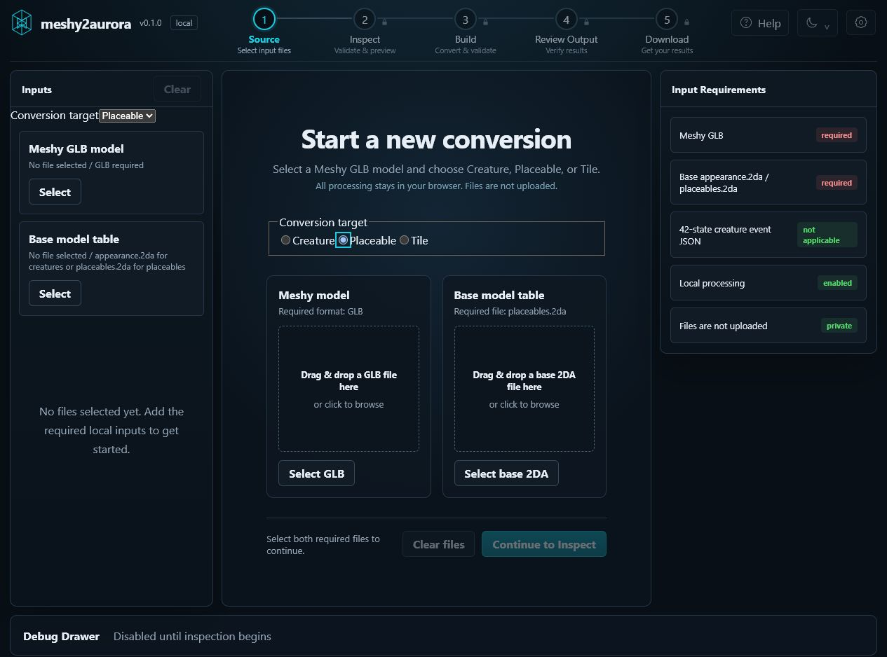
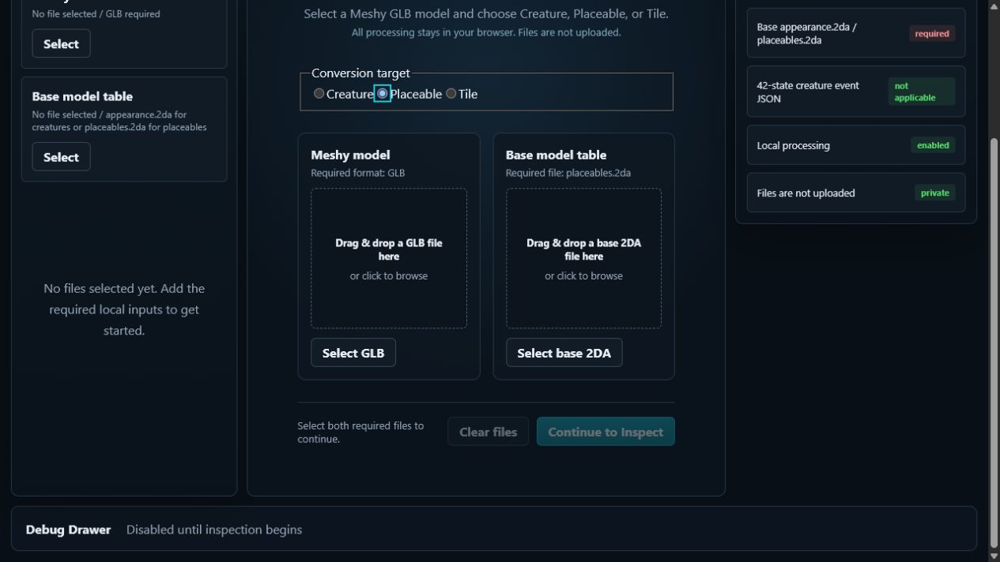
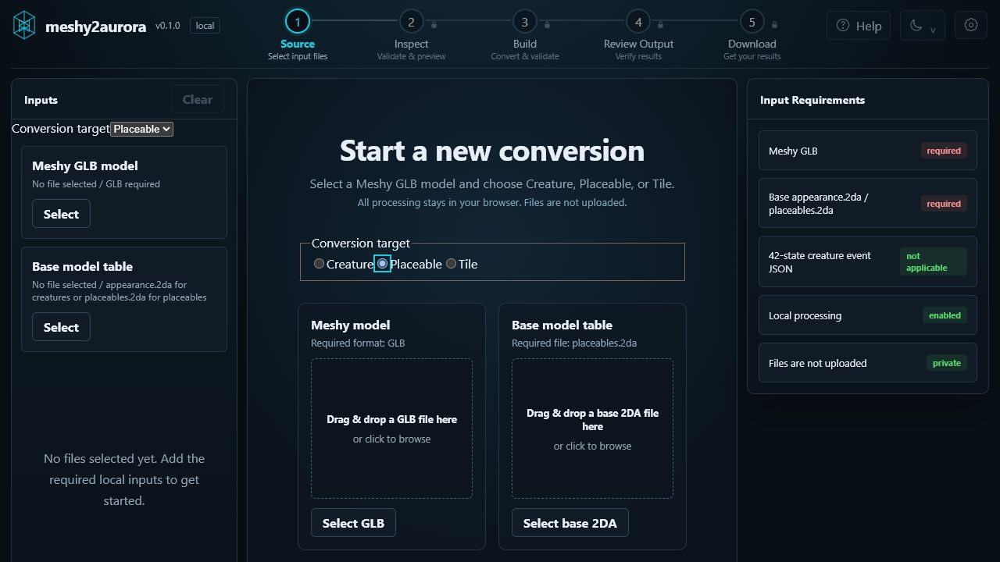

# Web Studio — uruchomienie pipeline'u placeable

## 1. Uruchom aktualną aplikację

W PowerShell:

```powershell
cd C:\Projects\meshy2aurora\apps\studio-web
npm run dev
```

`predev` przebuduje aktualny pakiet WASM. Po pojawieniu się komunikatu Vite
otwórz:

`http://127.0.0.1:5173/`

## 2. Wybierz cel `Placeable`

W sekcji `Conversion target` wybierz `Placeable`. Aplikacja zmieni wymagany
plik bazowy z `appearance.2da` na `placeables.2da`.



## 3. Wskaż dwa wejścia

Wybierz:

1. `Select GLB` — lokalny model Meshy w formacie `.glb`;
2. `Select base 2DA` — bazowy plik nazwany dokładnie `placeables.2da`.

Pliki są przetwarzane lokalnie w przeglądarce i nie są wysyłane.



Po wskazaniu obu plików przycisk `Continue to Inspect` zostanie odblokowany.

## 4. Przejdź przez workflow

Kolejne etapy są widoczne w górnym pasku:

1. `Source`;
2. `Inspect`;
3. `Build`;
4. `Review Output`;
5. `Download`.



Na ekranie `Inspect` sprawdź statystyki oraz podgląd. Następnie przejdź do
`Build` i uruchom konwersję. Aktualny wspólny writer zastosuje poprawione
shadow adjacency przez szwy UV/normalnych.

## 5. Pobierz wynik

Po udanym buildzie ekran `Review Output` pokaże wynik readbacku, resrefy i
status `offline-only`. W kroku `Download` pobierz:

- HAK;
- testowy MOD;
- binary MDL;
- ASCII PWK;
- raport materializacji JSON.

Wcześniej pobrane modele nie otrzymują poprawki automatycznie. Trzeba wykonać
nowy build i użyć nowo pobranych MOD/HAK.
